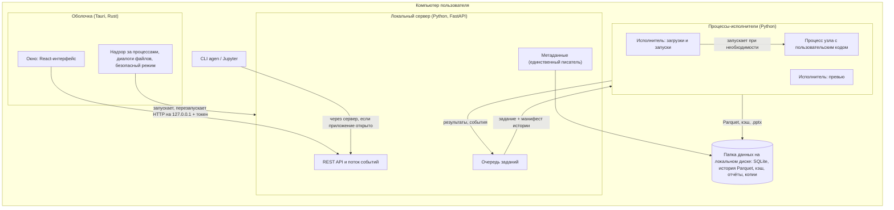
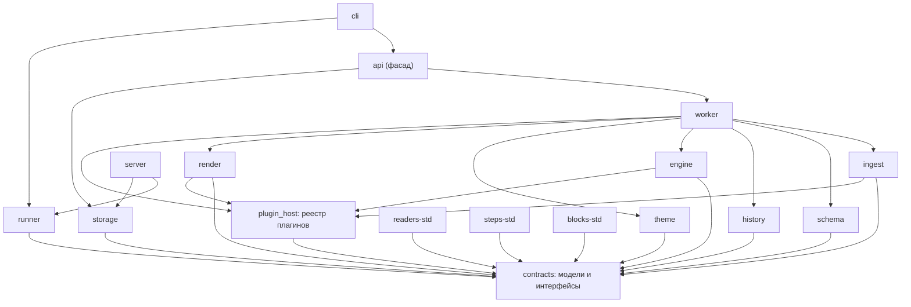
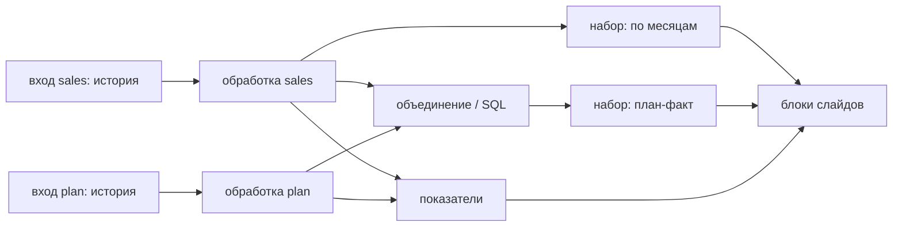
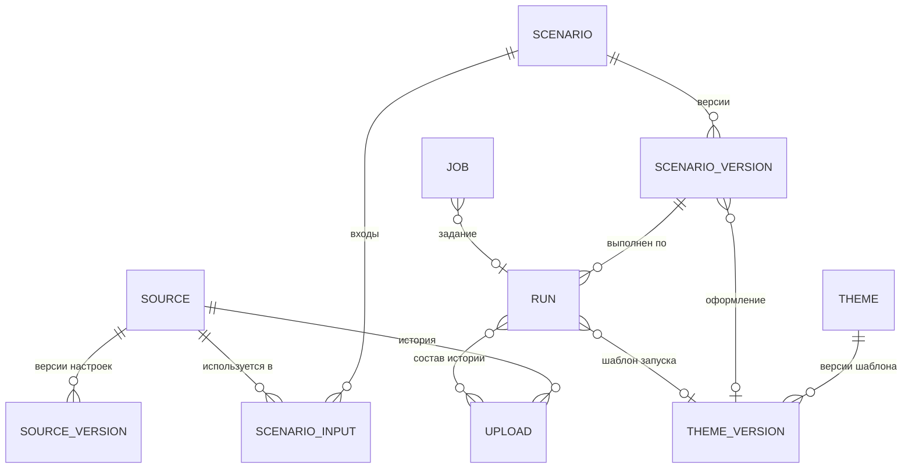

# Архитектура Autogenerator

> **Статус:** черновик v0.9 · **Дата:** 2026-10-03
> **Связанный документ:** [PRD.md](PRD.md). Термины (источник, история, тип периода, отчётный период, окно данных, сценарий, модуль, плагин и т. д.) определены в разделе 6 PRD, принятые решения — в разделе 12 PRD.
>
> Ответы на все уточняющие вопросы учтены (раздел 12 PRD); открытых вопросов нет. Заполнение слайдов-образцов (метки, графики, таблица), удаление слайдов, выгрузка в шаблон и обратная загрузка проверены прототипами на копии корпоративного шаблона пользователя: XSD-проверкой, отрисовкой в LibreOffice и в PowerPoint. Проверочный отчёт из 20 слайдов (все метки со сменой языка прогона, все графики, таблица, копия слайда-образца, удалённый слайд) и файл выгрузки открываются в PowerPoint без восстановления; служебные теги выгрузки переживают сохранение в PowerPoint. Единственный недочёт, замеченный в PowerPoint, — наложение подписей на комбинированных графиках; его закрывает правило `chart_fill` (раздел 6.5). Разделы о чтении выгрузок, истории и папке данных (3, 4.3, 6.1–6.3, 6.7, 8, 9, 12, 13) приведены в соответствие с этапом M1; что M1 оставил на потом (хранение исходного файла, фоновый профиль, подтверждение периода в интерфейсе), сказано на месте. Разделы об обработке, наборах данных, показателях, кэше узлов и превью (4.1–4.3, 5.2, 5.3, 6.4, 6.6, 6.7, 7–9, 13) приведены в соответствие с этапом M2. Разделы о шаблоне, слайдах-образцах, сборке, превью слайда, бенчмарке запуска, а также о чтении .xls и строках CSV длиннее шапки (3, 4.1–4.3, 6.1, 6.4–6.7, 8, 9, 11–13) приведены в соответствие с этапом M3; что M3 оставил на потом (хранение шаблонов и их версий в папке данных, подтверждение ролей макетов, элементы оформления, конструктор слайдов в окне приложения), сказано на месте.

## 1. Принципы

1. **Модули с контрактами.** Приложение — набор отдельных пакетов с одной задачей у каждого. Пакеты общаются только через общий пакет контрактов (модели данных и интерфейсы) и не знают о внутренностях друг друга. Любой модуль можно прочитать, протестировать и запустить отдельно. Границы проверяются автоматически.
2. **Сбой остаётся на месте.** Ошибка в шаге, плагине, пользовательском коде или модуле обработки ограничивается этим элементом и тем, что от него зависит. Координирующий сервер не загружает код обработки и плагинов, поэтому поломка в них не мешает ему запуститься. Ядро (контракты, сервер, хранилище) защищено тестами, безопасным режимом и откатом.
3. **Сценарий — это данные.** Вся логика отчёта хранится как декларативная спецификация: входы, шаги обработки, наборы данных, показатели, слайды. Её можно проверить без данных, версионировать, положить в git и выполнить повторно.
4. **Конструктор по умолчанию, код по желанию.** Любой элемент сценария (шаг, набор данных, показатель, блок слайда) можно заменить кодом на Python или SQL. Код — ещё один тип элемента в той же спецификации: он получает те же входы и обязан вернуть тот же тип результата.
5. **Столбцы адресуются по стабильному идентификатору.** Каждый столбец источника получает `id` — короткое латинское имя (`amount`, `region`), которое приложение предлагает по названию. Пока у источника нет загрузок, `id` можно поменять; после первой загрузки меняется только отображаемое название. Шаги, наборы, блоки и код ссылаются только на `id`; названия из файла связываются с `id` через сопоставление.
6. **Загрузки неизменяемы, история вычисляется.** Каждая загрузка хранится как есть; «действующая история» вычисляется по списку загрузок и правилам источника. Исключение загрузки полностью обратимо, а любой отчёт можно пересобрать.
7. **Большие таблицы живут на диске.** Чтение CSV потоковое; большие промежуточные результаты передаются между этапами и движками через Parquet на диске; операции, которым нужна вся таблица (удаление дубликатов, сортировка, объединение, оконные функции), на больших входах выполняет DuckDB с выгрузкой на диск. В память, интерфейс и презентацию попадают только агрегаты и выборки. Исключение — лист Excel, который читается в память целиком (раздел 6.1).
8. **Локально сейчас, сервер потом.** Хранилища, очередь заданий, события, кэш и доступ спрятаны за интерфейсами. Для одного пользователя на компьютере работают локальные реализации; для сервера они заменяются, а модули обработки не меняются.

## 2. Процессы и развёртывание

Autogenerator — десктоп-приложение для Windows 11 (x64). Внутри это несколько процессов, каждый со своей зоной ответственности:



| Процесс | Что делает | Что происходит при его сбое |
|---|---|---|
| **Оболочка** (Tauri 2) | Окно с интерфейсом (WebView2), нативные диалоги, передача путей перетащенных файлов, открытие готового .pptx, запуск и надзор за сервером, безопасный режим, обновления (v1) | Приложение закрывается; сервер и исполнители завершаются вместе с ним (Windows Job Object); данные не страдают, потому что оболочка их не пишет |
| **Локальный сервер** (Python, FastAPI + Uvicorn) | API для интерфейса, единственный писатель метаданных, очередь заданий, поток событий. Слушает только `127.0.0.1` на случайном порту и принимает запросы с токеном. Не импортирует модули обработки и плагины | Оболочка перезапускает сервер, интерфейс показывает «переподключение»; незавершённые задания помечаются прерванными и могут быть повторены. После нескольких неудачных запусков подряд оболочка включает безопасный режим (раздел 5.3) |
| **Исполнители** (пул Python-процессов) | Всё тяжёлое: чтение файлов, обработка, расчёты, сборка .pptx | Сервер запускает новый исполнитель; задание продолжается с готовых узлов из кэша (раздел 6.4) |
| **Процесс узла с кодом** | Выполнение одного узла с пользовательским кодом (по умолчанию для шагов «Python» в режиме «таблица» и для блоков «Python») | Ошибкой помечается только этот узел и зависимые от него |
| **CLI** `agen` | Запуск сценариев из командной строки и скриптов | Не влияет на приложение |
| **PowerPoint** (через COM) | Картинки слайдов-образцов для превью | Картинка не строится, показывается предыдущая с пометкой «≈»; экземпляр, запущенный приложением, завершается |

**Управление процессами в Windows.** Оболочка помещает сервер и все исполнители в Job Object с флагом `KILL_ON_JOB_CLOSE`, поэтому при закрытии или падении оболочки не остаётся «осиротевших» процессов. Исключение — PowerPoint для картинок слайдов-образцов (задание `slide_image`): его запускает служба COM Windows, а не исполнитель, поэтому в Job Object он не попадает; если PowerPoint уже открыт пользователем, COM подключается к этому экземпляру. Исполнитель сообщает серверу, запустил ли он PowerPoint сам, и номер процесса. Экземпляр, запущенный приложением, закрывается после задания; при таймауте и отмене его завершает сервер вместе с исполнителем, а при старте сервер завершает экземпляр, оставшийся после сбоя. В экземпляре пользователя закрывается только пробная копия. Лимит памяти каждого исполнителя задаётся тем же механизмом (`JOB_OBJECT_LIMIT_PROCESS_MEMORY`). Сервер дополнительно завершается сам, если пропал родительский процесс, и держит файл блокировки в папке данных: одновременно папкой владеет один сервер, а повторный запуск приложения открывает уже работающее окно.

**Python внутри установщика.** Приложение несёт собственный Python (python-build-standalone) и окружение ядра, собранное uv по lock-файлу; они лежат в ресурсах установщика (`bundle.resources`), а оболочка сама запускает `python.exe` и следит за ним. Системный Python не нужен и не затрагивается. Для работы с движком из своего кода установщик добавляет `agen` в PATH, регистрирует встроенный Python как ядро Jupyter «Autogenerator» и кладёт в папку установки пакеты модулей и файл ограничений версий: `pip install --find-links <папка> autogenerator-api -c constraints.txt`. Для пользовательских пакетов (v1) создаётся отдельный слой окружения с ограничениями версий ядра, поэтому они не могут заменить библиотеки, на которых работает приложение.

**Установщик.** Размер определяется Python-стеком (Polars, DuckDB, pyarrow, pandas): оценка 150–250 МБ. WebView2 ставится в автономном режиме (`offlineInstaller`), чтобы установка работала без интернета. Установщик, лаунчер и `python.exe` подписываются сертификатом подписи кода; на корпоративных машинах с AppLocker предусмотрена установка в Program Files. Обновление (v1) сначала останавливает сервер и исполнители, затем заменяет файлы.

**Папка данных** выбирается пользователем (по умолчанию `%LOCALAPPDATA%\Autogenerator`) и должна быть на локальном диске: сетевые пути отклоняются (SQLite в режиме WAL не работает в сетевых папках), для папок, которые синхронизируют OneDrive, Dropbox или SharePoint, показывается предупреждение. CLI и свой код берут другую папку из параметра `--home` или переменной `AGEN_HOME`. В папке лежат база метаданных, история выгрузок, кэш, временные файлы, готовые отчёты, резервные копии и журналы.

**Серверный режим (позже).** Тот же сервер разворачивается в Docker, интерфейс открывается в браузере, исполнители становятся воркерами очереди, хранилища переключаются на PostgreSQL и S3, включается авторизация (раздел 5.2).

## 3. Стек

| Слой | Выбор | Почему | Альтернативы |
|---|---|---|---|
| Оболочка | Tauri 2 (Rust) | Легче Electron по памяти и месту (на Windows разница небольшая: WebView2 — тоже Chromium); нативные диалоги, событие перетаскивания файлов с путями, механизм обновлений; надзор за процессами на Rust | Electron; pywebview |
| Python-среда | python-build-standalone + uv (workspace, lock-файл) | Воспроизводимая сборка, не зависит от системного Python, позволяет доставлять пакеты | PyInstaller: один файл, но нельзя доставлять пакеты пользователю |
| Бэкенд | Python 3.12, FastAPI, Pydantic v2 | Лучшая экосистема для таблиц и PowerPoint; Pydantic описывает контракты и отдаёт JSON Schema | — |
| Движок обработки | Polars (ленивый API, потоковое выполнение построчных операций) | Быстро на миллионах строк, читает только нужные столбцы и группы строк Parquet | pandas: не рассчитан на данные больше памяти |
| Блокирующие операции и SQL | DuckDB | Полноценный SQL; удаление дубликатов, сортировки, объединения и оконные функции выгружают промежуточные данные на диск при нехватке памяти | Polars: держит состояние таких операций в памяти |
| Единый диалект SQL | DuckDB + sqlglot | Формулы разбираются sqlglot в диалекте DuckDB и переводятся в выражения Polars; то, что переводчик не знает, выполняется в DuckDB. Пользователь видит один диалект | Два диалекта (Polars SQL и DuckDB) |
| Пользовательский код | pandas + pyarrow, Polars | pandas знаком пользователю; Polars — для больших данных | — |
| Чтение CSV | Свой потоковый читатель: порции по 32 МБ по концу строки (с учётом кавычек), каждую разбирает `pl.read_csv`, следующая читается заранее; части Parquet пишет Polars в фоновом потоке | В памяти пара порций при любом размере файла, прогресс по прочитанным байтам. `scan_csv` с `collect_batches` отображает файл в память, и на 10 млн строк память росла до 4 ГБ | Polars `scan_csv` → `collect_batches` → `pyarrow.ParquetWriter` |
| Чтение Excel | fastexcel (calamine); шапка и листы .xlsx — потоковым разбором XML первых строк; .xls (Excel 97–2003) — тот же fastexcel, книга до 65 536 строк на лист читается целиком | В разы быстрее openpyxl; fastexcel читает лист только целиком, поэтому шапку ищет свой разбор XML; объединённые ячейки (v1) — по диапазонам из calamine или разбором `<mergeCells>` листа, openpyxl для больших файлов не используется | openpyxl |
| Хранение истории | Parquet (zstd), разложенный по месяцам столбца периода | Сжатие в 5–10 раз, пропуск ненужных месяцев и групп строк; читают и Polars, и DuckDB | Одна база DuckDB |
| Метаданные | SQLite (режим WAL) через SQLAlchemy 2 и Alembic | Ноль администрирования на компьютере; те же миграции работают на PostgreSQL | — |
| Сборка .pptx | python-pptx + lxml | «Родные» редактируемые диаграммы PowerPoint, макеты и слайды корпоративного шаблона; тот же API доступен в блоке «Python». То, чего python-pptx не умеет (серии внутри групп комбинированного графика, метки, разбитые на прогоны, удаление слайда вместе с частями файла), делается правкой XML через lxml | Графики картинками |
| Картинки слайдов для превью | PowerPoint через COM (pywin32); запасной вариант — LibreOffice, если он установлен (в установщик не входит) | PowerPoint рисует с настоящими встроенными шрифтами шаблона | Только LibreOffice: встроенные шрифты не использует, отрисовка приблизительная |
| Текст с переменными | Jinja2 в `SandboxedEnvironment` + Babel (ru_RU) для текста, который пишет пользователь; буквальная подстановка для меток шаблона | Безопасно, привычный синтаксис; имена меток шаблона не обязаны быть корректным Jinja | — |
| Разбор кода | `ast` (Python), sqlglot (SQL) | Какие столбцы и входы использует пользовательский код | — |
| Сопоставление названий | rapidfuzz | Быстрые метрики похожести строк | — |
| Плагины | Python entry points + пакет `plugin_host` | Стандартный механизм: плагин — это обычный пакет | pluggy |
| Границы модулей | import-linter в CI | Автоматически запрещает недопустимые импорты между модулями | Ревью вручную |
| Сценарий как текст | YAML (ruamel.yaml) | Читается и правится руками, удобно в git | JSON |
| CLI | Typer | Простой CLI поверх движка | Click |
| Фронтенд | React, TypeScript, Vite, Mantine, TanStack Query, Zustand, dnd-kit | Быстро собирается интерфейс-конструктор | Vue, Svelte |
| Формы параметров | JSON Schema → форма на Mantine (собственный генератор или RJSF с общей темой; выбор — в M2) | Новый шаг из плагина сразу получает форму настройки без правки фронтенда | Ручные формы |
| Редактор кода | Monaco | Python, SQL и YAML с автодополнением `id` столбцов и `ctx` | CodeMirror 6 |
| Таблица и графики превью | AG Grid Community; Apache ECharts рисует готовые настройки графика, которые строит бэкенд | Виртуальная прокрутка; один источник истины для превью | TanStack Table, Recharts |

## 4. Модули и их границы

### 4.1. Карта модулей

Код — монорепозиторий uv workspace. Каждый модуль — отдельный Python-пакет в общем пространстве имён `autogenerator` (например, `autogenerator.ingest`) со своим `pyproject.toml`, README и тестами. `autogenerator` — пространство имён PEP 420: ни один пакет не содержит `autogenerator/__init__.py`. Имя не `autogen`, чтобы не конфликтовать с пакетом Microsoft AutoGen.

Версии: semver есть только у API плагинов в `contracts`; остальные пакеты несут общую версию приложения и поставляются одним установщиком по единому lock-файлу. Модуль разрабатывается, тестируется и заменяется отдельно (раздел 5.3), но пользователю доставляется в составе приложения.



| Модуль | Задача | Вход → выход | Зависит от |
|---|---|---|---|
| `contracts` | Модели спецификаций (источник, сценарий), типы, интерфейсы плагинов, хранилищ, очереди и событий, коды ошибок. Из логики — только общий разбор разметки .pptx (`contracts/ooxml.py`, раздел 6.5) | — | pydantic, pyarrow, ruamel.yaml, lxml |
| `plugin_host` | Обнаружение плагинов по entry points, проверка версии API, перехват ошибок загрузки, манифест плагинов | установленные пакеты → реестр + манифест | contracts |
| `ingest` | Хозяин чтения: выбор читателя из реестра, вывод типов, приведение, учёт ошибок приведения, запись Parquet по месяцам, профиль | путь к файлу → Parquet + снимок структуры + отчёт об ошибках | contracts, plugin_host, polars, pyarrow |
| `schema` | Сверка структуры с источником, кандидаты сопоставления | снимок + источник + используемые столбцы + статистика значений → результат сверки | contracts, rapidfuzz |
| `history` | Периоды загрузок, правила пересечения, действующая история, покрытие. Чистые функции над манифестом, без доступа к хранилищу | манифест истории + границы → ленивая таблица | contracts, polars |
| `engine` | Граф сценария, анализ используемых столбцов и их типов по шагам, выполнение (Polars, на больших входах — DuckDB), перевод SQL, окна, наборы, показатели, сравнение периодов, превью с выборкой, кэш узлов (`NodeCache`), запуск пользовательского кода в отдельном процессе | сценарий + истории входов + отчётный период → наборы и показатели | contracts, plugin_host, polars, duckdb, sqlglot, pandas, pyarrow |
| `theme` | Импорт .pptx-шаблона: размер слайда, макеты и их роли, элементы оформления (M4), манифест слайдов-образцов (метки, графики, таблицы, служебные теги выгруженных слайдов), проверка шаблона, заготовка слайдов сценария | .pptx → манифест + отчёт проверки + заготовка YAML | contracts, python-pptx, lxml |
| `render` | Хозяин сборки: слайды из макетов и слайды-образцы в рабочей копии шаблона, размещение, вызов блоков из реестра (включая подстановку меток), превью, пробная сборка одного слайда, проверка результата; выгрузка слайдов в шаблон и их сопоставление со сценарием при обратной загрузке (v1) | слайды + манифест шаблона + наборы + показатели → .pptx или описание превью | contracts, plugin_host, python-pptx, lxml, pyarrow |
| `readers-std` | Плагины CSV и Excel (.xlsx, .xls): кодировка, разделитель, строка заголовков, листы, строки длиннее шапки | — | contracts, polars, pyarrow, fastexcel |
| `steps-std` | Стандартные шаги (включая объединение, SQL и Python), окна, агрегаты | — | contracts, polars (DuckDB и запуск кода — через `StepContext`) |
| `blocks-std` | Стандартные блоки: текст, график, таблица, подстановка меток, заполнение графика и таблицы шаблона; общие форматы текста и меток (F-420) | — | contracts, python-pptx, lxml, jinja2, babel |
| `storage` | Реализации хранилищ: `SqliteMetadataStore`, `LocalBlobStore` (позже — PostgreSQL и S3 в отдельных пакетах), папка данных и её блокировка. Кэш узлов не здесь: это `NodeCache` в `engine` (раздел 6.4) | — | contracts, sqlalchemy, alembic |
| `runner` | Постановка заданий, локальные реализации `JobQueue`, `EventBus` и `ExecutorBackend` (пул процессов, лимиты, перезапуск) | задание → процесс-исполнитель | contracts |
| `worker` | Код внутри исполнителя: по типу задания лениво импортирует нужные модули и плагины и выполняет их; рисует картинку слайда через PowerPoint или LibreOffice (раздел 6.5) | задание + манифест → результат + события | ingest, schema, history, engine, theme, render, plugin_host |
| `api` | Публичный фасад для Jupyter, своего кода и CLI: `load_scenario`, `validate`, `preview`, `preview_slide`, `run`, `check_theme`, `describe_theme`, `scaffold_theme`, `Home` (папка данных: источники, загрузки, история) | — | worker, storage |
| `cli` | Команда `agen` | аргументы → задания или прямой вызов `api` | api, runner |
| `server` | FastAPI, единственный писатель метаданных, очередь заданий, SSE, резервные копии, авторизация (позже) | HTTP → задания | contracts, runner, storage |
| `frontend` | Интерфейс | OpenAPI-контракт сервера | — |
| `desktop` | Оболочка Tauri, установщик | — | — |

### 4.2. Правила границ

1. **Модули обработки не знают друг о друге.** `ingest`, `schema`, `history`, `engine`, `theme`, `render` зависят только от `contracts`, `plugin_host` и сторонних библиотек и не импортируют друг друга. Вместе их собирает только `worker`.
2. **Сервер не загружает обработку.** `server` не импортирует модули обработки и код плагинов; о плагинах он знает только из манифеста. Поэтому ошибка в `render` или в плагине не мешает серверу стартовать и показать её на экране «Модули».
3. **Плагины зависят только от контрактов.** Встроенные плагины разложены по трём пакетам с честными зависимостями, а хозяева (`ingest`, `engine`, `render`) содержат только оркестрацию.
4. **Связь через контракты.** Модули обмениваются Pydantic-моделями, таблицами Arrow и ссылками (URI) на Parquet, описанными в `contracts`. Общих глобальных состояний нет.
5. **Каждый модуль запускается отдельно.** У каждого есть точка входа для отладки без остального приложения: `python -m autogenerator.ingest выгрузка.xlsx`, `python -m autogenerator.engine сценарий.yaml --data папка_с_parquet`, `python -m autogenerator.theme шаблон.pptx` (манифест и отчёт проверки; с `--out манифест.json` рядом сохраняется рабочая копия `манифест.template.pptx`), `python -m autogenerator.render слайды.yaml --theme манифест.json --data папка --period 2026-03 -o отчёт.pptx` (манифест пишет `python -m autogenerator.theme шаблон.pptx --out манифест.json`; в папке лежат наборы `{набор}.parquet` и `metrics.json`, их пишут `python -m autogenerator.engine … --out папка` и `agen run --workdir папка` (в `папка/engine/outputs`)).
6. **Каждый модуль документирован и протестирован сам по себе.** README (назначение, контракт, пример), юнит-тесты и контрактные тесты: эталонные входы и выходы, которые должны сохраняться при любых изменениях внутри модуля.
7. **Заменяемые реализации.** Интерфейсы `MetadataStore`, `BlobStore`, `JobQueue`, `EventBus`, `ExecutorBackend` и `AuthProvider` описаны в `contracts`. Реализации хранилищ лежат в `storage`, очереди, событий и пула процессов — в `runner`, авторизации — в `server`. Кэш узлов пока работает с папкой на диске напрямую (`NodeCache` в `engine`); интерфейс `CacheStore` для общего хранилища появится вместе с сервером (раздел 5.2).
8. **Один писатель метаданных.** Метаданные пишет только сервер (или CLI, когда приложение закрыто, взяв блокировку папки данных). Исполнители не открывают SQLite: задание приносит им манифест (URI загрузок, периоды, порядковые номера, правила пересечения, версия источника), а результат возвращается серверу, который его фиксирует. Файлы загрузок и .pptx исполнители пишут через `BlobStore`, кэш узлов — через `NodeCache`; запись везде атомарная.

Правила 1–3 закреплены в конфигурации import-linter и проверяются в CI.

### 4.3. Плагины

Всё, что можно расширять, устроено как плагины, включая встроенное:

| Точка расширения (entry point) | Что добавляет | Интерфейс |
|---|---|---|
| `autogenerator.readers` | Формат файла | `can_read(path)`, `sniff(path, options) → ReadOptions`, `batches(path, options, progress=…, note=…) → поток порций Arrow` (все столбцы текстом; `note` — замечания о файле целиком, например у скольких строк отброшены лишние поля), `columns(path, options)` (шапка), `sample(path, options) → SampleTable` (выборка из начала, середины и конца), флаг `sample_reads_all` (выборка читает файл целиком, как у Excel) |
| `autogenerator.steps` | Шаг обработки | `Params` (Pydantic), `type_version`, `migrate_params`, `apply(lf, params, ctx)`; описание шага без данных — `inputs_used`, `columns_used`, `columns_mentioned`, `reads_all_columns`, `output_schema`, `row_local`, `lookback`, `key_columns`, `cacheable`, `check` (ниже) |
| `autogenerator.aggregations` | Агрегат для наборов и показателей | `polars_expr(column)` и эквивалент на SQL `sql(column)`; `needs_column`; `needs_order` — результат зависит от порядка строк (`first`, `last`), и движок перед агрегатом сортирует строки по столбцу периода и порядку загрузки |
| `autogenerator.windows` | Окно данных | `resolve(report_period) → [start, end)` |
| `autogenerator.blocks` | Блок слайда | `Params`, `type_version`, `migrate_params`, `target_kind` (`slot`, `markers`, `chart`, `table`), `data_needs(params)`, `check(params, example, shape_id)`, `render(target, params, data, ctx)`, `preview(target, params, data, ctx) → PreviewSpec`, `finish_slide(slide, items, ctx)` (ниже); `target` — область на слайде из макета или существующая фигура на слайде-образце |
| `autogenerator.exporters` | Формат результата (PDF в v1) | `export(pptx_uri) → uri` |

- **Версия API плагинов** одна на все точки расширения; сейчас 0.5: этап M2 расширил контракт шагов, контекст шага и агрегаты, этап M3 — контракт блоков (0.4) и замечания читателя `note` (0.5).
- **Контракт шага.** Без данных шаг сообщает: какие другие входы ему нужны (`inputs_used`); какие столбцы он читает (`columns_used`, `reads_all_columns`) и какие слова в его коде могут быть столбцами (`columns_mentioned`: если такого столбца нет в выгрузке, это предупреждение, а не ошибка); типы столбцов после себя (`output_schema`; `None` — станут известны только после прогона); сколько периодов истории до нижней границы ему нужно (`lookback`: по умолчанию 0 у построчных шагов (`row_local`) и `None`, то есть вся история, у остальных; `dedupe` с глубиной поиска N возвращает N); по каким столбцам он сравнивает строки между собой (`key_columns`: `{"data": [...], "{вход}": [...]}`, `"*"` — все столбцы; по ним строится выборка превью); можно ли кэшировать результат (`cacheable`); замечания до запуска (`check`: синтаксис кода, подпись функции, вызовы, которые неверны в режиме `batches`). При выполнении шаг получает `StepContext`: `period`, `anchor` (от какого дня отсчитываются относительные периоды), `large` (из истории входа прочитано больше 2 млн строк, раздел 6.4), `preview` (шаг считается для превью, часто на выборке), `window`, `warn`, `log`, `with_column` и `filter` (SQL-формула или условие: в Polars, а если sqlglot их не переводит — в DuckDB), `input` (результат другого входа из `inputs_used`), `sql` (запрос в DuckDB) и `run_code(…, pandas_types)` (пользовательский код).
- **Контракт блока.** `target_kind` говорит, что заполняет блок: область слайда из макета (`slot`) или метки, график или таблицу слайда-образца (`markers`, `chart`, `table`). Без данных блок сообщает, какие наборы и показатели ему нужны (`data_needs`), и проверяет параметры по манифесту слайда-образца (`check(params, example, shape_id)`: нет фигуры, не совпадает число серий, не привязана метка; у слайда из макета `example` пуст). При сборке блок получает цель `BlockTarget` (слайд, область, плейсхолдер, а на слайде-образце — фигуру и манифест слайда `example`) и `BlockContext`: `period`, `scenario_name`, `preview` (пробная сборка: непривязанные и пустые метки её не останавливают), `warn` и `keep_marker(shape_id, name)` (метка остаётся в тексте намеренно, и проверка после сборки не считает её незаменённой). Блок, который не смог заполнить цель, бросает `BlockError` со списком всех мест. `finish_slide(slide, items, ctx)` вызывается один раз на слайд после всех его блоков, со всеми целями и параметрами блоков этого типа: так `chart_fill` разводит подписи наложенных друг на друга графиков.
- **Рёбра графа** `engine` строит только по `inputs_used`, `columns_used` и `data_needs`, поэтому шаги из плагинов (включая объединения и SQL) правильно участвуют в изоляции ошибок.
- **Формы.** Параметры плагина описываются Pydantic-моделью; из неё строится JSON Schema, а по схеме интерфейс рисует форму настройки. Новый шаг из плагина появляется в конструкторе без изменений во фронтенде.
- **Превью блока** строит сам плагин на бэкенде (`preview`): это один из нескольких общих видов — настройки графика ECharts, HTML-таблица, готовый текст, значения меток, PNG или SVG. Интерфейс умеет рисовать только эти виды, поэтому блок из плагина получает превью без правки фронтенда; блок без превью показывается заглушкой.
- **Версии параметров.** В спецификации каждый узел хранит `type` и `type_version`. При загрузке сценария плагин переводит старые параметры в новые (`migrate_params`); отсутствующий плагин или неудачный перевод — ошибка проверки только этого узла.
- **Обнаружение и изоляция.** `plugin_host` загружает плагины в отдельном коротком процессе с таймаутом и записывает манифест: имя, версия, статус, трассировка ошибки, JSON Schema параметров, виды превью. Сервер, формы и экран «Модули» читают только манифест. Исполнители загружают плагины по одному с перехватом ошибок; сломанный плагин помечается неисправным, узлы, которые его используют, получают ошибку проверки, всё остальное работает.
- **Свой плагин** пользователя (v1) — обычный Python-пакет с entry point, установленный в пользовательский слой окружения.

## 5. Изоляция сбоев, масштабирование, разработка модулей

### 5.1. Уровни изоляции

| Уровень | От чего защищает | Как |
|---|---|---|
| Процессы | Падение или зависание вычислений | Оболочка, сервер и исполнители — разные процессы в одном Job Object; оболочка перезапускает сервер, сервер перезапускает исполнителей |
| Модули обработки | Правка или ошибка в `ingest`, `schema`, `history`, `engine`, `theme`, `render` | Сервер их не загружает; они работают только в исполнителях; контрактные тесты ловят поломку контракта до выпуска |
| Ядро | Ошибка в `contracts`, `server`, `storage` | Тесты и import-linter до выпуска; в работе — безопасный режим и откат к предыдущей рабочей версии (раздел 5.3) |
| Плагины | Ошибка при загрузке или работе расширения | Обнаружение в отдельном процессе, манифест, изоляция по одному; зависимые узлы получают ошибку, остальные работают |
| Узлы сценария | Ошибка шага, набора, показателя или блока | Граф; ошибка узла помечает только зависимые узлы; готовые узлы берутся из кэша при повторе (раздел 6.4) |
| Пользовательский код | Исключения, бесконечные циклы, нехватка памяти, изменение глобальных настроек | Отдельный процесс узла с таймаутом и лимитом памяти; при превышении завершается только он. Исполнитель, в котором выполнялся пользовательский код, после задания перезапускается, чтобы настройки pandas или Polars не перетекали в следующее задание |
| Окружение Python | Пакет пользователя ломает ядро | Отдельный слой окружения с ограничениями версий ядра |
| Интерфейс | Ошибка на одном экране или в одном блоке превью | Экраны — отдельные лениво загружаемые модули, у каждого экрана и блока своя граница ошибок (error boundary) |
| Данные | Сбой при записи или обновлении | Неизменяемые загрузки; атомарная запись (временный файл + переименование с повторами, если антивирус ненадолго держит файл); SQLite в режиме WAL; резервная копия перед миграцией базы |

### 5.2. Путь масштабирования

| Что | Сейчас (один пользователь, компьютер) | Потом (сервер, много пользователей) | Что меняется |
|---|---|---|---|
| Интерфейс | Окно Tauri | Браузер | Адрес сервера и экран входа; код экранов тот же |
| Сервер | Локальный процесс | Docker, несколько экземпляров за балансировщиком | Конфигурация, реализации `JobQueue` и `EventBus`; прерванными задания помечает только экземпляр-владелец (по сигналу живости) |
| Очередь и события | В процессе сервера | Redis или PostgreSQL; SSE подписывается на общую шину | Реализации `JobQueue`, `EventBus` |
| Вычисления | Пул процессов на компьютере | Воркеры очереди, добавляются горизонтально | Реализация `ExecutorBackend` |
| Метаданные | SQLite | PostgreSQL | Реализация `MetadataStore`; миграции Alembic те же |
| История и файлы | Локальная папка | S3 или MinIO | Реализация `BlobStore`: чтение возвращает URI и параметры доступа, запись — через `put`/`commit` (локально — временный файл и переименование, в S3 — загрузка объекта целиком). Polars и DuckDB читают Parquet из S3 напрямую |
| Кэш узлов | `NodeCache` в `engine`, папка `cache/engine` на диске | Общее объектное хранилище | Интерфейс `CacheStore` в `contracts` и его реализация; `NodeCache` становится локальной реализацией |
| Доступ | Без входа | Авторизация, роли, владельцы источников и сценариев | Реализация `AuthProvider`; `workspace_id` есть во всех таблицах верхнего уровня с первого дня |
| Пользовательский код | Отдельный процесс узла с лимитами | Тот же процесс узла, но в песочнице: контейнер без сети, gVisor или nsjail | Реализация запуска процесса узла |
| Плагины и пакеты пользователя | Один слой окружения | Окружение на рабочее пространство или только одобренные администратором плагины | Конфигурация окружений |

Модули обработки работают только с URI и интерфейсами из `contracts`, поэтому при переходе не меняются.

### 5.3. Разработка модулей, безопасный режим и откат

- **Режим разработчика** (MVP). Настройка «Папка с исходниками» или `agen serve --dev` запускает сервер и исполнители из локальной копии репозитория с editable-установкой пакетов. Исполнители перезапускаются при изменении кода модуля. `agen test <модуль>` прогоняет юнит- и контрактные тесты модуля перед применением.
- **Откат.** Предыдущее рабочее окружение и lock-файл сохраняются; вернуться к ним можно одной кнопкой. Перед каждым обновлением и миграцией базы делается резервная копия.
- **Безопасный режим.** Если сервер несколько раз подряд не запускается, оболочка показывает последнюю трассировку и предлагает запуск на предыдущей рабочей версии окружения или без режима разработчика.
- **Кэш и исправления.** Ключ кэша включает версию `engine` (общую версию приложения), версии плагинов шагов, окон и агрегатов и версии библиотек вычислений (раздел 6.4), поэтому после обновления старые результаты не используются.

## 6. Модули подробно

### 6.1. ingest: чтение выгрузки

Вход — путь к файлу, выход — Parquet в папке загрузки, снимок структуры (`SchemaSnapshot`) и отчёт об ошибках приведения. В десктоп-режиме интерфейс передаёт серверу путь к файлу (из события перетаскивания Tauri или нативного диалога), а не содержимое, и файл читается на месте; загрузка содержимого по HTTP нужна только в будущем серверном режиме. Перед загрузкой проверяется свободное место (примерно 3 × размер файла). Тот же файл (по SHA-256) второй раз в источник не загружается без явного подтверждения (`--force` в CLI).

1. Формат определяется по сигнатуре файла; чтение делегируется плагину-читателю. Формат книги Excel (.xlsx или .xls) определяется по содержимому, а не по расширению и не по читателю источника: выгрузку могли пересохранить в другом формате.
2. **CSV.** Файл режется на порции по 32 МБ, выровненные по концу строки с учётом кавычек и переносов внутри них. Каждую порцию разбирает `pl.read_csv` в несколько потоков, а следующая порция читается заранее, поэтому в памяти не бывает больше пары порций. Кодировки-кандидаты — UTF-8, UTF-8 с BOM и Windows-1251; кодировка определяется по началу, середине и концу файла. UTF-8 проверяется строго по всему файлу во время прохода; при ошибке загрузка останавливается с номером строки и предложением Windows-1251. Windows-1251 перекодируется порциями в памяти, без временного файла. Разделитель — тот из `;`, табуляции, `|` и `,`, что делит строки на одинаковое число полей (`csv.Sniffer` ненадёжен: в русских выгрузках запятая стоит и в дробях). Строка заголовков — первая, где большинство ячеек заполнено текстом, или указанная пользователем. Непарные кавычки — ошибка с номером строки. Строка, где полей больше, чем в шапке, — ошибка `FILE_FORMAT` с номером строки, где она начинается, и подсказкой. С `ragged: truncate` в параметрах чтения (`ReadOptions.ragged`, по умолчанию `error`; в CLI — `--ragged truncate` у `agen source create`, `agen upload add` и `agen inspect`) лишние поля отбрасываются, а число таких строк и номер первой становятся предупреждением загрузки. Пустые лишние поля (разделитель в конце строки) отбрасываются без настроек. Лишние поля Polars разбирает в запасные столбцы справа от шапки (сначала один, затем восемь); порцию, где лишних полей ещё больше, читатель проверяет построчно, а номер строки считает только для ошибки или замечания. Замечания читатель передаёт через `note` (раздел 4.3): `ingest` собирает их в `UploadResult.notes`, а `worker` превращает в предупреждения и пишет в снимок структуры (`SchemaSnapshot.notes`), поэтому их видно и в записи загрузки.
3. **Excel.** fastexcel читает лист целиком (предел формата — 1 048 576 строк). Пиковая память — порядка 3 × строки × столбцы × 32 байта (1 млн × 30 ≈ 3 ГБ), поэтому Excel читается в отдельном исполнителе с повышенным лимитом памяти и не параллельно с другой загрузкой. Шапка и состав листов находятся потоковым разбором XML первых строк каждого листа: fastexcel и с ограничением числа строк загружает лист целиком. Строка заголовков — первая строка, где большинство ячеек заполнено текстом, или указанная пользователем. Если лист не указан, выгрузка — первый лист с данными и все следующие листы с той же шапкой (так учётные системы делят выгрузки больше миллиона строк); листы читаются по очереди, в памяти один лист. Перед чтением .xlsx проверяется на zip-бомбу (раздел 12). .xls (Excel 97–2003) читает читатель `xls` — наследник читателя .xlsx с теми же правилами (поиск строки заголовков, листы с той же шапкой, даты текстом); первые строки листов даёт сам fastexcel, потому что XML в .xls нет. Строки считаются от верха листа (`skip_rows=0`), поэтому номер строки заголовков совпадает с номером строки в Excel, и пустые строки над шапкой его не сдвигают (так же у .xlsx). Файл с подписью OLE2, который не открывается как книга (документ Word, письмо Outlook, книга с паролем), отклоняется с подсказкой снять пароль и сохранить книгу как .xlsx. При загрузке в источник снимок структуры Excel строится по шапке, а типы берутся из источника, поэтому лист не читается дважды. Склейка многоуровневых шапок — v1.
4. **Вывод типов по выборке:** первые 10 тыс. строк плюс порции из середины и конца файла. Учитываются русские форматы: `1 234,56` (в том числе с неразрывными пробелами U+00A0 и U+202F), `(1 234,56)` для отрицательных, `29.09.2026`, `29.09.2026 14:30`, `31.12.2025 0:00:00`, `да`/`нет`, `T`/`F`. Тип выбирается, если распознаны 98% значений выборки. Остаются текстом числа с ведущими нулями («007»), целые, у которых во всех значениях не меньше 10 цифр (лицевые счета, номера договоров), и целые столбцы с названиями вроде «ИНН», «КПП», «Код», «Номер», «Телефон», «Артикул»: с ними не считают, а ведущие нули важны.
5. **Приведение и запись.** Столбцы читаются как текст и приводятся к типам выражениями Polars порция за порцией. Чтение, приведение и запись идут одновременно в разных потоках: пока одна порция приводится к типам, следующая читается, а предыдущую Polars пишет в фоновом потоке в свою часть `month=…/part-N.parquet` (без общего `ParquetWriter`); память ограничена глубиной очередей. Загрузка пишется во временную папку и переименовывается целиком, поэтому отмена или сбой не оставляют половины загрузки. Для CSV файл целиком в памяти не бывает; лист Excel после чтения пишется так же порциями.
6. **Контроль ошибок приведения.** После полного прохода для каждого столбца известно число и до 20 примеров значений, которые не удалось привести; исходные строки с ошибками сохраняются в `rejects.parquet` загрузки. Любая ошибка в столбце периода или доля ошибок больше 0,1% в используемом столбце переводит загрузку в `needs_review`: без явного подтверждения она не добавляется в историю.
7. **Раскладка по месяцам.** Данные пишутся в папки по месяцу столбца периода, по части на порцию: `uploads/{id}/month=2026-03/part-0.parquet`, `part-1.parquet` и т. д. Глобальной сортировки нет (она потребовала бы держать весь файл в памяти); внутри месяца сохраняется порядок строк файла. Окна данных пропускают целые месяцы и группы строк по статистике.
8. **Прогресс и отмена.** Сначала — проверка файла (SHA-256) по прочитанным байтам. Для CSV прогресс чтения — по прочитанным байтам файла, в том числе при перекодировании; для Excel — по листам; затем — профиль. Отмена — завершение процесса-исполнителя.
9. **Профиль столбцов** (пустые, уникальные, минимум, максимум, пять самых частых значений) сначала считается по выборке для снимка структуры, затем точно по записанной загрузке: один потоковый проход по всем столбцам и по проходу на частые значения. Частые значения считаются только у текстовых, целых и логических столбцов, где уникальных не больше 100 тыс.; у загрузок больше 1 млн строк число уникальных — оценка HyperLogLog. Так профиль не держит в памяти все значения столбца: 10 млн строк × 30 столбцов — около 15 с и 0,8 ГБ. Пока нет сервера, точный профиль считается в том же задании сразу после записи; вместе с сервером (M4) он переходит в фоновое задание `profile`.

**Выгрузка из нескольких файлов.** Части одной выгрузки загружаются одной загрузкой: `agen upload add <источник> часть1.xlsx часть2.xlsx --concat`, из своего кода — `Home.upload(id, [файлы])` (в задании — `IngestRequest.parts`, в `ingest` — `write_upload(..., more=[FilePart])`). Каждый файл сверяется с источником отдельно, поэтому порядок столбцов в частях может различаться. Строки всех файлов пишутся в одну загрузку, `_row` продолжается от файла к файлу, а строки с ошибками приведения кладутся в `rejects/{n}.parquet` со столбцом `_file`. Название загрузки — имена файлов через « + »; повторная загрузка проверяется по хешу упорядоченного списка хешей файлов. Если правило источника — `replace_period`, `agen upload add` пишет, какую загрузку заменяет новая (у загрузки на проверке — «после принятия заменит»), а если столбцы у них те же, подсказывает `--concat`: вторая часть выгрузки, загруженная отдельной командой, заменяет первую, а не дополняет её.

Параметры чтения хранятся в источнике, чтобы следующая выгрузка читалась так же. Исходный файл по умолчанию хранится до следующей загрузки источника, чтобы загрузку можно было перечитать с другими настройками. В M1 это ещё не сделано: исходный файл не копируется (`raw_uri` пуст), настройка `keep_originals` в источнике уже есть; хранение исходника и перечитывание загрузки с другими настройками — позже.

### 6.2. schema: сверка структуры и сопоставление

Работает на уровне источника: одно подтверждённое сопоставление действует для всех сценариев этого источника. Сам `schema` не разбирает сценарии: список используемых столбцов ему передаёт `worker`, получив его от `engine.column_usage`.

**Данные.** Снимок структуры файла — список `{source_name, normalized_name, dtype, format, stats}`. Источник хранит столбцы как `{id, name, dtype, aliases[]}`, где `aliases` — все названия, которые когда-либо сопоставлялись с этим столбцом. Нормализация названия: нижний регистр, схлопывание пробелов, `ё → е`, удаление пунктуации.

**Черновик источника** по первой выгрузке (`draft_source`): латинские `id` столбцов, типы, форматы дат, параметры чтения и столбец периода. Названия месяцев в `id` становятся `month` («Заказы в марте, шт.» → `order_v_month_sht`), чтобы `id` не зависел от месяца выгрузки. Столбец периода по умолчанию — столбец дат, которые укладываются в одну календарную единицу (месяц, квартал или год) и, если в имени файла есть период, заходят в него. Среди таких выше стоят столбцы, где даты не все одинаковые (одна дата бывает у «даты выгрузки»), потом с «дата» или «период» в названии, потом самые заполненные и самые левые. Если такого столбца нет, а в имени файла есть месяц, черновик — источник-срез (`period_from: upload`, раздел 6.3); CLI сообщает об этом. `--period-column` задаёт столбец периода явно, а `agen source create --period-at-upload` делает источник срезом.

**Алгоритм `reconcile(source, required, snapshot, value_stats)`:**

1. `required` приходит на вход: для каждого столбца — список узлов всех сценариев источника, которые его используют, и сила связи. Явная связь — параметры шагов (`columns_used`), разбор SQL (sqlglot), объявленные `uses` у кода. Слабая связь — строковые литералы в Python-коде, совпадающие с `id`. Столбец периода обязателен всегда, кроме источника-среза: там он заполняется при загрузке и в файле не ищется (раздел 6.3).
2. Точное совпадение по нормализованному названию или любому из `aliases`. Для оставшихся — второй проход по названиям без месяцев (`month_pattern`: названия месяцев заменяются меткой): «Выручка за январь» в источнике подходит к «Выручка за апрель» в новой выгрузке. Берётся только единственный подходящий столбец; если подходят несколько, не берётся ни один, и выдаётся предупреждение. Найденное так перечисляется в `by_pattern` результата сверки.
3. Для остальных — кандидаты среди несопоставленных столбцов файла по оценке `0.5 × похожесть_названия + 0.2 × совместимость_типа + 0.3 × похожесть_значений` (rapidfuzz для названий; `value_stats` из истории источника для сравнения значений).
4. Проверка типов: совпадает, приводится или несовместим. Тип сверяется по результату полного приведения (раздел 6.1, п. 6), а не только по выборке.
5. Итог: `ok` — загрузка идёт дальше; `needs_review` — экран сопоставления с лучшими кандидатами и кнопкой «Принять все»; `blocked` — отсутствует столбец с явной связью, выводится список зависящих от него шагов, слайдов и сценариев. Отсутствие столбца только со слабой связью даёт предупреждение, а не блокировку.
6. После подтверждения новые названия добавляются в `aliases`, а настройки источника получают новую версию.

`id` столбцов после первой загрузки не меняются (F-163): новое название столбца в файле добавляется в `aliases`. Загрузки хранят столбцы по `id`, поэтому столбец, который есть в загрузках, нельзя убрать из источника без явного подтверждения (`--force` в CLI): иначе его данные пропадут из истории.

Необязательные отсутствующие столбцы в этой загрузке становятся пустыми. Отсутствующие необязательные столбцы и неоднозначные совпадения попадают в `warnings` результата сверки и показываются при загрузке как предупреждения. Новые столбцы файла можно одним кликом добавить в источник; в старых загрузках они пустые. Дрейф значений (фильтр больше не находит выбранные значения, появились новые) даёт предупреждение.

### 6.3. history: история выгрузок и периоды

`history` — чистые функции над **манифестом истории**: списком загрузок входа с их URI, периодами, порядковыми номерами, статусами, правилом пересечения и версией источника. Манифест собирает сервер из метаданных и передаёт в задании; сам `history` к хранилищу не обращается.

**Сохранение загрузки.** Столбцы переименовываются в `id`, типы приводятся к типам источника, добавляются служебные столбцы `_upload_id`, `_upload_seq` (порядковый номер загрузки) и `_row` (номер строки в файле). Результат записывается атомарно и больше не меняется. Если позже у столбца меняется тип, приведение выполняется при чтении, а старые загрузки не переписываются.

**Период загрузки** определяется типом периода источника:

| Тип периода | Как определяется период выгрузки |
|---|---|
| Календарный (`day`, `week`, `month`, `quarter`, `year`) | Минимум и максимум дат расширяются до целых единиц: выгрузка с 9 по 31 января — «январь 2026»; план с датами 1 января, 1 февраля и 1 марта при типе `quarter` — «I квартал 2026» |
| Произвольный (`range`) | Диапазон подставляется по минимуму и максимуму дат и подтверждается пользователем при загрузке («3–19 марта 2026») |

Период, определённый по датам, показывается при загрузке. В CLI его можно поправить командой `agen upload period <id> 2026-03-03..2026-03-19`; подтверждение диапазона в интерфейсе — в M4. Строки с датой вне объявленного периода и строки без даты считаются и показываются у загрузки. Тип периода нового источника подставляется по датам первой выгрузки (`guess_period_type`).

**Выгрузки-срезы.** Некоторые выгрузки — срез на дату (например, остатки на конец месяца), и столбца с отчётным месяцем в них нет. У таких источников `period_from: upload` (по умолчанию `column`): период загрузки берётся из имени файла или задаётся при загрузке (`--period 2026-01`). В источнике есть столбец «Период загрузки» (`id` `period`, дата), который в файле не ищется. При записи он заполняется началом периода, а `history_view` берёт его из периода загрузки в метаданных, поэтому `agen upload period` меняет его без перезаписи файлов. Такой источник может иметь только календарный тип периода. Манифест истории передаёт `period_from`.

**Период по имени файла** (`period_from_name(name, unit, today)`) распознаётся в видах `2026-01`, `202601` и `01.2026`, а также по названию месяца с годом или без: по-русски в любом падеже («январь», «января», «январе»), по-английски («Jan», «January») и транслитом («noyabr»). Без года берётся последний такой месяц не позже сегодняшнего дня: выгрузки делают за прошедшие месяцы. Если в имени несколько разных месяцев («январь-февраль»), период не определяется. Распознавание работает для типов «месяц», «квартал» и «год».

Все границы хранятся как полуоткрытые интервалы `[start, end_exclusive)`, где `end_exclusive` — день после последнего дня периода. Это корректно работает и для столбцов с датой и временем: строки последнего дня не теряются и не дублируются. Правила пересечения, покрытие, отчётный период и окна используют этот объявленный период, а не минимум и максимум дат.

**Правило пересечения** — настройка каждого источника:

| Правило | Что происходит, если новая загрузка покрывает уже загруженный период |
|---|---|
| `replace_period` (по умолчанию) | Строки более ранних загрузок с датой внутри периода новой загрузки перестают участвовать в истории. Подходит и для месячных выгрузок, и для перевыгрузки произвольного диапазона |
| `merge_dedupe` | Строки объединяются, дубликаты по ключевым столбцам удаляются, остаётся строка из более новой загрузки |
| `replace_all` | Для накопительных выгрузок: в истории участвует только последняя загрузка |
| `append` | Строки просто добавляются (выгрузки, разбитые на части); если даты новой загрузки уже были загружены, выдаётся предупреждение о возможном двойном учёте |
| `ask` | Выбор нужен только загрузке, период которой пересекается с прежними; загрузка без пересечения просто добавляется. Для неё выбирается `replace_period`, `append`, `merge_dedupe` (убирает из более ранних загрузок строки с теми же ключами) или `replace_all`; выбор хранится в загрузке (`overlap_policy`) и действует при каждом чтении истории |

**Действующая история** вычисляется лениво:

```python
def history_view(manifest, lower=None, upper_exclusive=None) -> pl.LazyFrame:
    pc = manifest.period_column
    parts = []
    for up in manifest.active_uploads:                 # без исключённых, по _upload_seq
        lf = pl.scan_parquet(up.uri, storage_options=manifest.storage_options)
        for later in manifest.overlapping_later(up):    # правило replace_period
            covered = (pl.col(pc) >= later.start) & (pl.col(pc) < later.end_exclusive)
            lf = lf.filter(~covered.fill_null(False))   # строки без даты не теряются молча
        parts.append(lf)
    lf = pl.concat(parts, how="diagonal_relaxed")       # у старых загрузок новые столбцы пустые
    if lower is not None:
        lf = lf.filter(pl.col(pc) >= lower)
    if upper_exclusive is not None:                      # пересборка за прошлый период
        lf = lf.filter(pl.col(pc) < upper_exclusive)
    return lf
```

Раскладка по месяцам и статистика Parquet позволяют пропускать целые месяцы и группы строк, а ленивый план читает только нужные столбцы. Нижнюю границу `lower` передаёт `engine`, когда её можно протолкнуть (раздел 6.4). Когда загрузок становится много, фоновое уплотнение (v1) переписывает их в общий набор по месяцам; результат `history_view` при этом не меняется.

**Покрытие** — шкала периодов загрузок с пропусками и наложениями. Используется на экране истории и для предупреждений о неполных окнах и отстающих источниках. Шкала (`coverage_report`) строится по единицам типа периода; шкала длиннее 400 единиц укрупняется: дни → недели → месяцы → кварталы → годы. **Отчётный период по умолчанию** — период активной загрузки основного входа с самым поздним `end_exclusive` (а не последней по порядку), поэтому дозагрузка старых или исправленных периодов его не сдвигает.

### 6.4. engine: граф сценария, обработка и расчёты

**Граф.** Сценарий компилируется в направленный граф узлов:



`engine.column_usage(scenario)` по тому же графу возвращает, какие столбцы каких источников используют какие узлы; это нужно сверке структуры (раздел 6.2).

**Единица выполнения и восстановление.**

1. Материализуются (записываются в кэш как Parquet): результат обработки каждого входа, каждое объединение, каждый набор данных и показатель, каждый узел с пользовательским кодом. Шаги внутри обработки одного входа сливаются в один ленивый план и получают общий статус; шаг с пользовательским кодом разрезает обработку на отдельные узлы до и после него. В превью доступна пошаговая отладка.
2. Каждый материализуемый узел получает статус. Ошибка узла помечает только зависимые от него узлы («зависит от шага "net_of_vat", в котором ошибка»); независимые ветви выполняются.
3. Готовые узлы сразу пишутся в кэш. Если исполнитель завершён по таймауту или памяти, `runner` запускает задание заново в новом процессе, берёт готовые узлы из кэша, помечает ошибкой узел, который выполнялся, и зависимые от него, и досчитывает остальное.
4. Узел с пользовательским кодом выполняется в отдельном дочернем процессе (обмен через Parquet); таймаут шага обеспечивается завершением только этого процесса. Для режима «ленивый», где код лишь строит план, отдельный процесс необязателен.

**Выполнение.**

- Построчные операции (чтение, фильтры, формулы, приведение типов, выбор столбцов) Polars выполняет потоково.
- Операции, которым нужна вся таблица (удаление дубликатов, сортировка, объединения), автоматически выполняются в DuckDB, если из истории входа прочитано больше 2 млн строк (шаг видит это как `ctx.large`). У DuckDB `memory_limit` — половина бюджета памяти исполнителя (бюджет — 60% доступной памяти, раздел 6.6), `temp_directory` — `tmp/engine` в папке данных; при нехватке памяти DuckDB выгружает промежуточные данные на диск. Шаги и наборы на SQL всегда выполняет DuckDB. Ручной пометки «тяжёлое» нет. Например, `dedupe` с `keep: first` или `keep: last` на больших данных группирует строки по ключам и берёт в каждой группе наименьший или наибольший сквозной номер строки `_upload_seq · 2⁴⁰ + _row`; остаются строки с этими номерами, в прежнем порядке (`WHERE номер IN (SELECT max(номер) FROM data GROUP BY ключи) ORDER BY _upload_seq, _row`). На истории 5 × 10 млн строк это 30 с вместо 50 с у `QUALIFY row_number()`. Если объединение до удаления дубликатов размножило строки, у копий один номер, и остаются все копии. `keep: max` и `keep: min` по столбцу выполняются как раньше, через `QUALIFY row_number() OVER (PARTITION BY ключи ORDER BY столбец …, _upload_seq DESC, _row DESC) = 1`.
- Большие промежуточные результаты передаются между узлами, в кэш и между движками только через Parquet (`sink_parquet` / `COPY … TO`, затем `scan_parquet` / `read_parquet`). Передавать DuckDB ленивый план Polars напрямую нельзя: он материализуется целиком в памяти. `collect()` и обмен через Arrow используются только для агрегатов и выборок до заданного числа строк.
- Число строк до и после каждого шага считается только в превью: одним дополнительным проходом с подсчётами, без записи промежуточных таблиц. Обычный запуск знает число прочитанных строк истории и число строк после обработки входа.

**Диапазон чтения истории.** Сначала `engine` распространяет запрошенные периоды по графу: каждому набору и показателю нужен отчётный период, а сравнениям — ещё и предыдущий период или тот же период год назад (`compare`); формула из показателей сравнения тянет их периоды за собой. Для каждого входа берётся самое раннее начало окон зависящих от него наборов и показателей в этих периодах (например, `same_period_last_year` требует данных с `P − 12` месяцев). Затем граница отступает назад на `lookback` шагов входа (наибольший среди шагов) в единицах периода источника; у произвольного типа периода — в месяцах. Построчные шаги (`filter`, `formula`, `select`, `rename`, `cast`, `join`, `time_filter`, `sort`) и `python` в режиме `batches` не отступают, `dedupe` с глубиной поиска N отступает на N периодов. Вся история читается, если шагу она нужна целиком (`lookback` = `None`: `dedupe` без глубины, `sql`, `python` в режимах `table` и `lazy`), если вход нужен шагам другого входа (объединение, SQL) или у окна нет начала (`all`). Граница передаётся в чтение истории (`HistoryProvider.scan`, в исполнителе — `history_view`). При глубине «вся история» время запуска растёт вместе с историей; журнал запуска показывает, сколько строк истории прочитано.

**Отчётный период.** По умолчанию — самый поздний период основного входа (раздел 6.3); его можно задать вручную. Относительные фильтры по умолчанию отсчитываются от конца отчётного периода; в настройках сценария точку отсчёта можно переключить на дату запуска. История каждого входа обрезается по концу отчётного периода. Для каждого входа проверяется, покрывают ли его данные нужные окна; при нехватке — предупреждение «план загружен по 31 марта, отчётный период — апрель». В текст слайдов и в метки период передаётся полями `period.label`, `period.start`, `period.end`, `period.unit`, `period.month`, `period.month_gen`, `period.month_dat` и `period.month_prep` («март», «марта», «марту», «марте»; в тексте падеж и заглавную букву задаёт и фильтр `month`, у меток заглавную букву — `capital`), `period.year`, `period.prev_year`, `period.quarter` и `period.quarter_year` (квартал отчётного периода и его год), `period.last_quarter` и `period.last_quarter_year` (последний завершённый квартал на конец отчётного периода и его год), `period.quarter_label` и `period.last_quarter_label` («I квартал 2026»). Квартал выводится римскими или арабскими цифрами по формату.

**Единый диалект SQL.** Формулы, условия фильтров, формулы показателей, шаги и наборы на SQL пишутся на диалекте DuckDB. Формулы и условия разбираются sqlglot и переводятся в выражения Polars по таблице конструкций приложения с той же семантикой, что у DuckDB (деление целых даёт дробь, деление на ноль — пустое значение). Если конструкции нет в таблице, это не ошибка: формулу или условие выполняет DuckDB с тем же результатом (`ctx.with_column`, `ctx.filter`). Формула проверяется при вводе, автодополнение предлагает функции и столбцы.

**Превью.** Превью входа показывает первые строки после любого шага и число строк до и после каждого шага. Если в истории входа (в границах чтения) больше 500 тыс. строк, превью входа строится по выборке: строки с `hash(ключ) % K = 0` по всей истории входа в пределах нужных окон, где K = ceil(строк самого большого такого входа / 200 тыс.), не меньше 2, — в выборке остаётся около 200 тыс. строк. Хеш один для всех входов: `concat_str(столбцы ключа как строки, пустое → "\x00", разделитель "\x1f").hash(seed=0)`, дата и время приводятся к дате. Поэтому строки с одинаковым ключом — дубликаты и пары объединения — попадают в выборку вместе. Ключ выбирается по шагам входа: (а) ключ объединения, если второй вход тоже берётся выборкой; (б) столбцы `dedupe`; (в) другие ключи объединения; (г) ключи источника; (д) если ключа нет — номер строки (`_upload_id`, `_row`). Числа строк по выборке умножаются на K и помечаются «≈». Выборка кэшируется, поэтому повторное превью после правки шага читает уже её. Предупреждения о пустых окнах, строках без пары и фильтрах без строк в превью не выдаются. Превью набора и показателя точное (только нужные столбцы и окна; показатель — вместе с его сравнениями); выборку можно задать явно (`sample`: 1 — точно, k — каждый k-й ключ). Показатели и наборы для превью слайда тоже считаются точно; если это дольше 2 с, до окончания точного расчёта они показываются с пометкой «≈ по выборке».

| Тип шага | Что делает | Приоритет |
|---|---|---|
| `dedupe` | Удаление дубликатов по столбцам, выбор оставляемой строки (`first`, `last`, `max`, `min`), глубина поиска | MVP |
| `filter` | Условия по значениям, И / ИЛИ, или формула на SQL | MVP |
| `time_filter` | Абсолютный или относительный период | MVP |
| `sort` | Сортировка | MVP |
| `select` / `rename` / `cast` | Удаление, переименование, смена типа | MVP |
| `formula` | Вычисляемый столбец по SQL-выражению | MVP |
| `join` | Объединение с другим входом сценария (`left`, `inner`, `full`, `semi`, `anti`); проверка дублей ключей и строк без пары | MVP |
| `sql` | Запрос в DuckDB; текущая таблица доступна как `data`, другие входы — по своим `id` | MVP |
| `python` | Свой код (ниже) | MVP |
| `date_parts` / `replace_values` / `fill_null` / `text_clean` | Готовые преобразования без формул | v1 |

**Шаг «Python»** имеет три режима:

| Режим | Сигнатура | Когда и ограничения |
|---|---|---|
| `table` | `transform(df: pd.DataFrame или pl.DataFrame, ctx) → DataFrame` | Привычный pandas. В функцию передаются только нужные дальше столбцы и строки нужных окон. По умолчанию pandas получает обычные типы numpy (`pandas_types: numpy`): с ними привычный код pandas работает без сюрпризов. Типы Arrow (`pandas_types: arrow`, `to_pandas(use_pyarrow_extension_array=True)`) экономнее по памяти, но не все методы pandas с ними работают; их выбирают явно. Память оценивается как 3 × размер Arrow-таблицы; если оценка больше половины лимита памяти процесса с кодом, шаг не запускается и предлагаются режимы `lazy`, `batches` или сужение окна |
| `lazy` | `transform(lf: pl.LazyFrame, ctx) → LazyFrame` | Большие данные: код строит ленивый план, выполнение остаётся потоковым |
| `batches` | `transform(batch: pd.DataFrame, ctx) → DataFrame` | Построчные преобразования над порциями по 100 тыс. строк, типы pandas — как в режиме `table`. Столбцы всех порций должны совпадать с первой, типы приводятся к её типам. Группировки, удаление дубликатов и сдвиги внутри порции дают неверный результат — редактор находит такие вызовы разбором кода и предупреждает |

- Столбцы называются по `id` источника. `ctx` даёт `ctx.period`, `ctx.anchor`, `ctx.window("previous_period")`, `ctx.warn(...)`, `ctx.columns` (id → название). Вывод `print` попадает в журнал.
- Столбцы результата объявляются параметрами шага: `adds` — добавленные столбцы и их типы, `output` — все столбцы результата, если код меняет их набор. Тогда следующие шаги проверяются без данных, а при запуске проверяется, что код вернул объявленные столбцы. Без объявления столбцы известны только после прогона, и проверки дальше по входу мягче. `uses` — столбцы, которые читает код (без него код получает все столбцы), `timeout` — лимит времени, `cache: false` — не брать результат из кэша (тогда заново считаются весь вход и всё, что от него зависит).
- Ошибка показывается с трассировкой и номером строки в редакторе.

**Окна данных** считаются от отчётного периода `P` и его единицы:

| Окно | Отрезок | Пример при `P` = март 2026 | Для произвольного диапазона |
|---|---|---|---|
| `report_period` | `P` | март 2026 | сам диапазон |
| `previous_period` | предыдущая единица | февраль 2026 | диапазон такой же длины сразу перед `P` |
| `same_period_last_year` | `P` год назад | март 2025 | тот же диапазон год назад |
| `quarter_to_date` | с начала квартала по конец `P` | январь–март 2026 | с начала квартала, в который попадает конец `P` |
| `year_to_date` | с начала года по конец `P` | январь–март 2026 | с начала года |
| `last_n(n)` | `n` единиц, заканчивая `P` | `last_n(6)`: октябрь 2025 – март 2026 | `n` диапазонов такой же длины, заканчивая `P` |
| `all` | вся история по конец `P` | — | — |
| `range(a, b)` | произвольный диапазон | — | — |

Для произвольного типа группировка «по периоду» идёт по выбранной в наборе единице (день, неделя, месяц).

- **Набор данных** = вход (или результат объединения) → окно → фильтр (`where`) → группировка (столбцы и/или период: `{column, bucket}`) → агрегаты → сравнение периодов (`compare`) → расчёты (`derive`) → сортировка → топ-N, в том числе с «Прочими» (`others`), или сводная таблица (`pivot`: значения столбца группировки становятся столбцами). Без агрегатов набор — строки входа (`columns`) с сортировкой и топ-N. Расчёты `derive`: `share` (доля от итога), `cumsum` (накопительный итог), `rank` (ранг, 1 — у наибольшего значения), `formula` (SQL из столбцов набора, например `fact / plan`). Набор запросом — `type: sql` с `query` к входам и другим наборам по их `id`; набор кодом — `type: python` с `code` (функция `build(tables, ctx)`) и `inputs` (какие входы и наборы получает код). Окно у таких наборов применяется к каждому входу до запроса или кода. **Динамика** — набор с окном из нескольких периодов и группировкой по периоду.
- **Показатель** = одно число: агрегат входа в своём окне (`input` + `fn`), агрегат готового набора (`dataset` + `fn`), формула из других показателей (`revenue / plan`), запрос SQL, который возвращает одно число (`query`), или код (`code` + `inputs`, функция `value(tables, ctx)`). Формулу вычисляет тот же движок SQL-выражений. Если показатель не вычисляется (нет данных, деление на ноль или на пустое значение), он равен пустому значению: текст выводит «нет данных», в журнал идёт предупреждение.
- **Сравнение периодов** (`compare: [previous_period]` или `[same_period_last_year]`) — то же окно, посчитанное за предыдущий отчётный период или за тот же период год назад. У показателя `revenue` оно добавляет показатели `revenue_prev`, `revenue_prev_change` и `revenue_prev_change_pct` (год назад — `_ly`; окончание можно задать `suffix`), у набора — такие же столбцы к каждому агрегату. Несколько периодов на одном графике — v1.
- Входы и наборы — таблицы, на которые запросы SQL ссылаются по `id`, поэтому их `id` не должны совпадать; `data` зарезервирован: так в шаге SQL называется текущая таблица. У показателей своё пространство имён, но их `id` не должны совпадать с показателями, которые добавляет сравнение.
- Относительные периоды фильтров отсчитываются от конца отчётного периода или от даты запуска: `settings.relative_to: report_period | run_date`.
- В `render` уходят только готовые наборы и показатели, то есть небольшие агрегированные таблицы.

**Кэш узлов.** `NodeCache` движка хранит в папке данных (`cache/engine`) результаты обработки входов, наборов и показателей, выборки для превью и промежуточные результаты шагов с SQL и кодом: Parquet и рядом JSON с подробностями (число строк, шаги, предупреждения). Временные файлы DuckDB и пользовательского кода лежат в `tmp/engine`. Ключ — sha256 от описания узла (у входа — с параметрами и версиями плагинов шагов, у набора и показателя — с версиями плагинов окна и агрегатов), версий `engine`, Polars, DuckDB, sqlglot, pandas и pyarrow, отпечатка истории входа, границ чтения, отчётного периода, точки отсчёта относительных периодов и ключей узлов, от которых он зависит. Отпечаток истории даёт `HistoryProvider.fingerprint(input_id)`; в исполнителе это sha256 манифеста истории, он меняется с каждой загрузкой, правкой периода или настроек источника. Без отпечатка узел не кэшируется. Превью — отдельная запись (оно считает строки по шагам и не выдаёт часть предупреждений), превью «после шага» — тоже. Предупреждения и вывод кода хранятся вместе с результатом и повторяются в журнале при попадании в кэш; предупреждения о пропусках в загрузках выдаются всегда. Шаг «Python» с `cache: false` (например, код читает внешние файлы) отключает кэш своего входа и всего, что от него зависит; у наборов и показателей на Python такого флага пока нет. Файлы кэша пишутся атомарно; ошибка чтения считается промахом, запись удаляется. Размер ограничен: 20 ГБ или 10% свободного места (но не меньше 1 ГБ), давно не использованные записи вытесняются (LRU); на экране «Модули» есть кнопка «Очистить кэш». Кэш работает, когда история берётся из папки данных; запуск по файлам (`--input`) идёт без кэша.

### 6.5. theme и render: оформление и сборка презентации

`theme` импортирует и проверяет .pptx-шаблон и записывает его манифест; `render` собирает презентацию по сценарию, манифесту и готовым наборам и показателям. Оба модуля работают в исполнителях.

Отчёт всегда собирается в рабочей копии файла шаблона: так сохраняются мастера, макеты, тема, встроенные шрифты и слайды-образцы (python-pptx не умеет переносить слайды между файлами). Слайд отчёта получается одним из двух способов, и их можно смешивать в одном сценарии:

| Способ | Когда | Как собирается |
|---|---|---|
| **Слайд из макета** | Новый слайд с нуля | Новый слайд на макете шаблона; блоки ставятся в области макета или на сетку |
| **Слайд-образец** | Слайд уже нарисован в шаблоне: надписи, графики и таблица свободно расставлены на слайде | Слайд шаблона остаётся в рабочей копии и встаёт на своё место в порядке слайдов; метки в тексте заменяются значениями, графики и таблицы получают данные, остальное остаётся как в шаблоне. Неиспользуемые слайды шаблона удаляются, повторно используемый копируется внутри файла (ниже) |

Шаблон пользователя — как раз второй случай. Из 18 слайдов 16 содержательных (2–17); слайд 1 — обложка, слайд 18 — финальный. На слайдах 2–15 надписи и 16 графиков PowerPoint свободно расставлены поверх макета «Заголовок + 2 блока_2»; из его плейсхолдеров используется только заголовок на слайдах 12–15. Слайды 16 и 17 (график и таблица когорт) стоят на макете «Заголовок и объект». В тексте слайдов, включая обложку, 91 метка `{{…}}` (55 разных имён). В файле 139 макетов в двух мастерах (мастер — в русском PowerPoint «образец слайдов»: на нём лежат макеты). Графики заполнены демо-данными («Категория 1», «Ряд 1»), так что шаблон — заготовка для заполнения, а не старый отчёт.

**Импорт шаблона (`theme`).**

- Принимаются .pptx и .potx. Тип файла определяется по типу основной части в `[Content_Types].xml`, а не по расширению. python-pptx открывает только презентацию, поэтому у .potx в рабочей копии тип основной части меняется на тип презентации. Файлы с макросами (тип `macroEnabled`, часть `vbaProject.bin`) отклоняются, даже если у них расширение .pptx: python-pptx такие файлы открывает.
- Размер слайда берётся из шаблона (у пользователя — 15,125 × 8,5 дюйма); новая презентация никогда не создаётся из пустого `Presentation()` python-pptx. Сетка для слайдов из макетов считается от этого размера.
- Макеты перечисляются по всем мастерам через `p:sldLayoutIdLst` (`prs.slide_layouts` в python-pptx видит только первый мастер). Ключ макета — его id (`sldLayoutId` и `p14:creationId`); имя — только подпись, потому что имена повторяются в разных мастерах. Дополнительно запоминается отпечаток структуры (типы, индексы и геометрия плейсхолдеров): если после повторного импорта макета с таким id нет, он ищется по отпечатку. Макет без атрибута `preserve="1"` PowerPoint может удалить из файла, когда в шаблоне не останется ни одного слайда на нём. В шаблоне пользователя таких макетов два, и на обоих стоят слайды-образцы: «Заголовок + 2 блока_2» во втором мастере (слайды 2–15) и «Заголовок и объект» (слайды 16 и 17). У первого в первом мастере есть такая же копия с `preserve="1"`, и для новых слайдов приложение берёт её.
- Роли макетов (титульный, раздел, один блок, два блока, заголовок с текстом и блоком, пустой, финальный) сопоставляются с макетами шаблона: приложение предлагает макет по составу плейсхолдеров и по имени (финальный — «Последний», «Спасибо» и т. п.), пользователь подтверждает. Подтверждение — в окне «Оформление» (M4); до этого действуют предложенные роли, и их показывает `agen theme check`. Заголовок роли адресуется индексом плейсхолдера, а не типом: на титульных, разделительных и финальных макетах заголовок — плейсхолдер типа «текст», и его индекс различается от макета к макету. Недостающая роль строится из ближайшего подходящего макета. В шаблоне пользователя таких ролей две: «пустой» (берётся макет только с заголовком, заголовок удаляется) и «заголовок, текст и блок» (строится из макета с двумя текстовыми областями, например «Тезисы_2»). Финальная роль без своего макета берётся с титульного.
- Декоративные элементы, которых нет на макете роли (логотип и волна обложки), записываются как элементы оформления и переносятся на новые слайды этой роли. Если такие же элементы есть на макете с `preserve="1"`, они берутся оттуда: в шаблоне пользователя группы логотипа и волны со слайда 1 совпадают с группами макетов «Последний», поэтому берутся с макета «7_Последний» и не пропадут, если слайд 1 удалят из шаблона. Элементы оформления — этап M4: в M3 новый слайд из макета получает только то, что есть на его макете.
- Макеты, у плейсхолдеров которых нет геометрии ни в макете, ни в мастере, не предлагаются для новых слайдов (в шаблоне пользователя это «Заголовок и объект»). Из файла они не удаляются: слайды-образцы 16 и 17 на этом макете работают как обычно, потому что у их заголовка, графика и таблицы собственные размеры и положение.
- Слайды шаблона становятся слайдами-образцами. Для каждого строится манифест: метки (слайд `sldId`, фигура `cNvPr id`, номер абзаца и вхождения, текст сразу после метки, шрифт и его размер, положение и размер фигуры, перенос строк, выравнивание и автоподбор), графики (группы серий, оси, цвета серий, форматы подписей, число категорий и секторов), таблицы (строки, столбцы, стиль). Фигуры и слайды адресуются по id: на одном слайде шаблона пользователя до четырёх фигур с именем «Заголовок 18», а номер слайда меняется при перестановке. Порядок обхода фигур (в том числе внутри групп), абзацев и меток задаёт общий модуль `contracts/ooxml.py`: по нему `theme` нумерует вхождения меток в манифесте, а блок `markers` и `render` находят те же места.
- **Проверка шаблона** выдаёт отчёт: метки внутри объектов, которые приложение не редактирует (think-cell, SmartArt), и метки, пересекающие поле или перенос строки; одинаковые имена меток на разных слайдах (в шаблоне пользователя `{{Прон}}` на слайдах 2 и 3 относится к разным сегментам) и повторы на одном слайде; вписанные вручную годы и ссылки на номера слайдов («к {{Месяц}} 2025», «на слайде 2»); повторяющиеся имена фигур; фигуры за краем слайда; макеты без геометрии; установлены ли шрифты шаблона. Такие места правятся в самом шаблоне, после чего он загружается повторно (привязки переносятся, потерянные показываются списком). Например, на слайде 8 «к {{Месяц}} 2025» заменяется на «к {{Месяц}} {{Год_прошлый}}»: новая метка привязывается к прошлому году, а второй `{{Месяц}}` в этом абзаце — отдельным вхождением к месяцу в дательном падеже («к сентябрю»). Встроенные в файл шрифты показывает PowerPoint, но библиотеки для замеров текста их прочитать не могут, поэтому без установленных шрифтов проверки переполнения приблизительные.
- **Из командной строки.** `agen theme check шаблон.pptx` показывает размер слайда, роли макетов, слайды-образцы с метками, графиками и таблицами, шрифты и отчёт проверки (`--layouts` — все макеты с плейсхолдерами, `--verbose` — все метки и замечания, `--json` — манифест в JSON); если в отчёте есть ошибки, команда завершается с кодом 1. `agen theme scaffold шаблон.pptx -o слайды.yaml` пишет заготовку слайдов сценария: все слайды-образцы с их метками, графиками (`chart_fill` с пустыми сериями по числу серий шаблона) и таблицами (`table_fill`). Метки, которые есть на нескольких слайдах, выносятся в `markers` сценария. Метки с именами «Месяц», «Год», «Год_прошлый» и «Квартал» (а также month и year) сразу привязаны к переменным периода, у остальных значение пустое, и `agen validate` показывает, что осталось привязать.
- Каждый импорт — новая версия шаблона; прежние версии хранятся, версия сценария ссылается на версию шаблона, а запуск записывает её в журнал. Хранение шаблонов и их версий в папке данных — этап M4. Пока поле `theme` сценария — путь к файлу шаблона (относительно сценария; `--theme` в командной строке его заменяет), и шаблон импортируется в рабочую папку запуска при каждом запуске.

**Метки на слайдах-образцах** (блок `markers`).

- Метка — `{{имя}}`, где имя — любой текст длиной до 64 символов без фигурных скобок и переноса строки; пробелы по краям игнорируются. Имя — буквальный ключ: метки не проходят через Jinja, а значения вставляются как текст. Иначе шаблон пользователя не работал бы: 12 его имён (`{{lk+}}`, `{{nps_lk=}}`) — синтаксические ошибки Jinja, а ещё 10 Jinja молча прочитала бы как другие имена, потому что `{{+` и `-}}` у неё управляют пробелами (`{{web-}}` дал бы значение `{{web}}` со слайда 6). По той же причине идентификаторы показателей из имён меток не генерируются.
- Привязка: (где действует, имя) → показатель, переменная периода или фрагмент текста Jinja, как у текстового блока (например, условие «рост» или «снижение»), + формат + поведение при пустом значении. Результат фрагмента вставляется как текст, как и любое значение. Привязка действует на всю презентацию, на один слайд, на одну фигуру или на одно вхождение метки. Окно привязки группирует одинаковые имена на разных слайдах и спрашивает, одно ли это значение.
- **В сценарии** привязки задаются полем `markers`: у сценария — на всю презентацию, у слайда-образца — на слайд (ключ `имя`), на одну фигуру (`имя@id`) или на одно вхождение в фигуре (`имя@id#номер`; вхождения нумеруются с единицы в порядке текста фигуры). Действует самая точная привязка. Короткая запись — строка: `period.month` (`period.Month` — с заглавной буквы) или id показателя; число — готовое значение. Полная запись — ровно одно из `metric`, `period`, `text` (текст с переменными, как у текстового блока) и `value` (готовое значение), плюс формат, `capital` и `empty` (ниже). У слайда из макета полей `markers` и `keep` нет.
- Формат: число знаков после запятой (`decimals`), масштаб (`scale`: тыс., млн, млрд), знак «+» у положительных (`sign`), доля в процентах (`percent`) или процентные пункты (`points`) и единица (`unit`): `auto` добавляет «%» или «п.п.», только если их нет в шаблоне сразу после метки, `add` — всегда, вместе со словом масштаба, `none` — никогда. Цвет значения по знаку — `color`: `sign` — положительное зелёным (2E7559), отрицательное красным (C00000), ноль цветом шаблона; `"RRGGBB"` — один цвет при любом знаке; полная форма — `positive`, `negative`, `zero` (пусто — цвет шаблона) и `by`. Знак берётся из показателя `by`, если он задан и не пуст (пустой `by` не подменяется показателем привязки: иначе выручка без прошлого периода окрасилась бы как рост), иначе из показателя привязки (`metric`), иначе из текста значения: «+» — плюс, «-» или «−» — минус, иначе ноль. Знак показателя берётся до округления. Цвет ставится только в прогон значения (`a:solidFill` в его `a:rPr` сразу после `a:ln`, прежняя заливка прогона убирается); показатель `by` входит в `data_needs`. Цвет в YAML пишется в кавычках: без них `2E7559` читается как число. Те же форматы есть у текстовых блоков: форматирование — общий код в `blocks-std`. Переменные периода — поля `period` (раздел 6.4): месяц в именительном, родительном, дательном и предложном падеже (`month`, `month_gen`, `month_dat`, `month_prep`; каждый можно взять с заглавной буквы), год (`year`), прошлый год (`prev_year`), подпись периода (`label`), квартал отчётного периода и последний завершённый квартал (на конец отчётного периода), каждый арабскими (`quarter`) или римскими (`quarter_roman`) цифрами, с подписью («I квартал» — `quarter_name`, «I квартал 2027» — `quarter_label`) и со своим годом (`quarter_year`); у последнего завершённого те же переменные начинаются с `last_`. В отчёте за январь 2027 квартал отчётного периода — I квартал 2027, а последний завершённый — IV квартал 2026. На слайдах 12 и 14 шаблона пользователя `{{Год}}` рядом с `{{Q}}` привязывается на уровне слайда к году выбранного квартала.
- Пустое значение по умолчанию останавливает сборку со списком слайдов и фигур: за меткой в шаблоне часто стоит «%» или «млн.», и «нет данных%» на слайде хуже остановки. Для отдельной метки можно выбрать «оставить пустой» (`empty: blank`) или «оставить метку» (`empty: keep`). Правило «нет данных» из текстовых блоков к меткам не применяется. В превью и в пробной сборке для картинки слайда непривязанные метки и пустые значения сборку не останавливают: метка остаётся в тексте и подсвечивается жёлтым, незаполненные графики и таблицы дают предупреждение, а непривязанное показывается списком в окне привязки.
- **Замена.** PowerPoint разбивает текст на прогоны (`a:r`) по языку и флагу проверки орфографии, поэтому 70 из 91 метки шаблона разрезаны на 3–6 прогонов, а замена внутри одного прогона нашла бы только 21 метку. Алгоритм: в каждом абзаце склеить текст прогонов, полей и переносов (`a:r`, `a:fld`, `a:br`), найти метки и заменять их справа налево; значение записать в прогон, где начинается метка, с его оформлением; язык прогона выставить по значению (ru-RU для кириллицы: 12 из 14 меток `{{Месяц}}` начинаются в прогоне с языком en-US), флаг ошибки орфографии снять; прогоны внутри метки удалить, прогон с окончанием метки обрезать. Метки, пересекающие поле или перенос строки, не заменяются; проверка шаблона показывает их в своём отчёте, чтобы метку исправили в шаблоне. Значение перед вставкой приводится к одной строке без символов, недопустимых в XML, и без `{{`/`}}`. Проверочный отчёт на копии шаблона заменил все 91 метку без изменений оформления, кириллическим значениям выставил язык ru-RU, и PowerPoint открыл его без восстановления.
- **Проверка после сборки.** В слайдах, заметках и графиках повторно ищутся `{{`. Допустимы только метки, для которых выбрано «оставить метку»; любое другое найденное `{{` останавливает сборку со списком слайдов и фигур. python-pptx не пересчитывает автоподбор размера фигуры, поэтому приложение предупреждает, если значение длиннее метки в фигуре с переносом строк, если фигура выходит за край слайда (в шаблоне пользователя фигуры уже выходят за край на слайдах 4, 9, 10, 11 и 14; проверка идёт с допуском около 0,01 дюйма, иначе предупреждение получит и логотип на обложке) или налезает на соседнюю, и что центрированный заголовок без переноса строк при более длинном значении расширится в обе стороны от прежнего центра.

**Графики на слайдах-образцах** (блок `chart_fill`).

- Устройство графика задаёт шаблон: число серий в каждой группе (например, столбцы на основной оси и линия на второй) берётся из шаблона. Параметры блока: набор (`dataset`), столбец категорий (`categories`) и серии (`series`) в порядке шаблона. Для каждой серии задаются столбец набора (`column`), название (`name`, становится текстом легенды вместо «Ряд 1»), масштаб (`scale`: тыс., млн, млрд) и формат числа Excel (`number_format`; пусто — как у серии в шаблоне). Другое число серий задаётся по группам: `groups: [3, 1]` — три серии столбцов и одна линия; у графика с одной группой достаточно перечислить серии.
- **Серии из данных** (`series_from` вместо `series`): по серии на каждое значение столбца набора, как в сводной таблице, — только у графика с одной группой серий и не у круговой. Набор «длинный»: строка на категорию и серию. Задаются столбец названий (`column`), столбец значений (`value`), порядок (`order`), формат (`number_format`) и масштаб (`scale`), общие для всех серий. Категории идут в порядке появления в наборе; пропущенная пара категории и серии — 0, повторы складываются, строки без названия серии пропускаются с предупреждением. Порядок серий: `name` (по умолчанию) — по названию, как в `pivot_table` pandas (текст — по кодам символов, числа и даты — по возрастанию); `data` — по первому появлению; список названий — сначала они, потом остальные по названию. `groups` вместе с `series_from` не задаётся: число серий подгоняется под данные тем же слоем правки XML, что и при `groups` (ниже), а если оно отличается от шаблона, выдаётся предупреждение.
- Формат числа записывается в данные серии, и его показывают оси и подписи, у которых формат связан с источником (в шаблоне пользователя — график на слайде 16). У подписей остальных столбчатых и линейных графиков (слайды 2, 3, 5, 7–12 и 14) формат задан в самом шаблоне («#,##0», «#,##0.0», «0%», «0.0%»), поэтому `number_format` серии записывается и в её подписи. Общие подписи группы серий получают формат, только если у всех серий группы он один и тот же. Без `number_format` подписи остаются как в шаблоне, и вид значения (доля, масштаб) должен соответствовать их формату. Круговые диаграммы (слайды 13 и 15) подписывают секторы названием и долей, которую PowerPoint вычисляет сам.
- Когда число серий не меняется, данные подставляет `chart.replace_data()` python-pptx: цвета, подписи, комбинированная структура, вторая ось, легенда и стиль сохраняются. Когда число серий меняется, `replace_data()` ломает комбинированный график: лишняя серия попадает в группу линии, а при удалении пропадает вся группа линии и остаются оси без графика. Поэтому число серий по группам меняет собственный слой правки XML: клонирует серию внутри её группы, выдаёт ей `c:idx` и `c:order`, не занятые во всём графике, новый `c16:uniqueId` и цвет, отличный от остальных серий (цвета сравниваются после перевода темы и оттенков в RGB; серия шаблона без своей заливки считается окрашенной автоматически — цветами accent1…6 темы по `c:idx`, как в стиле PowerPoint по умолчанию), и никогда не оставляет группу пустой. Затем данные подставляет `replace_data()`. Она сопоставляет серии по порядку, в котором их перебирает python-pptx (группы в порядке документа, внутри группы по `c:order`), поэтому данные серий передаются в том же порядке, а не по `c:idx` и не по порядку легенды. Удаление линии из комбинированного графика — правка шаблона, а не привязка данных.
- Подписи и настройки отдельных точек и секторов, для которых в новых данных нет категории (индекс не меньше числа категорий, индексы считаются с нуля), удаляются; если секторов круговой диаграммы стало больше, их настройки достраиваются, и каждый новый сектор получает свой `c16:uniqueId`. Круговая диаграмма по умолчанию получает не больше секторов, чем в шаблоне (6): если категорий больше, пять самых больших показываются отдельно, а остальные собираются в шестой сектор «Прочие», как в топ-N набора (F-301). Предел меняет `max_points`, название сектора — `others`.
- Категории передаются готовыми строками в русском формате («янв. 2026», формат Babel `category_format`, по умолчанию `LLL yyyy`): оси дат в шаблоне нет, а даты python-pptx записывает числом с форматом «гггг-мм-дд», и на оси вместо месяца видно «2026-01-01» или серийное число.
- Закреплённые категории: на слайдах 12 и 14 надписи с метками расставлены напротив каждой из четырёх полос, поэтому число и порядок категорий там закрепляются при привязке (`expected_categories`); если набор даёт другое число категорий или другой порядок, сборка останавливается с сообщением, какие категории ожидались. Парные графики на слайдах 9 и 10 наложены друг на друга и выровнены по категориям, поэтому получают один и тот же список категорий. Надписи, которые должны следовать за сегментом полосы (метки `{{nps_*=}}` на слайде 14), при других данных окажутся не на месте: приложение предупреждает и предлагает заменить их подписями данных самого графика.
- Проверка значений: в сериях с процентным форматом подписей («0%», «0.0%») ожидаются доли от 0 до 1; в 100%-гистограммах сумма долей по категории около 1, потому что подписи показывают сами значения, а не вычисленную долю.
- Встроенная книга Excel графика перезаписывается из набора (python-pptx использует для этого XlsxWriter, он входит в сборку); данные из неё не читаются.
- Подписи комбинированных графиков. Оси столбцов и линии масштабируются независимо, поэтому при других данных линия заходит в верхние сегменты столбцов и её подписи ложатся на подписи столбцов (в PowerPoint это было видно на слайдах 5, 7, 9 и 10 шаблона). После записи данных `chart_fill` разводит подписи по высоте (`labels: auto` — по умолчанию; `labels: off` — без разводки). Разводка идёт в `finish_slide`, после всех графиков слайда, потому что наложенные графики правятся вместе. Прямоугольники подписей оцениваются в дюймах слайда по шрифту и формату подписи. Если подпись линии задевает подпись столбца или соседнюю подпись линии, верх столбцов опускается (максимум их оси растёт) ровно настолько, насколько нужно: столбцы занимают не меньше 45 % высоты области построения, в крайнем случае 30 %. Ось линии подбирается так, чтобы линия с подписями шла полосой над столбцами с зазором 0,08 дюйма и с размахом, близким к шаблонному. Подписи линии ставятся над точками, а ручные сдвиги подписей из шаблона снимаются, потому что они подогнаны под демо-данные. Скрытая ось (в шаблоне это ось с белым текстом) получает точные границы, а ось линии ещё и формат числа линии; видимая ось получает круглые границы и шаг делений. У пары наложенных графиков (слайды 9 и 10) нижний получает ту же долю высоты под столбцы, если его собственные подписи от этого не налезут друг на друга. Если пересечений нет, график не меняется. Горизонтальные и нормированные (100 %) графики, логарифмические и перевёрнутые оси, линии с накоплением и линия на одной оси со столбцами пропускаются, и причина записывается в журнал. На 55 случайных наборах данных для этих четырёх слайдов (220 слайдов) пересечений подписи линии с другими подписями не осталось (было 279), в том числе при запасе 0,05 дюйма и шрифте крупнее на 25 %. Цена — столбцы ниже, поэтому подписи тонких сегментов столбцов налезают друг на друга чаще (642 пары против 478 на тех же наборах); это отдельная задача подписей столбцов.
- Проверки после сборки: у каждой группы серий есть свои оси, и каждая ось используется; `c:idx` и `c16:uniqueId` серий уникальны; у точки и её подписи `c16:uniqueId` общий (так сохраняет PowerPoint), у разных точек и серий — разный; число точек совпадает с числом категорий; индексы подписей точек и настроек секторов меньше числа категорий; у графиков с накоплением нет положения подписи «снаружи» (PowerPoint такой файл не открывает, хотя схема OOXML его пропускает); XSD-проверка. Для окна привязки текущее содержимое графика читается XPath-запросами по копии: часть свойств python-pptx при чтении добавляет в XML пустые элементы.

**Таблицы на слайдах-образцах** (блок `table_fill`). Таблица шаблона заполняется из набора: заголовок — из столбцов набора, новые строки копируются с первой строки данных, новые столбцы — с последнего столбца, с новыми id строк и столбцов. Общая ширина таблицы не меняется: первые столбцы (на слайде 17 — «Квартал» и «База») сохраняют ширину, остальные делят оставшуюся ширину поровну. Стиль таблицы и границы сохраняются, размер шрифта задаётся явно: из `font_size`, иначе из ячеек шаблона, а если там его нет — унаследованный (стиль прочего текста образца слайдов `p:otherStyle`, затем стиль презентации `p:defaultTextStyle`, иначе 18 пт, как в PowerPoint). Пустые значения дают пустые ячейки (или текст `empty`). Строки не ниже, чем в шаблоне (новые — как строка, с которой скопированы), если так таблица помещается выше заданной нижней границы; иначе высота строк считается по тексту, а если таблица не помещается и так, шрифт уменьшается ступенями; если она не помещается и с самым мелким шрифтом, остаются только последние строки (самые свежие когорты), сколько поместится, и выдаётся предупреждение. Надпись над столбцами (на слайде 17 — «Количество кварталов…») можно привязать к ширине столбцов таблицы. Заливка ячеек данных: `fill` у столбца — столбец набора с цветом «RRGGBB» на каждую строку (пусто — заливка шаблона; сам столбец цвета в `other_columns` не попадает); `heatmap` — тепловая карта, как условное форматирование Excel: `columns`, `min` и `max` (пусто — наименьшее и наибольшее значение ячеек карты после `max_rows`, включая строки, которые потом не поместятся на слайд), `colors` (по умолчанию F8696B → FFEB84 → 63BE7B). Цвета идут равномерно от `min` до `max`, между соседними цветами каналы смешиваются линейно с отбрасыванием дробной части, за пределами — крайние цвета. Значение ячейки — число набора или текст вида «45,0 %»; пустые и нечисловые ячейки карту не получают, а непустой `fill` важнее карты. Заливка встаёт на своё место в `a:tcPr` ячейки, прежняя убирается. Раскраска по порогам в настройках блока — v1; пока пороги можно посчитать в наборе и передать цветом через `fill`. Параметры блока: `dataset`; `columns` — столбцы по порядку, у каждого `column`, `header`, формат числа как у меток, `date_format` (по умолчанию «янв. 2026») и `fill`; `other_columns` — дописать после них остальные столбцы набора (например, месяцы сводной таблицы; по умолчанию — если `columns` не задан); `number` — формат чисел в остальных столбцах; `header` — первая строка таблицы служит заголовком (по умолчанию да); `fixed_columns` — сколько первых столбцов сохраняют ширину (по умолчанию 1); `font_size` (по умолчанию — как в ячейках шаблона, иначе унаследованный) и `min_font_size` (8 пт); `heatmap`; `bottom` — нижняя граница в дюймах от верха слайда (по умолчанию четверть дюйма от низа слайда); `max_rows` — не больше стольких последних строк.

**Незаполненный слайд-образец.** На слайде-образце непривязанная или не заполненная метка, график или таблица по умолчанию останавливает сборку со списком слайдов и фигур: иначе в отчёте останутся демо-данные шаблона («Категория 1», «Ряд 1»). Остальные узлы при этом досчитываются, и все такие места показываются одним списком. Фигуры, которые намеренно остаются как в шаблоне (например, график с постоянными данными), перечисляются в `keep` слайда по id. Слайд, который пользователь не взял в сценарий, в отчёт не попадает.

**Что сохраняется как есть.** Всё из шаблона, что приложение не заполняет: объекты и служебные теги think-cell (на слайдах 16 и 17 — пустые служебные объекты, на слайдах 2, 3, 4, 6 и 8 — теги на отдельных фигурах), прочие служебные данные фигур (`p:custDataLst`), встроенные шрифты, картинки, фигуры; python-pptx сохраняет их без изменений. Исключения такие:

- Слайды отчёта идут в порядке сценария. Неиспользуемый, пропущенный или удалённый слайд удаляется вместе со связью и самой частью файла: иначе в отчёте остаются невидимые слайды со старыми данными. python-pptx называет часть нового слайда по числу слайдов (`slideN.xml`) и не проверяет, занято ли имя, поэтому после удаления части слайдов переименовываются по порядку до следующего добавления слайда; иначе в архиве появятся две части с одним именем. Список разделов (`p14:sectionLst`) python-pptx не ведёт, поэтому он переписывается по итоговому списку слайдов после всех добавлений, копий, перестановок и удалений.
- Слайд-образец, использованный второй раз (дублирование слайда F-401 в MVP, повторяющиеся слайды F-412 в v1), копируется внутри файла вместе со всеми связями: графики и их книги Excel, стили и цвета графиков, заметки и теги think-cell получают собственные копии. Иначе копии делят одну часть: `replace_data()` на копии перезаписывает книгу Excel графика-оригинала, а общая страница заметок ссылается только на один слайд.
- Свойства файла (название, автор, дата) и названия слайдов в `docProps/app.xml` задаются заново; список авторов примечаний (`ppt/commentAuthors.xml`), на который не ссылается ни одно примечание, удаляется (в шаблоне пользователя там три имени без единого примечания).
- Пустые плейсхолдеры (без своего текста, только с текстом-подсказкой, который виден в режиме правки) удаляются. Плейсхолдеры с текстом шаблона, например название на обложке и заголовки слайдов 13 и 15–17, остаются как есть.

Проверка после сборки ищет висячие связи, части без ссылок, повторяющиеся имена в архиве и слайды, которых нет в списке разделов.

**Блоки** (плагины `autogenerator.blocks`, стандартные — в `blocks-std`). Блок получает цель: область на слайде из макета или существующую фигуру на слайде-образце.

- текст — Jinja2 в песочнице с контекстом `{metrics, period, scenario, run}`, фильтрами `number` (с `decimals`, `scale` — тыс. или млн, `sign=true`), `percent` (с `sign=true` добавляет «+» к положительным, с `points=true` выводит процентные пункты), `money`, `date` и `month` (с падежом) (Babel, ru_RU) — те же форматы, что у меток (F-420), и функциями `change`, `change_pct`; пустой показатель, в том числе результат `change_pct` от пустого значения, выводится как «нет данных». Это текст, который пользователь пишет в приложении; метки слайдов-образцов обрабатывает блок `markers`;
- `markers`, `chart_fill` и `table_fill` — подстановка меток и заполнение графика и таблицы слайда-образца (выше);
- график — новая «родная» диаграмма PowerPoint (столбцы, линии, круговая, кольцевая) в слайде из макета. Данные встраиваются, график редактируется в PowerPoint. Если категорий или точек слишком много для читаемого слайда, выдаётся предупреждение с предложением топ-N. Новый комбинированный график (v1) строится доработкой XML диаграммы (второй `c:lineChart` со своей осью); готовые комбинированные графики шаблона заполняются блоком `chart_fill` уже в MVP;
- таблица — новая таблица в слайде из макета, со стилем по умолчанию из шаблона и выбором любого стиля, определённого в нём; форматы, усечение до N строк;
- KPI-карточка (v1), блок «Python» `render(slide, target, data, ctx)` (v1), картинка из matplotlib или plotly (v1).

**Размещение на слайде из макета.** Плейсхолдеры — это области, а не цели вставки: в корпоративном шаблоне пользователя нет плейсхолдеров «график», «таблица» и рабочих «объект», а плейсхолдеры «текст» размером с подпись. Блок ставится в область: плейсхолдер, объединение нескольких плейсхолдеров, область, снятая с фигуры слайда-образца (на слайдах-образцах шаблона пользователя графики почти во всю ширину слайда), или клетка сетки. Если в макете есть плейсхолдер «график» или «таблица», используются `insert_chart` / `insert_table`. Плейсхолдер без геометрии областью не считается. Заголовок пишется в плейсхолдер заголовка макета, чтобы у слайдов были настоящие заголовки для структуры и чтения с экрана. Пустые плейсхолдеры удаляются. Текстовые блоки наследуют шрифты и цвета темы. Выход за поля шаблона — предупреждение, а не ошибка: сам шаблон пользователя местами выходит за поля.

- **Повторяющиеся слайды** (v1) — слайд с `repeat_by: <column_id>` рендерится для каждого значения столбца.
- **Ошибка блока** на слайде из макета — на слайд ставится красная пометка «Ошибка: …», запись в журнал; остальные блоки и слайды собираются. На слайде-образце ошибка останавливает сборку (выше): ошибки всех блоков всех слайдов-образцов собираются в один список мест (слайд, фигура).
- **Превью** строит сам блок на бэкенде (`preview`, раздел 4.3): текст рендерится тем же Jinja и Babel, геометрия берётся из шаблона; точная проверка слайда из макета — пробный .pptx. Превью слайда-образца — картинка слайда из пробной сборки одного слайда: задание `run` с `slide` (номер слайда среди включённых в сценарий, с единицы), `preview` и `image` (раздел 6.6), в командной строке — `agen preview сценарий.yaml slide:3 --image слайд.png`. Пробная сборка читает и считает только входы, наборы и показатели этого слайда, а также основной вход: по нему определяется отчётный период. Картинку рисует `worker` через PowerPoint на компьютере пользователя (COM из PowerShell), с настоящими шрифтами шаблона: пробная копия открывается только для чтения и без окна, слайд выводится в PNG в двойном размере; если PowerPoint уже открыт, картинка рисуется в нём, и на это время его окно не отвечает. `Quit` вызывается, только если PowerPoint запустило само задание и в нём не осталось открытых презентаций. Если PowerPoint не установлен или не смог нарисовать слайд, картинку рисует LibreOffice, если он есть на компьютере (в установщик приложения он не входит), с пометкой «приблизительно»: встроенные шрифты он не использует. LibreOffice запускается без окна с отдельным профилем во временной папке (`-env:UserInstallation`), иначе при открытом у пользователя LibreOffice преобразование не выполняется. Если нет ни PowerPoint, ни LibreOffice, картинки слайда нет (в журнале предупреждение): показываются превью блоков слайда (значения меток, данные графиков и таблицы). Пока картинка готовится, показывается предыдущая с пометкой «≈».
- **Сохранение результата.** Имя файла очищается от символов `<>:"/\|?*`, завершающих точек и пробелов и зарезервированных имён Windows. Если файл с таким именем открыт в PowerPoint или занят, результат сохраняется рядом как `Отчёт_март_2026 (2).pptx` с записью в журнал; запуск не считается ошибкой.

**Выгрузка в шаблон и обратная загрузка** (v1, F-422). Свободную вёрстку и новый вид слайда из макета пользователь делает в PowerPoint, а приложение превращает результат в слайд-образец с теми же привязками.

- **Выгрузка** (задание `export_theme`) — та же сборка в рабочей копии шаблона, но слайды шаблона не удаляются, а выбранные слайды сценария дописываются в конец. В тексте блоков вместо значений пишутся метки: каждое выражение `{{ … }}` становится меткой с читаемым именем по показателю (`{{Выручка}}`) и с тем же форматом, а условие `…` — меткой вроде `{{Текст 1}}`, привязанной к этому фрагменту. Слова вокруг меток остаются обычным текстом, и их можно менять в PowerPoint. Графики и таблицы — родные, с данными из истории за выбранный период, чтобы было что оформлять.
- **Служебные теги.** Каждый выгруженный слайд и каждая фигура блока получают тег PowerPoint (`p:custDataLst` → часть `/ppt/tags/tagN.xml`; так же think-cell помечает фигуры в шаблоне пользователя): `AGEN_SLIDE` и `AGEN_BLOCK` со значением «id сценария:id слайда или блока». Кроме того, фигуры получают понятные имена («График: выручка по месяцам»), которые видны в области выделения PowerPoint.
- **Загрузка** — обычная повторная загрузка шаблона: новая версия и проверка шаблона. Задание `import_theme` читает теги в манифест, а `render` сопоставляет их с блоками прежней версии сценария и предлагает новую версию, в которой эти слайды — слайды-образцы: метки привязаны к тем же показателям и форматам, графики — к тем же наборам и сериям (`chart_fill`), таблицы — к тем же наборам (`table_fill`). Положение, размеры, цвета, шрифты, новые фигуры и картинки берутся из файла. Пользователь подтверждает предложение в отчёте загрузки; прежняя версия сценария остаётся (F-503).
- **Отчёт загрузки** показывает: блок без фигуры (фигуру удалили); повторяющийся тег (фигуру или слайд скопировали в PowerPoint: привязку сохраняет первая фигура, копию пользователь привязывает сам или удаляет); новые метки без привязки; график, у которого в PowerPoint поменяли тип или число серий. Незаполненные места, как на любом слайде-образце, останавливают сборку.
- **Где править.** Теги сохраняет PowerPoint. LibreOffice при сохранении .pptx удаляет все теги, в том числе теги think-cell, перенумеровывает фигуры и переименовывает плейсхолдеры. Тогда фигура ищется по имени в пределах слайда, заголовок — по плейсхолдеру заголовка, слайд — по порядку и заголовку; что не нашлось, привязывается вручную в окне привязки.
- Если сценарий был на встроенном оформлении, загруженный файл становится новым оформлением пользователя.
- **Прототип** на копии шаблона пользователя выгрузил слайд с заголовком и текстом с метками, графиком и таблицей. Затем в файле сделаны правки, как в PowerPoint: график сдвинут и сужен, серия перекрашена, у заголовка изменены размер шрифта и начертание, вокруг метки дописан текст, метка разрезана на три прогона с разными языками, добавлена фигура, текстовый блок скопирован. После загрузки все блоки и слайд нашлись по тегам, копия найдена как повтор, а сборка с новыми данными (на одну категорию больше) сохранила все правки. Выгруженный и собранный файлы прошли XSD-проверку. После сохранения в LibreOffice тегов в файле не осталось, а имена фигур, кроме заголовка, сохранились. Файл выгрузки, сохранённый пользователем в PowerPoint 16, сохранил все теги `AGEN_SLIDE` и `AGEN_BLOCK`: загрузка нашла все привязки, а сборка с новыми данными сохранила правки пользователя (график и таблица поменяны местами, текстурная заливка серии). Тест на CI-стенде (раздел 13) повторяет эту проверку.

### 6.6. runner и worker: задания и исполнители

- **Задания:** `ingest` (загрузка файла), `profile` (фоновый профиль; до сервера точный профиль считает задание `ingest`), `preview` (вход после шага, набор, показатель), `run` (полный запуск; с `slide` — пробная сборка одного слайда для превью, с `preview` — непривязанные и пустые метки не останавливают сборку, с `image` — картинка первого слайда собранного файла в PNG; путь к картинке и пометка «приблизительно» возвращаются в `RunResult.image_path` и `image_note`), `discover_plugins` (манифест плагинов), `import_theme` (импорт и проверка шаблона), `export_theme` (выгрузка слайдов сценария в шаблон, v1), `maintenance` (уплотнение истории, очистка кэша и временных файлов). Отдельного задания для картинки слайда нет: её рисует `run` с `image` через PowerPoint или LibreOffice (раздел 6.5). PowerPoint — одно приложение на пользователя: если он уже открыт, COM подключается к нему, и картинка рисуется в том же PowerPoint, где работает пользователь. Поэтому такие задания выполняются по одному. Задание открывает пробную копию без окна, закрывает только её, повторяет вызовы, которые занятый PowerPoint отклонил, и не вызывает `Quit`, если PowerPoint запущен не им или в нём открыты другие презентации. Повторяется каждый вызов COM (запуск PowerPoint, открытие, размер слайда, вывод в PNG, закрытие, число открытых презентаций, `Quit`), но только при отказах «занят» (`RPC_E_CALL_REJECTED`, `RPC_E_SERVERCALL_RETRYLATER`): каждые 0,25 с, до 30 с, в пределах таймаута задания (120 с). Если PowerPoint так и не ответил, картинку рисует LibreOffice или её нет. Завершение PowerPoint при таймауте описано в разделе 2.
- **Пул.** По умолчанию один исполнитель для загрузок и запусков и один для превью. Бюджет памяти — 60% доступной (а не установленной) памяти на момент старта; на компьютере пользователя с 32 ГБ это обычно больше 12 ГБ, чего хватает на лист Excel в 1 млн строк (около 3 ГБ) и DuckDB с запасом. На Windows лимит памяти каждого процесса задаётся через Job Object; в каждом исполнителе явно выставляются `memory_limit`, `threads` и `temp_directory` для DuckDB и `POLARS_MAX_THREADS` для Polars так, чтобы их сумма не превышала бюджет. DuckDB получает половину бюджета; процесс с пользовательским кодом — весь бюджет, исполнитель на это время ждёт его. Временные файлы Polars и DuckDB лежат в `Autogenerator/tmp` (движок — в `tmp/engine`) и очищаются при старте.
- **Лимиты.** Таймаут на узел и на задание (по умолчанию 60 с для превью, 30 мин для загрузки и запуска). При превышении процесс завершается; выполнявшийся узел получает ошибку, а задание продолжается в новом процессе с готовыми узлами из кэша. У каждого исполнителя есть предел числа заданий, после которого он перезапускается; исполнитель, в котором выполнялся пользовательский код, перезапускается после задания.
- **События:** прогресс, этапы, предупреждения, вывод кода — через `EventBus` в сервер и дальше в интерфейс.
- **Журнал запуска:** версии сценария, источников, шаблона оформления, приложения, плагинов и хэш окружения; отчётный период; манифест истории каждого входа; время и число строк по узлам; число прочитанных строк истории; предупреждения; путь к .pptx.

### 6.7. contracts, api и CLI

- Модели источника и сценария — Pydantic; из них генерируются JSON Schema и OpenAPI, из OpenAPI — типы TypeScript (openapi-typescript). JSON Schema подключается к Monaco, поэтому YAML сценария проверяется и дополняется прямо в редакторе.
- Проверка сценария без данных: ссылки на `id`, совместимость типов, существование входов, наборов и показателей, корректность окон, доступность и версии плагинов, а для слайдов-образцов — существование слайдов и фигур шаблона по id, привязка всех меток, графиков и таблиц слайда, совпадение числа серий `chart_fill` по группам с шаблоном (у `series_from` число серий известно только по данным, поэтому проверяется, что в графике одна группа серий и он не круговой). Типы столбцов идут от источника через все шаги (`output_schema`). Типы результатов формул и запросов SQL определяет DuckDB командой `DESCRIBE` на пустых таблицах с теми же столбцами и типами, поэтому опечатка в имени столбца или функции и несовместимые типы видны до чтения данных. После кода на Python без объявленных столбцов (`adds`, `output`) типы известны только после прогона, и дальше по такому входу проверки мягче.
- Миграции формата сценария (`spec_version`) выполняет `engine` при загрузке сценария; параметры узлов переводит сам плагин (`migrate_params`). Каждое сохранение сценария — неизменяемая версия; изменения настроек источника тоже версионируются.
- CLI:
  ```
  agen inspect выгрузка.xlsx                               # структура и профиль
  agen source create sales --from выгрузка.csv             # источник по первой выгрузке
  agen source create stock --from остатки_2026-01.xlsx --period-at-upload   # срез: период при загрузке
  agen source import sources.yaml                          # из YAML; изменения — новой версией
  agen source export | set | show | list | delete …
  agen upload add sales янв.csv фев.csv                    # загрузка с прогрессом
  agen upload add sales ч1.xlsx ч2.xlsx --concat           # части одной выгрузки — одна загрузка
  agen upload add stock остатки.xlsx --period 2026-01      # период среза, если его нет в имени файла
  agen upload list | show | accept | exclude | include | period | delete …
  agen history sales                                       # загрузки, покрытие, пропуски
  agen theme check шаблон.pptx                             # роли макетов, слайды-образцы, отчёт проверки
  agen theme scaffold шаблон.pptx -o слайды.yaml           # заготовка слайдов сценария
  agen validate сценарий.yaml                              # проверка без данных; источники — из папки данных
  agen preview сценарий.yaml sales/dedupe                  # превью входа после шага; dataset:…, metric:…
  agen preview сценарий.yaml slide:3 --image слайд.png     # пробная сборка слайда и его картинка
  agen run сценарий.yaml --period 2026-03 -o отчёт.pptx    # история из папки данных приложения
  agen run сценарий.yaml --input sales=продажи.csv --input plan=план.xlsx -o отчёт.pptx
  agen test engine                                         # тесты модуля (режим разработчика)
  ```
  Папка данных — параметр `--home`, переменная `AGEN_HOME` или папка приложения. История входа в `agen run`: файлы, переданные явно (`--input`, `--data`), иначе папка данных, если там есть источник входа, иначе папка `data` рядом со сценарием; `--no-home` — только файлы. `agen validate` и `agen preview` берут источники и историю из папки данных так же (`--no-home` — без неё). Шаблон — из поля `theme` сценария (путь относительно сценария) или `--theme`.
  Если приложение открыто, CLI работает через его сервер по токену из файла в папке данных, доступного только текущему пользователю. Если приложение закрыто, CLI на время записи берёт блокировку папки данных (`server.lock`) и вызывает движок напрямую через `api`.
- Из Python: `from autogenerator.api import run, preview, preview_slide, check_theme, Home` (`Home` — папка данных: источники, загрузки, история; `preview_slide` — пробная сборка одного слайда с картинкой; `check_theme`, `describe_theme` и `scaffold_theme` — то же, что `agen theme check` и `agen theme scaffold`).

### 6.8. server: API, метаданные, задания

FastAPI с роутерами по областям (источники, загрузки, сценарии, оформление, превью, запуски, модули, система). Сервер — единственный писатель метаданных: принимает результаты заданий от исполнителей и фиксирует их. Хранилища — реализации из `storage`; очередь и события — реализации из `runner`. Поток событий — Server-Sent Events. Резервная копия базы — перед каждой миграцией и по кнопке. Сервер не импортирует модули обработки и плагины.

## 7. Большие данные: сводка мер

| Где | Мера |
|---|---|
| Чтение | CSV — потоково, порциями, без загрузки файла в память; строгая проверка кодировки; Excel — лист целиком в отдельном исполнителе с повышенным лимитом, шапка и листы — по первым строкам без чтения листа; многолистовые Excel как одна выгрузка |
| Качество | Полный учёт ошибок приведения типов, примеры, отдельный файл отклонённых строк, подтверждение при ошибках |
| Хранение | Parquet с zstd, разложенный по месяцам; уплотнение (v1) |
| Чтение истории | Только нужные столбцы; пропуск месяцев и групп строк вне окон; нижняя граница истории по окнам с учётом сравнений и глубины шагов (`lookback`); глубина поиска дубликатов |
| Вычисления | Построчные операции — Polars потоково; удаление дубликатов, сортировки и объединения на входах больше 2 млн строк — DuckDB с лимитом памяти (половина бюджета) и выгрузкой на диск; формулы, которые не переводятся в Polars, — DuckDB; обмен большими таблицами через Parquet; режимы `lazy` и `batches` для пользовательского кода |
| Превью | Выборка по хешу ключа (около 200 тыс. строк, если в истории входа больше 500 тыс.), сохраняющая дубликаты и пары; числа строк по шагам — только в превью; точные наборы и показатели; кэш узлов и выборок на диске |
| Интерфейс и .pptx | Только агрегаты и первые строки; ограничение числа точек на графике |
| Память | Бюджет исполнителей от доступной памяти, лимиты через Job Object, явные настройки DuckDB и Polars |
| Диск | Проверка свободного места перед загрузкой (≈ 3 × размер файла); временные файлы в папке данных с очисткой при старте; кэш не больше 20 ГБ или 10% свободного места; экран истории показывает занимаемое место по источникам |
| Проверка | Генератор синтетических данных: выгрузка на 10 млн строк и история из 5 загрузок по 10 млн строк (50 млн) с повторяющимися между загрузками ключами. Бенчмарк загрузки, превью, удаления дубликатов между загрузками, объединения и полного запуска, с замером пиковой памяти и с включённым Defender |

## 8. Формат (пример)

Ежемесячный отчёт на двух источниках: продажи из CRM (месячные выгрузки) и план продаж (выгрузка раз в квартал, по месяцам и регионам, месяц записан первым числом).

**Источники:**

```yaml
- id: sales_crm
  name: Продажи из CRM
  format: csv
  options: { encoding: cp1251, delimiter: ";" }
  period_from: column        # upload — у выгрузок-срезов без столбца с месяцем (раздел 6.3)
  period_column: date
  period_type: month
  overlap_policy: replace_period
  keys: [order_no]
  columns:
    - { id: date,     name: Дата заказа,  dtype: date,   aliases: [Дата заказа, Дата] }
    - { id: order_no, name: Номер заказа, dtype: string, aliases: [Номер заказа, № заказа] }
    - { id: region,   name: Регион,       dtype: string, aliases: [Регион] }
    - { id: amount,   name: "Сумма, ₽",   dtype: float,  aliases: [Сумма, "Сумма, руб."] }

- id: sales_plan
  name: План продаж
  format: xlsx
  options: { sheet: План, header_row: 2 }
  period_column: month
  period_type: quarter
  overlap_policy: replace_period
  columns:
    - { id: month,       name: Месяц,     dtype: date,   aliases: [Месяц] }
    - { id: region,      name: Регион,    dtype: string, aliases: [Регион] }
    - { id: plan_amount, name: "План, ₽", dtype: float,  aliases: ["План, ₽", План] }
```

**Сценарий:**

```yaml
spec_version: 1
name: Ежемесячный отчёт по продажам
theme: templates/corporate.pptx     # шаблон (условный), путь относительно сценария; хранение в папке данных — M4

inputs:
  - id: sales
    source: sales_crm
    main: true                       # по нему определяется отчётный период
    pipeline:
      - { id: dedupe_orders, type: dedupe, type_version: 1, by: [order_no], keep: last }
      - { id: positive_only, type: filter, type_version: 1, where: "amount > 0" }
      - id: net_of_vat
        type: python
        type_version: 1
        mode: lazy                   # подходит для миллионов строк
        code: |
          import polars as pl
          def transform(lf, ctx):
              return lf.with_columns(amount_net=pl.col("amount") / 1.2)
  - id: plan
    source: sales_plan

datasets:
  - id: by_month
    input: sales
    window: quarter_to_date          # динамика за квартал
    group_by: [{ column: date, bucket: month }]
    aggregate: [{ column: amount_net, fn: sum, as: revenue }]
  - id: plan_fact
    type: sql
    window: report_period            # окно применяется к обоим входам до запроса
    query: |
      WITH f AS (SELECT region, SUM(amount_net) AS fact FROM sales GROUP BY region),
           p AS (SELECT region, SUM(plan_amount) AS plan FROM plan GROUP BY region)
      SELECT f.region, f.fact, p.plan, f.fact / p.plan AS done
      FROM f LEFT JOIN p USING (region)
      ORDER BY done DESC NULLS LAST

metrics:
  - id: revenue
    input: sales
    window: report_period
    column: amount_net
    fn: sum
    compare: [previous_period]     # + revenue_prev, revenue_prev_change, revenue_prev_change_pct
  - { id: plan,      input: plan, window: report_period, column: plan_amount, fn: sum }
  - { id: plan_done, formula: "revenue / plan" }

markers:                           # метки слайдов-образцов на всю презентацию
  Месяц: period.month               # «март»
  Год: period.year

slides:
  - layout: title                   # роль макета; при импорте шаблона сопоставлена с его макетом
    blocks:
      - { type: text, slot: title, text: "Продажи: {{ period.label }}" }

  - layout: title_and_content
    blocks:
      - { type: text,  slot: title, text: "Динамика за {{ period.quarter_label }}" }
      - { type: chart, slot: body, chart: column, dataset: by_month, x: date, series: [revenue], data_labels: true }

  - layout: title_and_two_content
    blocks:
      - type: text
        slot: title
        text: >-
          Выручка {{ metrics.revenue | money }}
          ({{ metrics.revenue_prev_change_pct | percent(sign=true) }} к прошлому месяцу),
          план выполнен на {{ metrics.plan_done | percent }}
      - { type: table, slot: left,  dataset: plan_fact, columns: [region, fact, plan, done] }
      - { type: chart, slot: right, chart: bar, dataset: plan_fact, x: region, series: [fact, plan] }

  - example: { id: 263, label: "Выручка по месяцам" }   # условный слайд-образец; в сценарии хранится id слайда шаблона
    markers:
      Выручка:  { metric: revenue, scale: million, decimals: 1 }   # «млн ₽» уже написано в шаблоне
      Прирост+: { metric: revenue_prev_change_pct, percent: true, sign: true, decimals: 1 }   # «%» добавится, если его нет после метки
      "Месяц@5#2": period.month_dat                      # второй {{Месяц}} в фигуре 5: «к марту»
    blocks:
      - type: chart_fill
        shape: { id: 4, label: "Диаграмма 3" }            # фигура адресуется по id, имя — подпись
        dataset: by_month
        categories: date                                  # даты становятся строками «янв. 2026»
        series:
          - { column: revenue, name: Выручка, number_format: "#,##0" }   # формат данных и подписей серии
```

При загрузке мартовских продаж отчётный период — март 2026: второй слайд показывает динамику январь–март из трёх месячных загрузок, третий — март против февраля и против плана. Четвёртый слайд — условный слайд-образец (в шаблоне пользователя метки и слайды другие; пример показывает только, как записываются привязки): в его надписях метки `{{Месяц}}`, `{{Год}}`, `{{Выручка}}` и `{{Прирост+}}` заменяются значениями с оформлением шаблона (месяц и год привязаны на уровне сценария и действуют на всех слайдах-образцах, а второй `{{Месяц}}` в фигуре 5 — в дательном падеже), а график шаблона получает помесячную выручку, сохраняя цвета и подписи. Если бы план был загружен только по февраль, в журнале появилось бы предупреждение, таблица план-факт показала бы факт по регионам с пустым планом, а показатель `plan_done` вывелся бы как «нет данных».

Пользователь не обязан писать этот YAML руками: его собирает конструктор. Но его можно открыть, поправить, положить в git и запустить из командной строки.

## 9. Хранение



| Таблица | Основные поля |
|---|---|
| `sources` | `id`, `workspace_id`, `owner_id`, `name`, `current_version` (номер версии настроек), `created_at` |
| `source_versions` | `id`, `source_id`, `number`, `spec` (JSON: столбцы, `aliases`, параметры чтения, столбец и тип периода, ключи, правило пересечения), `comment`, `created_at` |
| `uploads` | `id` (`{источник}-{seq}-{6 hex}`, например `sales-003-a1b2c3`), `source_id`, `seq`, `source_version`, `original_name` (у выгрузки из нескольких файлов — имена через « + »), `sha256` (у нескольких файлов — хеш списка их хешей), `size`, `format`, `options` (JSON: параметры чтения), `raw_uri` (хранится до следующей загрузки; в M1 пуст), `data_uri`, `rejects_uri`, `schema_snapshot` (JSON), `cast_report` (JSON), `mapping` (JSON), `profile` (JSON), `period_start`, `period_end_exclusive`, `period_unit`, `period_label`, `period_from_data` (JSON: даты в данных), `rows`, `rows_outside_period`, `null_period_rows`, `status` (активна / исключена / на проверке), `review_reasons` (JSON), `overlap_policy` (правило этой загрузки при `ask`), `data_bytes`, `uploaded_at` |
| `scenarios` | `id`, `workspace_id`, `owner_id`, `name`, `current_version_id`, `theme_id`, `created_at` |
| `scenario_inputs` | `scenario_id`, `input_id`, `source_id`, `is_main` |
| `scenario_versions` | `id`, `scenario_id`, `number`, `spec` (JSON), `theme_version_id`, `comment`, `created_at` |
| `runs` | `id`, `scenario_version_id`, `theme_version_id`, `report_period`, `source_versions` (JSON), `inputs_history` (JSON: манифест по каждому входу), `app_version`, `plugin_versions` (JSON), `env_lock_hash`, `status`, `node_stats` (JSON), `warnings` (JSON), `output_uri`, `started_at`, `finished_at` |
| `jobs` | `id`, `workspace_id`, `type`, `status`, `progress`, `payload` (JSON), `error`, `owner_instance`, `heartbeat_at`, `created_at`, `finished_at` |
| `themes` | `id`, `workspace_id`, `name`, `current_version_id` |
| `theme_versions` | `id`, `theme_id`, `number`, `pptx_uri`, `sha256`, `slide_size`, `layouts` (JSON: ключи, отпечатки, роли), `examples` (JSON: манифест слайдов-образцов — метки, графики, таблицы), `lint` (JSON: отчёт проверки), `imported_at` |

`uploads` и `runs` наследуют рабочее пространство через источник и сценарий.

Папка данных (`local` — рабочее пространство на компьютере пользователя; в серверном режиме на его месте `{workspace_id}`):

```
Autogenerator/
  db/autogenerator.sqlite
  local/sources/{source_id}/uploads/{upload_id}/month=2026-03/part-0.parquet
  local/sources/{source_id}/uploads/{upload_id}/rejects.parquet   # у выгрузки из нескольких файлов — rejects/{n}.parquet
  local/sources/{source_id}/uploads/{upload_id}/original.csv   # до следующей загрузки (в M1 не сохраняется)
  local/themes/{theme_id}/{number}.pptx                   # с M4; пока шаблон — файл по пути из сценария
  local/outputs/{run_id}/Отчёт_март_2026.pptx
  cache/engine/{ключ[:2]}/{ключ}.parquet + .json         # кэш узлов (раздел 6.4)
  tmp/engine/                                             # временные файлы DuckDB и кода
  backups/  logs/  server.lock  cli.token
```

Метаданные пишет один процесс: сервер приложения, а пока его нет — команда `agen`. Этот процесс держит блокировку `server.lock` открытым файлом, поэтому после сбоя блокировка снимается сама; вторая команда, которая пишет, получает сообщение «папка данных занята». Схема базы меняется миграциями Alembic; перед миграцией существующей базы делается копия в `backups`.

## 10. API (черновик)

| Метод | Путь | Назначение |
|---|---|---|
| POST | `/api/sources` | Создать источник из образца выгрузки |
| GET / PUT | `/api/sources/{id}` | Структура, параметры чтения, столбец и тип периода, правило пересечения (сохранение создаёт версию) |
| POST | `/api/sources/{id}/uploads` | Добавить один или несколько файлов по путям (задание `ingest`); результат — структура, сверка, период, отчёт об ошибках приведения. В серверном режиме — загрузка содержимого |
| POST | `/api/uploads/{id}/reparse` | Перечитать с другими параметрами (пока хранится исходный файл) |
| POST | `/api/uploads/{id}/confirm` | Подтвердить сопоставление, период и ошибки приведения, добавить в историю, при желании запустить сценарии |
| PATCH / DELETE | `/api/uploads/{id}` | Исключить из истории, вернуть, удалить |
| GET | `/api/sources/{id}/history` | Загрузки, шкала покрытия, занимаемое место |
| POST | `/api/scenarios` | Создать сценарий на источниках |
| GET / PUT | `/api/scenarios/{id}` | Прочитать / сохранить (сохранение создаёт версию) |
| GET | `/api/scenarios/{id}/versions` | Версии |
| GET / PUT | `/api/scenarios/{id}/yaml` | Сценарий как текст |
| POST | `/api/preview/validate` | Проверить черновик без данных |
| POST | `/api/preview/node` | Черновик, отчётный период, узел → первые строки, оценки счётчиков, статус, вывод кода |
| POST | `/api/preview/slide` | Описания превью блоков слайда из макета или картинка слайда-образца (задание `slide_image`) |
| POST | `/api/scenarios/{id}/runs` | Запуск за отчётный период (по умолчанию — по основному входу) |
| GET | `/api/runs/{id}` · `/api/runs/{id}/output` | Статус и журнал · готовый файл |
| GET | `/api/jobs/{id}` · `/api/events` | Статус задания · поток событий (SSE) |
| GET | `/api/modules` · POST `/api/modules/cache/clear` | Манифест модулей и плагинов · очистка кэша |
| POST | `/api/themes` | Импорт шаблона (задание `import_theme`); результат — манифест и отчёт проверки |
| GET | `/api/themes/{id}` | Макеты, роли, слайды-образцы, их метки, графики и таблицы |
| PUT | `/api/themes/{id}/roles` | Сопоставление ролей макетов |
| POST | `/api/themes/{id}/reimport` | Новая версия шаблона: привязки переносятся по id и отпечаткам, у выгруженных слайдов — по служебным тегам; потерянные показываются списком; прежние версии сохраняются |
| POST | `/api/scenarios/{id}/export-template` | Выгрузка слайдов из макетов в шаблон .pptx (задание `export_theme`, v1); обратно файл загружается через `reimport` |
| POST | `/api/system/backup` · `/api/system/rollback` | Резервная копия · откат к предыдущей рабочей версии |

Эндпоинты превью принимают несохранённый черновик, чтобы результат правок был виден до сохранения.

## 11. Фронтенд

Интерфейс разбит на функциональные модули (`features/*`), каждый — отдельный лениво загружаемый раздел со своей границей ошибок: сбой в одном разделе не ломает остальные. Во время разработки (до этапа M4) интерфейс открывается как локальное веб-приложение; в релизе — в окне Tauri. Окна разделов появляются в M4 вместе с оболочкой; до этого всё делается из CLI и `autogenerator.api`: слайды описываются в YAML сценария, шаблон проверяется командой `agen theme check`, слайд смотрится картинкой (`agen preview … slide:N --image`).

| Раздел | Что в нём |
|---|---|
| Источники | Список источников; история загрузок, шкала покрытия, занимаемое место, добавление файлов (в том числе пачкой, перетаскиванием) с прогрессом и отменой |
| Структура источника | Параметры чтения, превью, карточки столбцов (тип, профиль, название, `id`), столбец и тип периода, ключи, правило пересечения |
| Проверка загрузки | Сопоставление («ожидалось» ↔ «в файле», подсказки с уверенностью, «Принять все»), подтверждение периода, ошибки приведения типов с примерами |
| Сценарии | Список, создание на источниках, выбор основного источника, копирование |
| Обработка | По вкладке на вход; список шагов с перетаскиванием и выключателями; результат выбранного шага и счётчик «≈ 12,5 млн → ≈ 11,9 млн строк (оценка по выборке; точные числа — после фонового подсчёта)». Формы шагов строятся по JSON Schema; шаги «Python» и «SQL» открывают Monaco |
| Наборы и показатели | Окна, группировки, агрегаты, сводные, SQL и Python-наборы с мини-превью |
| Оформление | Загрузка шаблона, отчёт проверки, сопоставление ролей макетов, список слайдов-образцов, отчёт загрузки выгруженных слайдов (v1) |
| Слайды | Лента слайдов из макетов и слайдов-образцов, холст в размере слайда шаблона, свойства блока, выбор отчётного периода для превью, вставка переменных. Блоки слайда из макета рисуются по описаниям превью с бэкенда. Для слайда-образца — картинка слайда с подсвеченными метками, графиками и таблицами и окно привязки: метки с группировкой одинаковых имён, серии графиков по группам с цветами шаблона, непривязанное — списком. Кнопка «Выгрузить в шаблон» (v1) |
| Код сценария | YAML в Monaco с проверкой по схеме; просмотр в MVP, правка в v1 |
| Запуски | Запуск за выбранный период, прогресс, журнал с выводом кода, открытие результата, история |
| Модули | Модули и плагины, версии, состояние, текст ошибок, очистка кэша, режим разработчика, откат |

Редактируемый сценарий живёт в клиентском хранилище (Zustand) как JSON той же схемы, что и на бэкенде; черновик автосохраняется, «Сохранить» создаёт версию.

## 12. Безопасность и приватность

- Локальный сервер слушает только `127.0.0.1` на случайном порту. Токен выдаёт оболочка при запуске: в REST он передаётся заголовком, в поток событий `/api/events` — параметром запроса или cookie (браузерный EventSource не умеет заголовки). Для CLI токен записывается в файл в папке данных, доступный только текущему пользователю. CORS разрешён только для origin оболочки.
- Файлы: проверка сигнатуры; защита от zip-бомб в .xlsx: отклоняется файл, где часть от 100 МиБ сжата сильнее 100:1 или распакованного XML больше 8 ГиБ (лист в миллион строк × 30 столбцов — около 1,5 ГБ XML, поэтому настоящий лист не отклоняется); .xls (OLE2) — не zip и на zip-бомбу не проверяется; имена файлов не используются в путях на диске.
- Шаблон .pptx — данные. Принимаются .pptx и .potx; тип определяется по содержимому, файлы с макросами отклоняются, даже если у них расширение .pptx (раздел 6.5); zip-бомбы проверяются так же, как у .xlsx. Текст меток не исполняется, значения вставляются как текст. PowerPoint для превью открывает через COM только пробную копию в папке `tmp`, без окна презентации, и не закрывается приложением, если его запустил пользователь.
- Код пользователя исполняется только в исполнителях и процессах узлов с лимитами. Формулы и текстовые шаблоны произвольный Python не исполняют: SQL разбирается sqlglot, текст рендерится в песочнице Jinja2.
- Данные не покидают компьютер; внешние вызовы (например, ИИ) — только после явного включения.
- Серверный режим (позже): авторизация, роли, песочница для процессов узлов с кодом, шифрование соединений.

## 13. Тестирование

- **По модулям:** юнит-тесты и контрактные тесты (эталонные входы и выходы) у каждого пакета; модуль тестируется без остальных; `agen test <модуль>`.
- **Границы:** import-linter в CI, включая правило «сервер не импортирует модули обработки и плагины».
- **Плагины:** совместимость встроенных плагинов с текущей версией контрактов; сломанный плагин не мешает остальным и серверу; перевод старых параметров (`migrate_params`).
- **Изоляция сбоев:** исключение в шаге, бесконечный цикл, нехватка памяти, убитый исполнитель посреди запуска (задание продолжается с кэша), упавший сервер (не остаётся живых исполнителей), ошибка импорта в `render` (сервер стартует и показывает ошибку), пользовательский код, меняющий настройки pandas или Polars (не влияет на следующее задание), безопасный режим и откат.
- **История и периоды:** пересечения по каждому правилу; календарные и произвольные типы периода; план, датированный первым числом месяца; месяц без данных в крайние дни; столбец периода с датой и временем; пустые даты; дозагрузка старых периодов после новых (отчётный период не сдвигается); исключение и возврат загрузки; разная структура старых и новых загрузок; несколько источников с разными датами; пересборка за прошлый период.
- **Распознавание:** набор «неудобных» файлов: Windows-1251, смена кодировки в середине файла, `;`, запятая в дробях, неразрывные пробелы, отрицательные в скобках, пустые строки над шапкой, объединённые ячейки, даты текстом, формат, который меняется в конце файла (ошибки приведения видны и требуют подтверждения).
- **Windows:** пути и имена файлов с кириллицей и пробелами, профиль пользователя с кириллическим именем, длинные пути, выходной файл открыт в PowerPoint, входной файл открыт в Excel, папка данных в OneDrive (предупреждение), сетевая папка (отказ), второй экземпляр приложения.
- **Большие данные:** бенчмарки из раздела 7 с порогами из раздела 9 PRD, с замером пиковой памяти и с включённым Defender; корректность выборки для превью (дубликаты и пары ключей сохраняются). Бенчмарк загрузки — `tools/bench_ingest.py` (файлы генерирует `tools/make_big_data.py`): каждый замер — отдельный процесс, который делает то же, что `agen upload add`, и сам сообщает пиковую память. Workflow `bench.yml` запускает его на стандартном раннере GitHub `windows-latest` (4 ядра, 16 ГБ) вручную, раз в неделю и на PR, которые меняют чтение и запись загрузки; состояние Defender записывается в журнал. Замер на 4 ядрах Linux: CSV 10 млн × 30 — 77 с и 0,9 ГБ, лист Excel 1 млн × 30 — 24 с и 3,2 ГБ. Бенчмарк превью — `tools/bench_preview.py`: история из 5 загрузок по 10 млн строк (50 млн) с повторами номеров заказов между загрузками и внутри них и второй вход для объединения; превью идёт через то же задание исполнителя, что и в приложении. Замеры: первое превью (построение выборки), превью каждого шага на готовой выборке и после правки шага (цель — 2 с), точное превью без выборки (для сравнения); число строк после удаления дубликатов и пар объединения, пересчитанное с выборки, должно отличаться от точного не больше чем на 5%. Workflow `bench-preview.yml` запускает его на `windows-latest` вручную, раз в неделю и на PR, которые меняют движок, шаги, историю или сам бенчмарк. Замер на 4 ядрах Linux: превью шага — 0,1–0,4 с, первое превью — 7 с, точный расчёт — 62 с и 4,8 ГБ, погрешность выборки — 0,0% после удаления дубликатов и 1,2% у пар объединения. Бенчмарк запуска — `tools/bench_run.py`: та же история 5 × 10 млн строк с повторами номеров заказов (дубликаты ищутся по всей истории) и отчёт из 7 слайдов на 7 столбцах в синтетическом шаблоне (обложка, слайды-образцы с метками, комбинированным графиком, круговой диаграммой и таблицей, слайды из макетов с графиком и таблицей, финальный слайд). Запуск идёт через то же задание `run`, что и `agen run`: сначала без кэша узлов, затем с кэшем (пересборка после правки слайда); `--profile` добавляет время записи Parquet и запросов DuckDB, `--check` завершается с кодом 1, если цель в 2 минуты не достигнута. С `--retry` холодный запуск дольше цели повторяется один раз с пустым кэшем, и `--check` судит по повтору; отчёт показывает оба замера. Время на машинах GitHub с Windows заметно меняется от запуска к запуску, а настоящее замедление видно в обоих замерах. Workflow `bench-run.yml` запускает его с `--check --retry` на `windows-latest` вручную, раз в неделю и на PR, которые меняют движок, шаги, историю, шаблон, сборку, блоки, задание запуска, синтетический шаблон или сам бенчмарк. Замер на 4 ядрах Linux: без кэша — 69 с (84 с до ускорения удаления дубликатов, раздел 6.4), с кэшем — 11,5 с, пиковая память — 5,3 ГБ. На `windows-latest` до ускорения — 119,6 с и 183 с в двух прогонах: разброс на этих машинах большой. С объединением со вторым входом на 10 млн строк сборка заняла 119 с; это больше истории из цели PRD, поэтому в бенчмарке объединения нет.
- **Шаблон:** синтетический шаблон в репозитории, который генерирует скрипт, с теми же особенностями, что у шаблона пользователя: метки, разбитые на прогоны с разными языками; имена меток с `+`, `-`, `=`; одинаковые имена на разных слайдах; комбинированные графики со второй осью; круговые диаграммы с настройками секторов; 100%-гистограммы с надписями напротив полос; пустая таблица со стилем; служебные объекты think-cell; встроенные шрифты; макет без геометрии. Проверки: все метки заменены с тем же оформлением, кроме языка проверки правописания (он выставляется по значению), `{{` не осталось, двоичные части и незаполняемый XML не изменились, число серий по группам сохранено, осей без графиков нет, подписи линии комбинированных графиков не пересекаются с подписями столбцов и друг с другом (оценка прямоугольников подписей, как в `chart_fill`, на случайных наборах данных), пропущенный слайд удалён из файла, файл открывается в PowerPoint без восстановления (через COM на отдельном раннере, см. CI ниже). Эти проверки — приёмочный тест `packages/worker/tests/test_template.py`: без параметров он идёт на синтетическом шаблоне, в том числе в CI. На настоящем шаблоне пользователя его запускают у пользователя на компьютере: `agen test worker --template шаблон.pptx` (`theme` и `render` вместе собирает только `worker`; путь к шаблону тест получает в `AGEN_TEST_TEMPLATE`). Тест сам привязывает все метки, графики и таблицу к пробным значениям, поэтому данные и сценарий пользователя ему не нужны; он проверяет то же, что и на синтетическом шаблоне, в том числе что без одной привязки метки и одного блока графика сборка останавливается со списком слайдов и фигур. Двоичные части должны остаться теми же байтами или исчезнуть вместе с удалённым слайдом (кроме книг Excel графиков); мастера, макеты, темы и незаполняемые фигуры использованных слайдов сравниваются в каноническом XML. Подписи линии проверяются на трёх случайных наборах: значения шаблона, умноженные на 0,5–1,5. Слайды с метками, которые нельзя заменить, тест показывает отдельной проверкой и в сборку не берёт. Если PowerPoint установлен, тест открывает собранный файл в нём тем же скриптом COM, что и картинка слайда. Сам шаблон в репозиторий не кладётся. Цикл выгрузки и загрузки (v1): выгрузка → правки (перемещение, цвет, текст вокруг меток, копия фигуры и слайда, удалённая фигура) → загрузка → те же привязки и тот же результат сборки; на CI-стенде правки делает PowerPoint через COM, чтобы проверить, что теги переживают сохранение.
- **Сквозные:** «золотые» тесты генерации (история + сценарий + период → .pptx, сравнение по содержанию через python-pptx), те же тесты через CLI, в том числе через папку данных (источники, загрузки, история, отчёт); Playwright для сценария «загрузил три месяца → настроил → получил отчёт»; сборка установщика и проверка установки и запуска на Windows с включёнными SmartScreen и Defender.
- **CI:** GitHub Actions: ruff, mypy, pytest по пакетам, import-linter, eslint, tsc, vitest, сборка Tauri. Бенчмарки загрузки, превью и запуска идут на стандартном раннере `windows-latest` (выше). Скрипт картинки слайда в CI на Windows проверяется разбором PowerShell, а повтор отказов «занят» — отдельным тестом; самого PowerPoint на стандартных раннерах нет. Открытие .pptx в PowerPoint через COM и проверка установки с включёнными SmartScreen и Defender идут на собственном раннере: Windows 11 x64, 16 ГБ памяти, лицензированный PowerPoint, включённый Defender; раннер работает в сеансе пользователя, а не как служба, потому что автоматизацию Office из служб Microsoft не поддерживает. На стандартных раннерах GitHub стоит Windows Server без Office.

## 14. Структура репозитория

```
packages/
  contracts/        # autogenerator.contracts — модели, интерфейсы, версия API плагинов
  plugin_host/      # autogenerator.plugin_host — реестр, обнаружение, манифест
  ingest/           # autogenerator.ingest
  schema/           # autogenerator.schema
  history/          # autogenerator.history
  engine/           # autogenerator.engine
  theme/            # autogenerator.theme — импорт и проверка шаблона
  render/           # autogenerator.render
  readers-std/      # autogenerator.readers_std — CSV, Excel
  steps-std/        # autogenerator.steps_std — шаги, окна, агрегаты
  blocks-std/       # autogenerator.blocks_std — текст, график, таблица, подстановка меток, заполнение графика и таблицы шаблона
  storage/          # autogenerator.storage — SQLite, локальные файлы и кэш
  runner/           # autogenerator.runner — очередь, события, пул процессов
  worker/           # autogenerator.worker — код исполнителей
  api/              # autogenerator.api — фасад для Jupyter и своего кода
  cli/              # autogenerator.cli — команда agen
  server/           # autogenerator.server — FastAPI, метаданные, SSE, резервные копии
frontend/
  src/app/          # каркас, маршруты, границы ошибок
  src/features/     # sources, history, upload-review, scenarios, pipeline, datasets, themes, slides, code, runs, modules
  src/shared/       # сгенерированный API-клиент, общие компоненты
desktop/            # Tauri: окно, надзор за процессами, Job Object, безопасный режим, установщик
tools/              # генератор больших тестовых данных, бенчмарки
examples/           # образцы выгрузок за несколько месяцев и сценарии
pyproject.toml      # uv workspace
.importlinter       # правила границ модулей
PRD.md
ARCHITECTURE.md
```

## 15. Ключевые решения

| № | Решение | Почему | Цена |
|---|---|---|---|
| 1 | Модули — отдельные пакеты с общими контрактами, границы проверяет import-linter | Можно разбираться, менять и тестировать по одному | Больше шаблонного кода |
| 2 | Сервер не загружает обработку и плагины; обработка — только в исполнителях | Ошибка в модуле обработки или плагине не мешает приложению запуститься | Манифест плагинов вместо прямого импорта |
| 3 | Плагины через entry points и `plugin_host`, встроенное тоже плагин | Расширение без правки ядра; сбой плагина локален | Интерфейсы плагинов нужно держать стабильными и версионировать параметры |
| 4 | Десктоп: Tauri + локальный Python-сервер + исполнители в одном Job Object | Изоляция процессов, нет «осиротевших» процессов (кроме PowerPoint для превью, раздел 2), тот же сервер потом работает на сервере | Сборка из двух экосистем (Rust и Python) |
| 5 | Сценарий как граф с материализацией узлов и восстановлением с кэша | Ошибка одного узла не валит отчёт, кроме узлов, от которых зависят привязки слайдов-образцов: они по умолчанию останавливают сборку (раздел 6.5); падение процесса не теряет готовое | Запись промежуточных результатов на диск |
| 6 | Декларативная спецификация с кодом как типом элемента | Версии, git, проверка без данных, нет потолка возможностей | Код проверяется только прогоном |
| 7 | Стабильные `id` столбцов и `aliases`; `id` неизменен после первой загрузки | Устойчивость к переименованиям; читаемые имена в коде | Нужен шаг сопоставления |
| 8 | Неизменяемые загрузки, тип периода источника, полуоткрытые интервалы | Обратимость, правильные периоды, пересборка за любой период | Правила пересечения применяются при чтении |
| 9 | Polars для построчных операций + DuckDB для блокирующих операций и SQL; обмен большими таблицами через Parquet | Миллионы строк на ноутбуке; SQL для аналитика; один диалект | Два движка; запись промежуточных данных на диск |
| 10 | Интерфейсы хранилищ, очереди, событий, кэша, исполнителей и доступа с первого дня; один писатель метаданных | Масштабирование заменой реализаций; нет гонок в SQLite | Небольшая лишняя абстракция в MVP |
| 11 | Сначала движок и CLI (M0–M3), десктоп-оболочка и установщик — в M4 | Раньше получаем работающие отчёты; меньше риска | Интерфейс до M4 — локальное веб-приложение |
| 12 | «Родные» диаграммы PowerPoint | Графики можно править после генерации | Превью слайда из макета — приближение, точная проверка — пробный .pptx; картинку слайда-образца рисует PowerPoint через COM |
| 13 | Пространство имён `autogenerator` (PEP 420), фасад `autogenerator.api`, команда `agen` | Нет конфликта с пакетом Microsoft AutoGen; понятная точка входа | Длиннее импорт |
| 14 | Два способа собрать слайд: из макета и из слайда-образца шаблона | Шаблон пользователя — нарисованные слайды со свободно расставленными надписями и графиками; из макетов их не повторить | Импорт и проверка шаблона, манифест слайдов-образцов |
| 15 | Метки слайдов-образцов — буквальные ключи, значения вставляются как текст; Jinja — только для текста, написанного в приложении | Часть имён меток пользователя (`{{lk+}}`, `{{web-}}`) Jinja читает с ошибкой или как другое имя | Две системы подстановки |
| 16 | Число серий в графиках шаблона меняет собственный слой правки XML, а не `replace_data()` | python-pptx при смене числа серий ломает комбинированные графики | Свой код над XML диаграмм и проверки после сборки |
| 17 | Свободная вёрстка и новый вид слайдов — выгрузкой в шаблон и правкой в PowerPoint, а не своим редактором слайдов | Выбор пользователя (вопрос 14 PRD). PowerPoint уже умеет всё оформление, а приложение берёт на себя графики, метки и привязки; служебные теги — штатный механизм PowerPoint, на нём же работает think-cell | Для правки нужен PowerPoint: LibreOffice удаляет теги, и часть привязок восстанавливается по именам фигур или вручную |

## 16. Развитие после MVP

- **ИИ** отдельным модулем: блок «Выводы» (модель получает только агрегаты), сопоставление столбцов по смыслу, помощь в написании шагов.
- **Источники:** базы данных, Google Sheets, API, папка или почта, запуск по расписанию с отправкой результата.
- **История:** срок хранения, архив, уплотнение; точный повтор прошлого запуска с тем же составом загрузок (F-609b) — `history_view` по списку загрузок из `runs.inputs_history`.
- **Серверный режим и несколько пользователей** (раздел 5.2).
- **Платформы:** macOS — если понадобится: своя подписанная сборка, превью слайдов-образцов через PowerPoint для Mac или LibreOffice.
- **Экспорт:** PDF (v1), Google Slides.
