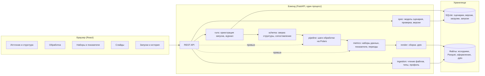
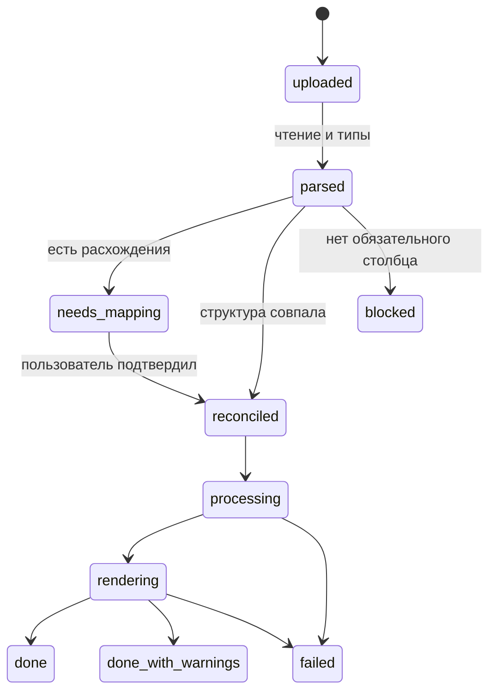
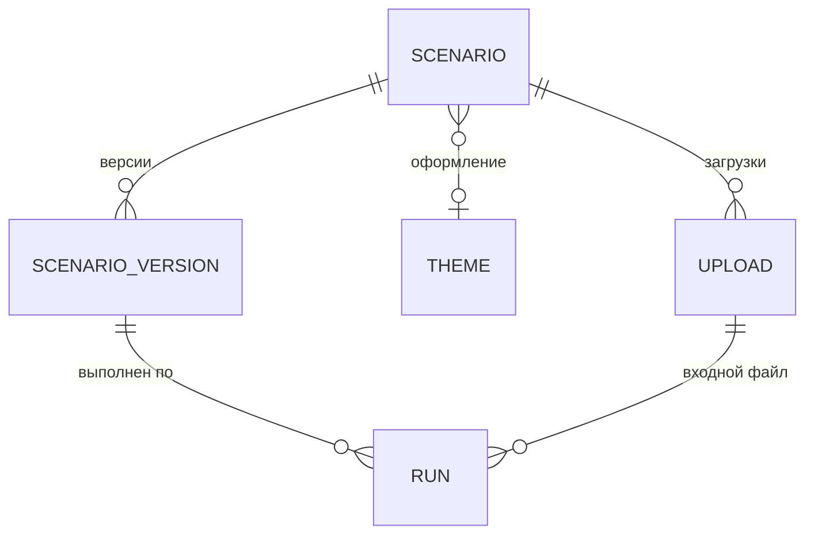

# Архитектура Autogenerator

> **Статус:** черновик v0.1 · **Дата:** 2026-09-29
> **Связанный документ:** [PRD.md](PRD.md). Термины (сценарий, набор данных, показатель, сопоставление и т. д.) определены в разделе 5 PRD.
>
> Решения, помеченные **[ОТКРЫТО №N]**, зависят от уточняющего вопроса N из раздела 11 PRD.

## 1. Принципы

1. **Сценарий — это данные, а не код.** Вся логика пользователя хранится как декларативная JSON-спецификация: структура, шаги обработки, наборы данных, показатели, слайды. Её можно проверить без данных, версионировать, сравнить, перенести и выполнить повторно.
2. **Столбцы адресуются по внутреннему идентификатору, а не по названию.** Каждый столбец сценария получает стабильный `id`. Шаги, наборы и блоки ссылаются только на `id`. Названия из файла связываются с `id` через сопоставление. Переименование столбца в источнике — это одна запись в сопоставлении, а не правка всего сценария.
3. **Один движок для превью и для генерации.** Превью в интерфейсе и итоговая презентация считаются одним и тем же кодом, поэтому числа на экране и в .pptx совпадают.
4. **Предсказуемость.** Нет случайности и скрытой зависимости от текущего времени: относительные периоды считаются от явной точки отсчёта, которая записывается в журнал запуска.
5. **Изоляция ошибок.** Ошибка шага или блока локализуется и попадает в журнал; остальные слайды генерируются.
6. **Простой старт, понятный рост.** MVP — один процесс, SQLite и локальные файлы, без очередей и облака. Границы модулей проведены так, чтобы потом вынести тяжёлую работу в воркеры и перейти на PostgreSQL и S3 без переписывания логики.

## 2. Стек

| Слой | Выбор | Почему | Альтернативы |
|---|---|---|---|
| Бэкенд | Python 3.12, FastAPI, Pydantic v2 | Лучшая экосистема для таблиц и PowerPoint; Pydantic описывает и проверяет спецификацию сценария и отдаёт JSON Schema | Node.js: слабее с данными и диаграммами PowerPoint |
| Обработка данных | Polars (ленивый API) | Быстро на миллионах строк, оптимизатор плана запросов, строгие типы | pandas: привычнее, но медленнее; DuckDB: хорош как второй движок, если понадобится SQL |
| Чтение Excel | Polars `read_excel` на движке calamine (fastexcel); openpyxl для объединённых ячеек | calamine в разы быстрее openpyxl | pandas + openpyxl |
| Чтение CSV | Polars + charset-normalizer (кодировка) + `csv.Sniffer` (разделитель) | Надёжно различает UTF-8 и Windows-1251 | — |
| Сборка .pptx | python-pptx | Создаёт «родные» редактируемые диаграммы PowerPoint с данными внутри, работает с макетами корпоративного шаблона | Aspose (платный); графики картинками (не редактируются) |
| Текст с переменными | Jinja2 в `SandboxedEnvironment` + свои фильтры форматирования на Babel (локаль ru_RU) | Безопасно, привычный синтаксис `{{ }}` | Собственный мини-язык |
| Сопоставление названий | rapidfuzz | Быстрые метрики похожести строк | — |
| Фронтенд | React, TypeScript, Vite, Mantine, TanStack Query, Zustand, dnd-kit | Быстро собирается интерфейс-конструктор с перетаскиванием | Vue, Svelte |
| Таблица превью | AG Grid Community | Виртуальная прокрутка больших таблиц | TanStack Table |
| Графики в превью | Apache ECharts | Все нужные типы графиков, внешне близко к PowerPoint | Recharts |
| Метаданные | SQLite через SQLAlchemy 2 и Alembic | Ноль администрирования для одного пользователя; миграции готовы к переходу на PostgreSQL **[ОТКРЫТО №2]** | PostgreSQL сразу |
| Файлы | Локальный диск за интерфейсом `FileStore` | Позже S3 или MinIO без изменения модулей | — |
| PDF и картинки слайдов | LibreOffice в headless-режиме | Бесплатно, стабильно | — |
| Поставка | Docker Compose; локальный запуск одной командой | **[ОТКРЫТО №3]** | Десктоп-обёртка (Tauri), если нужна программа на компьютере |

## 3. Общая схема



Поток данных при запуске: **файл → ingestion (Parquet + структура) → schema (сверка и сопоставление) → pipeline (обработка) → metrics (наборы и показатели) → render (.pptx) → журнал и история.**

## 4. Модули бэкенда

### 4.1. ingestion: чтение выгрузки

Вход — файл, выход — нормализованная таблица в Parquet и снимок структуры (`SchemaSnapshot`).

1. Формат определяется по сигнатуре файла, а не только по расширению.
2. **CSV:** кодировка через charset-normalizer (приоритет UTF-8, затем Windows-1251), разделитель через `csv.Sniffer` по первым 64 КБ, учёт кавычек.
3. **Excel:** список листов; строка заголовков — первая строка, где большинство ячеек заполнено текстом (порог настраивается, пользователь может указать строку вручную). Склейка многоуровневых шапок из объединённых ячеек — v1 **[ОТКРЫТО №8]**.
4. Все столбцы сначала читаются как текст, затем тип выводится по выборке до 10 тыс. строк с учётом русских форматов: `1 234,56`, `29.09.2026`, `29.09.2026 14:30`, `да`/`нет`. Для Excel даты берутся из типа ячейки.
5. Значения, которые не удалось привести к типу, становятся пустыми, а их число попадает в профиль столбца и в предупреждения.
6. Нормализованная таблица сохраняется в Parquet: все дальнейшие операции работают с ним. Исходный файл хранится для аудита и перечитывания.
7. Профиль столбца: число пустых, число уникальных, минимум и максимум, 10 самых частых значений.

Параметры чтения (лист, строка заголовков, кодировка, разделитель, форматы дат) сохраняются в сценарии в `source.options`, чтобы следующая выгрузка читалась так же.

### 4.2. schema: сверка структуры и сопоставление

Это модуль, который отвечает за сценарий «новая выгрузка с изменённой структурой» **[ОТКРЫТО №1]**.

**Данные.** Снимок структуры файла — список `{source_name, normalized_name, dtype, format, stats}`. Сценарий хранит свои столбцы как `{id, display_name, dtype, aliases[]}`, где `aliases` — все названия из файлов, которые когда-либо сопоставлялись с этим столбцом.

**Нормализация названия:** нижний регистр, обрезка и схлопывание пробелов, `ё → е`, удаление пунктуации.

**Алгоритм `reconcile(scenario, snapshot)`:**

1. Обходом спецификации вычисляется `required` — столбцы, на которые ссылается хотя бы один включённый шаг, набор, показатель или блок. Остальные столбцы сценария не блокируют запуск.
2. Точное совпадение: нормализованное название из файла совпадает с названием или любым из `aliases` столбца сценария.
3. Для несовпавших столбцов ищутся кандидаты среди несопоставленных столбцов файла по оценке
   `score = 0.5 × похожесть_названия + 0.2 × совместимость_типа + 0.3 × похожесть_значений`,
   где похожесть названия — метрики rapidfuzz (Jaro-Winkler, сравнение токенов), похожесть значений — пересечение частых значений для текстовых столбцов и близость диапазонов для чисел и дат.
4. Проверка типов у сопоставленных пар: совпадает, приводится (например, число записано текстом) или несовместим.
5. Итог:
   - `ok` — все обязательные столбцы найдены точно, типы совпадают: запуск идёт сразу;
   - `needs_review` — есть кандидаты или приводимые типы: экран сопоставления, где лучший кандидат уже выбран, а кнопка «Принять все» подтверждает предложения одним кликом;
   - `blocked` — у обязательного столбца нет кандидатов: список зависящих от него шагов и слайдов, запуск не выполняется.
6. После подтверждения новые названия добавляются в `aliases`, и в следующий раз шаг 2 срабатывает сам.

Дополнительно проверяется «дрейф» значений: если в столбце, по которому фильтрует шаг, выбранные значения больше не встречаются или появились новые, запуск получает предупреждение (F-209).

Если окажется, что новые выгрузки бывают совсем другими файлами, этот модуль расширяется сопоставлением по смыслу (описание столбца и примеры значений отдаются LLM, результат всё равно подтверждает пользователь). Остальные модули от этого не меняются, потому что они работают с `id`.

### 4.3. pipeline: движок обработки

Шаг — класс в реестре шагов:

```python
class Step(Protocol):
    type: ClassVar[str]              # "dedupe", "filter", "time_filter", ...
    params: BaseModel                # Pydantic-модель параметров шага

    def columns_used(self) -> set[ColumnId]: ...
    def output_schema(self, schema: Schema) -> Schema: ...   # проверка без данных
    def apply(self, lf: pl.LazyFrame, ctx: RunContext) -> pl.LazyFrame: ...
```

- Перед шагами столбцы переименовываются из названий файла в `id` по сопоставлению; дальше движок видит только `id`. Отображаемые названия подставляются только в интерфейсе и на слайдах.
- Шаги компилируются в один ленивый план Polars; оптимизатор сам отбрасывает неиспользуемые столбцы и переносит фильтры ближе к чтению.
- `output_schema` позволяет проверить сценарий без данных: например, если шаг ссылается на столбец, удалённый предыдущим шагом, редактор сразу показывает ошибку.
- Превью после шага N: план из шагов 1…N, первые 100 строк и отдельный подсчёт строк до и после шага. Для больших файлов промежуточный результат кэшируется в Parquet с ключом `hash(исходный файл, шаги 1…N)`.
- `RunContext` содержит точку отсчёта `anchor_date`, вычисленный период, локаль, идентификатор запуска и накопитель предупреждений.
- Фильтр по времени берёт `anchor_date` из максимальной даты в столбце или из даты запуска (настройка шага) **[ОТКРЫТО №6]**. Вычисленный период доступен тексту слайдов как `{{ period }}`.

| Тип шага | Что делает | Приоритет |
|---|---|---|
| `dedupe` | Удаление дубликатов по столбцам, выбор оставляемой строки | MVP |
| `filter` | Условия по значениям, И / ИЛИ | MVP |
| `time_filter` | Абсолютный или относительный период | MVP |
| `sort` | Сортировка | MVP |
| `select` / `rename` / `cast` | Удаление, переименование, смена типа | MVP |
| `compute` | Вычисляемый столбец по выражению | v1 |
| `fill_null` / `replace_values` / `text_clean` | Очистка значений | v1 |
| `join` | Объединение со справочником **[ОТКРЫТО №9]** | Позже |

Выражения вычисляемых столбцов (v1) пишутся на небольшом безопасном языке (арифметика, сравнения, `если`, функции дат и строк), разбираются парсером (Lark) и компилируются в выражения Polars. `eval` не используется нигде.

### 4.4. metrics: наборы данных и показатели

- **Набор данных** = результат обработки + необязательный фильтр + группировка (столбцы и/или период: день, неделя, месяц, квартал, год) + агрегаты `{column, fn, as}` + сортировка + ограничение (топ-N с «Прочими»).
- **Показатель** = одно число: агрегат по набору или по результату обработки.
- **Сравнение с прошлым периодом** (v1) **[ОТКРЫТО №7]**: набор считается дважды, для периода запуска и для предыдущего периода такой же длины. Показатель получает `value`, `prev`, `delta`, `delta_pct`. Если данных за прошлый период в выгрузке нет, в журнал идёт предупреждение.
- Наборы считаются лениво и кэшируются в рамках запуска: несколько блоков на одном наборе не пересчитывают его.

### 4.5. render: сборка презентации

- **Оформление.** Основа — .pptx-файл: корпоративный шаблон или встроенный нейтральный **[ОТКРЫТО №4]**. При загрузке оформления приложение читает его макеты и плейсхолдеры и предлагает их в конструкторе слайдов.
- **Блоки:**
  - текст — плейсхолдер или текстовое поле; шаблон рендерится Jinja2 в песочнице с контекстом `{metrics, period, scenario, run}` и фильтрами `number`, `percent`, `money`, `date` (Babel, ru_RU);
  - график — `CategoryChartData` и `add_chart` (столбцы, линии, круговая, кольцевая); комбинированный график (v1) собирается правкой XML диаграммы. Цвета серий берутся из темы оформления. Данные диаграммы встраиваются в .pptx, поэтому график редактируется в PowerPoint;
  - таблица — `add_table` с форматами, усечение до N строк с пометкой;
  - KPI-карточка (v1) — группа фигур: число, подпись, стрелка изменения.
- **Размещение.** Блок привязывается к плейсхолдеру макета или к координатам на сетке; конструктор в браузере работает в тех же координатах (пропорции 16:9).
- **Повторяющиеся слайды** (v1) **[ОТКРЫТО №10]**: слайд с `repeat_by: <column_id>` рендерится для каждого значения столбца, а его наборы получают дополнительный фильтр по этому значению.
- **Ошибки.** Если блок не собрался, на слайд ставится заметная пометка «Ошибка: …», а запись уходит в журнал; остальные блоки и слайды продолжают собираться.
- **Превью в конструкторе.** Интерфейс рисует слайд сам (ECharts для графиков, HTML для текста и таблиц) по данным от эндпоинта превью; числа считаются тем же движком, что и при генерации. Точный вид проверяется кнопкой «Собрать пробный .pptx»; в v1 добавляются картинки слайдов через LibreOffice.
- **PDF** (v1): готовый .pptx конвертируется LibreOffice.

### 4.6. runs: запуск



Запуск фиксирует версию сценария, хэш исходного файла, `anchor_date`, применённое сопоставление, число строк после каждого шага, предупреждения и путь к .pptx. Повторный запуск с теми же входами даёт тот же результат.

В MVP запуск выполняется в фоне процесса FastAPI, интерфейс опрашивает статус. Когда понадобится (расписание, несколько пользователей), выполнение переносится в очередь (arq или Celery с Redis) без изменения API.

### 4.7. spec: модель сценария

- Спецификация описана моделями Pydantic; из них генерируется JSON Schema и OpenAPI, а из OpenAPI — типы TypeScript для фронтенда (openapi-typescript).
- Проверка сценария без данных: ссылки на существующие `id`, совместимость типов в шагах, существование наборов и показателей, на которые ссылаются блоки и переменные в тексте.
- Поле `spec_version` и миграции спецификации позволяют менять формат, не ломая сохранённые сценарии.
- Каждое сохранение создаёт неизменяемую версию; сценарий ссылается на текущую.

## 5. Формат сценария (пример)

Еженедельный отчёт по продажам: убрать дубли заказов, оставить положительные суммы за последние 4 недели, показать выручку по неделям и топ-5 регионов.

```json
{
  "spec_version": 1,
  "name": "Еженедельный отчёт по продажам",
  "theme_id": "corporate-2026",
  "source": {
    "format": "xlsx",
    "options": { "sheet": "Продажи", "header_row": 1 },
    "columns": [
      { "id": "c_date",   "display_name": "Дата заказа",  "dtype": "date",   "aliases": ["Дата заказа", "Дата"] },
      { "id": "c_order",  "display_name": "Номер заказа", "dtype": "string", "aliases": ["Номер заказа", "№ заказа"] },
      { "id": "c_region", "display_name": "Регион",       "dtype": "string", "aliases": ["Регион"] },
      { "id": "c_amount", "display_name": "Сумма, ₽",     "dtype": "float",  "aliases": ["Сумма", "Сумма, руб."] }
    ]
  },
  "pipeline": [
    { "id": "s1", "type": "dedupe",      "params": { "by": ["c_order"], "keep": "last" } },
    { "id": "s2", "type": "filter",      "params": { "all": [{ "column": "c_amount", "op": ">", "value": 0 }] } },
    { "id": "s3", "type": "time_filter", "params": { "column": "c_date", "last": 4, "unit": "week", "anchor": "max_in_data" } }
  ],
  "datasets": [
    {
      "id": "by_week",
      "group_by": [{ "column": "c_date", "bucket": "week" }],
      "aggregations": [{ "column": "c_amount", "fn": "sum", "as": "revenue" }],
      "sort": [{ "by": "c_date" }]
    },
    {
      "id": "by_region",
      "group_by": [{ "column": "c_region" }],
      "aggregations": [{ "column": "c_amount", "fn": "sum", "as": "revenue" }],
      "sort": [{ "by": "revenue", "desc": true }],
      "limit": { "top": 5, "others_label": "Прочие" }
    }
  ],
  "metrics": [
    { "id": "revenue_total", "from": "pipeline", "column": "c_amount", "fn": "sum" },
    { "id": "orders",        "from": "pipeline", "column": "c_order",  "fn": "n_unique" }
  ],
  "slides": [
    {
      "layout": "title",
      "blocks": [
        { "type": "text", "slot": "title", "template": "Продажи: {{ period | date_range }}" }
      ]
    },
    {
      "layout": "title_and_two_content",
      "blocks": [
        { "type": "text",  "slot": "title", "template": "Выручка {{ metrics.revenue_total | money }}, заказов {{ metrics.orders | number }}" },
        { "type": "chart", "slot": "left",  "chart": "column", "dataset": "by_week",   "x": "c_date",   "series": ["revenue"], "data_labels": true },
        { "type": "chart", "slot": "right", "chart": "pie",    "dataset": "by_region", "x": "c_region", "series": ["revenue"] }
      ]
    }
  ]
}
```

Пользователь не пишет этот JSON руками: его собирает конструктор. Переменные в тексте вставляются из выпадающего списка с русскими названиями.

## 6. Хранение



| Таблица | Основные поля |
|---|---|
| `scenarios` | `id`, `name`, `current_version_id`, `theme_id`, `created_at` |
| `scenario_versions` | `id`, `scenario_id`, `number`, `spec` (JSON), `comment`, `created_at` |
| `uploads` | `id`, `scenario_id`, `original_name`, `sha256`, `size`, `format`, `raw_path`, `parquet_path`, `schema_snapshot` (JSON), `uploaded_at` |
| `runs` | `id`, `scenario_version_id`, `upload_id`, `status`, `anchor_date`, `mapping` (JSON), `step_stats` (JSON), `warnings` (JSON), `output_path`, `started_at`, `finished_at` |
| `themes` | `id`, `name`, `pptx_path`, `layouts` (JSON) |

Файлы:

```
data/
  uploads/{upload_id}/original.xlsx
  uploads/{upload_id}/data.parquet
  themes/{theme_id}.pptx
  outputs/{run_id}/Отчёт_2026-09-29.pptx
  cache/{hash}.parquet
```

## 7. API (черновик)

| Метод | Путь | Назначение |
|---|---|---|
| POST | `/api/uploads` | Загрузить файл; вернуть `upload_id`, распознанную структуру и превью |
| POST | `/api/uploads/{id}/reparse` | Перечитать с другими параметрами: лист, строка заголовков, кодировка, разделитель |
| GET | `/api/uploads/{id}/profile` | Профиль столбцов |
| POST | `/api/scenarios` | Создать сценарий из загрузки |
| GET / PUT | `/api/scenarios/{id}` | Прочитать / сохранить (сохранение создаёт версию) |
| GET | `/api/scenarios/{id}/versions` | Список версий |
| POST | `/api/preview/validate` | Проверить черновик спецификации без данных |
| POST | `/api/preview/pipeline` | Черновик спецификации, `upload_id`, `until_step` → первые строки и счётчики |
| POST | `/api/preview/dataset` | Данные набора для превью графика или таблицы |
| POST | `/api/preview/slide` | Всё, что нужно интерфейсу, чтобы нарисовать слайд |
| POST | `/api/scenarios/{id}/runs` | Запустить на `upload_id`; вернуть результат сверки структуры |
| POST | `/api/runs/{id}/mapping` | Подтвердить сопоставление и продолжить |
| GET | `/api/runs/{id}` | Статус и журнал |
| GET | `/api/runs/{id}/output` | Скачать .pptx |
| POST | `/api/themes` | Загрузить оформление .pptx |
| GET | `/api/themes/{id}/layouts` | Макеты и плейсхолдеры оформления |

Эндпоинты превью принимают несохранённый черновик сценария в теле запроса, чтобы пользователь видел результат правок до сохранения.

## 8. Фронтенд

| Экран | Что на нём |
|---|---|
| Сценарии | Список, создание, копирование, последний запуск |
| Источник | Загрузка образца, параметры чтения, таблица превью, карточки столбцов (тип, профиль, название) |
| Обработка | Слева список шагов с перетаскиванием и выключателями; справа результат выбранного шага и счётчик «12 480 → 11 902 строк» |
| Наборы и показатели | Конструктор группировок и агрегатов с мини-превью |
| Слайды | Лента слайдов слева, холст 16:9 в центре, свойства блока справа; вставка переменных в текст из списка |
| Запуск | Загрузка новой выгрузки, экран сопоставления («ожидалось» ↔ «в файле», подсказки с уверенностью), прогресс, журнал, скачивание |
| История | Прошлые запуски, повторное скачивание |

Редактируемый сценарий живёт в клиентском хранилище (Zustand) как JSON той же схемы, что и на бэкенде; черновик автосохраняется, кнопка «Сохранить» создаёт версию.

## 9. Безопасность, надёжность, производительность

- **Файлы:** проверка сигнатуры, лимит размера, защита от zip-бомб в .xlsx (лимит распакованного объёма), имена загруженных файлов не используются в путях на диске.
- **Никакого исполнения пользовательского кода:** выражения разбираются собственным парсером, текст рендерится в песочнице Jinja2.
- **Данные не покидают сервер.** Внешние вызовы (например, ИИ) возможны только после явного включения.
- **Доступ:** MVP для одного пользователя слушает только `localhost`. При развёртывании на сервере обязательна авторизация (v1) **[ОТКРЫТО №2]**.
- **Производительность:** ленивый план Polars, Parquet, кэш промежуточных шагов, вывод типов по выборке, превью ограничено 100 строками.

## 10. Тестирование

- Юнит-тесты шагов и агрегатов на маленьких таблицах (pytest; для фильтров и дубликатов — property-based тесты через hypothesis).
- Набор «неудобных» файлов для распознавания: Windows-1251, разделитель `;`, запятая в дробях, пустые строки над шапкой, объединённые ячейки, даты текстом.
- Тесты сверки структуры: переименование, удаление, добавление, перестановка, смена типа.
- «Золотые» тесты генерации: выгрузка + сценарий → .pptx, который читается обратно через python-pptx и сравнивается по содержанию (слайды, тексты, данные диаграмм), а не побайтно.
- Фронтенд: Vitest для логики, Playwright для сквозного сценария «загрузил → настроил → скачал».
- CI в GitHub Actions: ruff, mypy, pytest, eslint, tsc, vitest.

## 11. Структура репозитория (предлагаемая)

```
backend/
  app/
    api/         # роуты FastAPI
    spec/        # модели сценария, проверка, миграции формата
    ingestion/   # чтение CSV и Excel, типы, профиль
    schema/      # сверка структуры, сопоставление
    pipeline/    # реестр шагов, компиляция в Polars
    metrics/     # наборы данных, показатели, периоды
    render/      # python-pptx: макеты, текст, графики, таблицы
    runs/        # оркестрация запусков, журнал
    storage/     # SQLAlchemy, FileStore
  tests/
frontend/
  src/
    api/         # сгенерированные типы и клиент
    features/    # source, pipeline, datasets, slides, runs
    components/
examples/        # образцы выгрузок и сценариев для тестов и демо
PRD.md
ARCHITECTURE.md
docker-compose.yml
```

## 12. Ключевые решения

| № | Решение | Почему | Цена |
|---|---|---|---|
| 1 | Декларативная спецификация вместо кода и формул | Версии, проверка без данных, сопоставление, перенос | Ограниченная выразительность; компенсируется вычисляемыми столбцами |
| 2 | Стабильные `id` столбцов и `aliases` | Устойчивость к переименованиям в источнике | Нужен шаг сопоставления |
| 3 | Polars вместо pandas | Скорость и ленивый план | Менее привычный API; изолирован в модулях pipeline и metrics |
| 4 | «Родные» диаграммы PowerPoint вместо картинок | Графики можно править после генерации | Превью в браузере не совпадает с .pptx до пикселя |
| 5 | SQLite и локальные файлы в MVP | Простота для одного пользователя | Переход на PostgreSQL и S3 при многопользовательском режиме |
| 6 | Модульный монолит | Быстрый старт, один разработчик | Воркеры выделяются позже |

## 13. Развитие после MVP

- **ИИ:** блок «Выводы» (модель получает только агрегаты слайда, а не сырые данные), сопоставление столбцов по смыслу, создание сценария по текстовому описанию **[ОТКРЫТО №1, №5]**.
- **Источники:** базы данных, Google Sheets, API, папка или почта, запуск по расписанию с отправкой результата.
- **Несколько пользователей:** авторизация, роли, PostgreSQL, S3.
- **Экспорт:** PDF, Google Slides.
