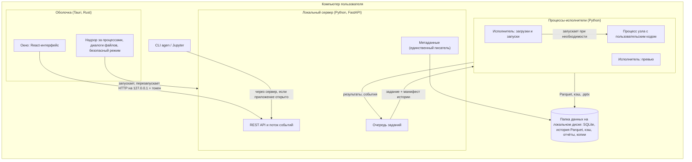
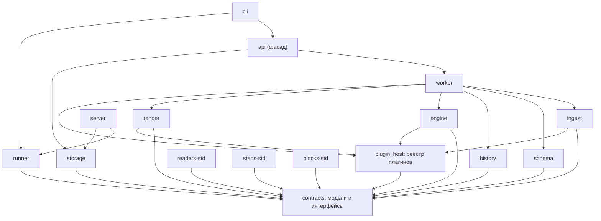
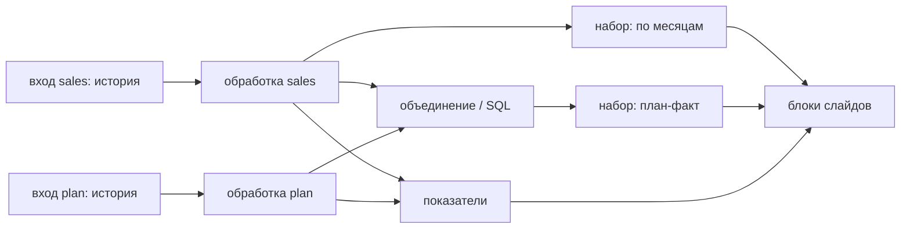
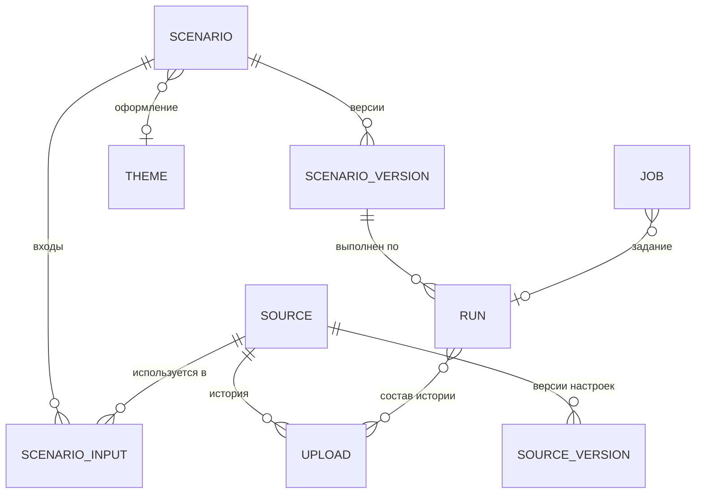

# Архитектура Autogenerator

> **Статус:** черновик v0.3 · **Дата:** 2026-09-29
> **Связанный документ:** [PRD.md](PRD.md). Термины (источник, история, тип периода, отчётный период, окно данных, сценарий, модуль, плагин и т. д.) определены в разделе 6 PRD, принятые решения — в разделе 12 PRD.
>
> Решения, помеченные **[ОТКРЫТО №N]**, зависят от открытого вопроса N из раздела 12.2 PRD.

## 1. Принципы

1. **Модули с контрактами.** Приложение — набор отдельных пакетов с одной задачей у каждого. Пакеты общаются только через общий пакет контрактов (модели данных и интерфейсы) и не знают о внутренностях друг друга. Любой модуль можно прочитать, протестировать и запустить отдельно. Границы проверяются автоматически.
2. **Сбой остаётся на месте.** Ошибка в шаге, плагине, пользовательском коде или модуле обработки ограничивается этим элементом и тем, что от него зависит. Координирующий сервер не загружает код обработки и плагинов, поэтому поломка в них не мешает ему запуститься. Ядро (контракты, сервер, хранилище) защищено тестами, безопасным режимом и откатом.
3. **Сценарий — это данные.** Вся логика отчёта хранится как декларативная спецификация: входы, шаги обработки, наборы данных, показатели, слайды. Её можно проверить без данных, версионировать, положить в git и выполнить повторно.
4. **Конструктор по умолчанию, код по желанию.** Любой элемент сценария (шаг, набор данных, показатель, блок слайда) можно заменить кодом на Python или SQL. Код — ещё один тип элемента в той же спецификации: он получает те же входы и обязан вернуть тот же тип результата.
5. **Столбцы адресуются по стабильному идентификатору.** Каждый столбец источника получает `id` — короткое латинское имя (`amount`, `region`), которое приложение предлагает по названию. Пока у источника нет загрузок, `id` можно поменять; после первой загрузки меняется только отображаемое название. Шаги, наборы, блоки и код ссылаются только на `id`; названия из файла связываются с `id` через сопоставление.
6. **Загрузки неизменяемы, история вычисляется.** Каждая загрузка хранится как есть; «действующая история» вычисляется по списку загрузок и правилам источника. Исключение загрузки полностью обратимо, а любой отчёт можно пересобрать.
7. **Большие таблицы живут на диске.** Чтение CSV потоковое; большие промежуточные результаты передаются между этапами и движками через Parquet на диске; операции, которым нужна вся таблица (удаление дубликатов, сортировка, объединение, оконные функции), на больших входах выполняет DuckDB с выгрузкой на диск. В память, интерфейс и презентацию попадают только агрегаты и выборки. Исключение — лист Excel, который читается в память целиком (раздел 6.1).
8. **Локально сейчас, сервер потом.** Хранилища, очередь заданий, события, кэш и доступ спрятаны за интерфейсами. Для одного пользователя на компьютере работают локальные реализации; для сервера они заменяются, а модули обработки не меняются.

## 2. Процессы и развёртывание

Autogenerator — десктоп-приложение для Windows 10/11 **[ОТКРЫТО №12]**. Внутри это несколько процессов, каждый со своей зоной ответственности:



| Процесс | Что делает | Что происходит при его сбое |
|---|---|---|
| **Оболочка** (Tauri 2) | Окно с интерфейсом (WebView2), нативные диалоги, передача путей перетащенных файлов, открытие готового .pptx, запуск и надзор за сервером, безопасный режим, обновления (v1) | Приложение закрывается; сервер и исполнители завершаются вместе с ним (Windows Job Object); данные не страдают, потому что оболочка их не пишет |
| **Локальный сервер** (Python, FastAPI + Uvicorn) | API для интерфейса, единственный писатель метаданных, очередь заданий, поток событий. Слушает только `127.0.0.1` на случайном порту и принимает запросы с токеном. Не импортирует модули обработки и плагины | Оболочка перезапускает сервер, интерфейс показывает «переподключение»; незавершённые задания помечаются прерванными и могут быть повторены. После нескольких неудачных запусков подряд оболочка включает безопасный режим (раздел 5.3) |
| **Исполнители** (пул Python-процессов) | Всё тяжёлое: чтение файлов, обработка, расчёты, сборка .pptx | Сервер запускает новый исполнитель; задание продолжается с готовых узлов из кэша (раздел 6.4) |
| **Процесс узла с кодом** | Выполнение одного узла с пользовательским кодом (по умолчанию для шагов «Python» в режиме «таблица» и для блоков «Python») | Ошибкой помечается только этот узел и зависимые от него |
| **CLI** `agen` | Запуск сценариев из командной строки и скриптов | Не влияет на приложение |

**Управление процессами в Windows.** Оболочка помещает сервер и все исполнители в Job Object с флагом `KILL_ON_JOB_CLOSE`, поэтому при закрытии или падении оболочки не остаётся «осиротевших» процессов. Лимит памяти каждого исполнителя задаётся тем же механизмом (`JOB_OBJECT_LIMIT_PROCESS_MEMORY`). Сервер дополнительно завершается сам, если пропал родительский процесс, и держит файл блокировки в папке данных: одновременно папкой владеет один сервер, а повторный запуск приложения открывает уже работающее окно.

**Python внутри установщика.** Приложение несёт собственный Python (python-build-standalone) и окружение ядра, собранное uv по lock-файлу; они лежат в ресурсах установщика (`bundle.resources`), а оболочка сама запускает `python.exe` и следит за ним. Системный Python не нужен и не затрагивается. Для работы с движком из своего кода установщик добавляет `agen` в PATH, регистрирует встроенный Python как ядро Jupyter «Autogenerator» и кладёт в папку установки пакеты модулей и файл ограничений версий: `pip install --find-links <папка> autogenerator-api -c constraints.txt`. Для пользовательских пакетов (v1) создаётся отдельный слой окружения с ограничениями версий ядра, поэтому они не могут заменить библиотеки, на которых работает приложение.

**Установщик.** Размер определяется Python-стеком (Polars, DuckDB, pyarrow, pandas): оценка 150–250 МБ. WebView2 ставится в автономном режиме (`offlineInstaller`), чтобы установка работала без интернета. Установщик, лаунчер и `python.exe` подписываются сертификатом подписи кода; на корпоративных машинах с AppLocker предусмотрена установка в Program Files. Обновление (v1) сначала останавливает сервер и исполнители, затем заменяет файлы.

**Папка данных** выбирается пользователем (по умолчанию `%LOCALAPPDATA%\Autogenerator`) и должна быть на локальном диске: сетевые пути отклоняются (SQLite в режиме WAL не работает в сетевых папках), для папок, которые синхронизируют OneDrive, Dropbox или SharePoint, показывается предупреждение. В папке лежат база метаданных, история выгрузок, кэш, временные файлы, готовые отчёты, резервные копии и журналы.

**Серверный режим (позже).** Тот же сервер разворачивается в Docker, интерфейс открывается в браузере, исполнители становятся воркерами очереди, хранилища переключаются на PostgreSQL и S3, включается авторизация (раздел 5.2).

## 3. Стек

| Слой | Выбор | Почему | Альтернативы |
|---|---|---|---|
| Оболочка | Tauri 2 (Rust) | Легче Electron по памяти и месту (на Windows разница небольшая: WebView2 — тоже Chromium); нативные диалоги, событие перетаскивания файлов с путями, механизм обновлений; надзор за процессами на Rust | Electron; pywebview |
| Python-среда | python-build-standalone + uv (workspace, lock-файл) | Воспроизводимая сборка, не зависит от системного Python, позволяет доставлять пакеты | PyInstaller: один файл, но нельзя доставлять пакеты пользователю |
| Бэкенд | Python 3.12, FastAPI, Pydantic v2 | Лучшая экосистема для таблиц и PowerPoint; Pydantic описывает контракты и отдаёт JSON Schema | — |
| Движок обработки | Polars (ленивый API, потоковое выполнение построчных операций) | Быстро на миллионах строк, читает только нужные столбцы и группы строк Parquet | pandas: не рассчитан на данные больше памяти |
| Блокирующие операции и SQL | DuckDB | Полноценный SQL; удаление дубликатов, сортировки, объединения и оконные функции выгружают промежуточные данные на диск при нехватке памяти | Polars: держит состояние таких операций в памяти |
| Единый диалект SQL | DuckDB + sqlglot | Формулы разбираются sqlglot в диалекте DuckDB и переводятся в выражения Polars; то, что переводчик не знает, выполняется в DuckDB. Пользователь видит один диалект | Два диалекта (Polars SQL и DuckDB) |
| Пользовательский код | pandas + pyarrow, Polars | pandas знаком пользователю; Polars — для больших данных | — |
| Чтение CSV | Polars `scan_csv` → порции (`collect_batches`) → `pyarrow.ParquetWriter`; charset-normalizer, `csv.Sniffer` | Файл не загружается в память; прогресс по записанным строкам | — |
| Чтение Excel | fastexcel (calamine) | В разы быстрее openpyxl; объединённые ячейки (v1) — по диапазонам из calamine или разбором `<mergeCells>` листа, openpyxl для больших файлов не используется | openpyxl |
| Хранение истории | Parquet (zstd), разложенный по месяцам столбца периода | Сжатие в 5–10 раз, пропуск ненужных месяцев и групп строк; читают и Polars, и DuckDB | Одна база DuckDB |
| Метаданные | SQLite (режим WAL) через SQLAlchemy 2 и Alembic | Ноль администрирования на компьютере; те же миграции работают на PostgreSQL | — |
| Сборка .pptx | python-pptx | «Родные» редактируемые диаграммы PowerPoint, макеты корпоративного шаблона; тот же API доступен в блоке «Python» | Графики картинками |
| Текст с переменными | Jinja2 в `SandboxedEnvironment` + Babel (ru_RU) | Безопасно, привычный синтаксис | — |
| Разбор кода | `ast` (Python), sqlglot (SQL) | Какие столбцы и входы использует пользовательский код | — |
| Сопоставление названий | rapidfuzz | Быстрые метрики похожести строк | — |
| Плагины | Python entry points + пакет `plugin_host` | Стандартный механизм: плагин — это обычный пакет | pluggy |
| Границы модулей | import-linter в CI | Автоматически запрещает недопустимые импорты между модулями | Ревью вручную |
| Сценарий как текст | YAML (ruamel.yaml) | Читается и правится руками, удобно в git | JSON |
| CLI | Typer | Простой CLI поверх движка | Click |
| Фронтенд | React, TypeScript, Vite, Mantine, TanStack Query, Zustand, dnd-kit | Быстро собирается интерфейс-конструктор | Vue, Svelte |
| Формы параметров | JSON Schema → форма на Mantine (собственный генератор или RJSF с общей темой; выбор — в M2) | Новый шаг из плагина сразу получает форму настройки без правки фронтенда | Ручные формы |
| Редактор кода | Monaco | Python, SQL и YAML с автодополнением `id` столбцов и `ctx` | CodeMirror 6 |
| Таблица и графики превью | AG Grid Community; Apache ECharts рисует готовые настройки графика, которые строит бэкенд | Виртуальная прокрутка; один источник истины для превью | TanStack Table, Recharts |

## 4. Модули и их границы

### 4.1. Карта модулей

Код — монорепозиторий uv workspace. Каждый модуль — отдельный Python-пакет в общем пространстве имён `autogenerator` (например, `autogenerator.ingest`) со своим `pyproject.toml`, README и тестами. `autogenerator` — пространство имён PEP 420: ни один пакет не содержит `autogenerator/__init__.py`. Имя не `autogen`, чтобы не конфликтовать с пакетом Microsoft AutoGen.

Версии: semver есть только у API плагинов в `contracts`; остальные пакеты несут общую версию приложения и поставляются одним установщиком по единому lock-файлу. Модуль разрабатывается, тестируется и заменяется отдельно (раздел 5.3), но пользователю доставляется в составе приложения.



| Модуль | Задача | Вход → выход | Зависит от |
|---|---|---|---|
| `contracts` | Модели спецификаций (источник, сценарий), типы, интерфейсы плагинов, хранилищ, очереди и событий, коды ошибок. Без логики | — | pydantic, pyarrow |
| `plugin_host` | Обнаружение плагинов по entry points, проверка версии API, перехват ошибок загрузки, манифест плагинов | установленные пакеты → реестр + манифест | contracts |
| `ingest` | Хозяин чтения: выбор читателя из реестра, вывод типов, приведение, учёт ошибок приведения, запись Parquet по месяцам, профиль | путь к файлу → Parquet + снимок структуры + отчёт об ошибках | contracts, plugin_host, polars, pyarrow |
| `schema` | Сверка структуры с источником, кандидаты сопоставления | снимок + источник + используемые столбцы + статистика значений → результат сверки | contracts, rapidfuzz |
| `history` | Периоды загрузок, правила пересечения, действующая история, покрытие. Чистые функции над манифестом, без доступа к хранилищу | манифест истории + границы → ленивая таблица | contracts, polars |
| `engine` | Граф сценария, анализ используемых столбцов, выполнение, перевод SQL, окна, наборы, показатели | сценарий + истории входов + отчётный период → наборы и показатели | contracts, plugin_host, polars, duckdb, sqlglot |
| `render` | Хозяин сборки: оформление, размещение, вызов блоков из реестра, превью блоков | слайды + наборы + показатели → .pptx или описание превью | contracts, plugin_host, python-pptx |
| `readers-std` | Плагины CSV и Excel: кодировка, разделитель, строка заголовков, листы | — | contracts, polars, fastexcel, charset-normalizer |
| `steps-std` | Стандартные шаги, окна, агрегаты | — | contracts, polars, duckdb |
| `blocks-std` | Стандартные блоки: текст, график, таблица | — | contracts, python-pptx, jinja2, babel |
| `storage` | Реализации хранилищ: `SqliteMetadataStore`, `LocalBlobStore`, `LocalCacheStore` (позже — PostgreSQL и S3 в отдельных пакетах) | — | contracts, sqlalchemy |
| `runner` | Постановка заданий, локальные реализации `JobQueue`, `EventBus` и `ExecutorBackend` (пул процессов, лимиты, перезапуск) | задание → процесс-исполнитель | contracts |
| `worker` | Код внутри исполнителя: по типу задания лениво импортирует нужные модули и плагины и выполняет их | задание + манифест → результат + события | ingest, schema, history, engine, render, plugin_host |
| `api` | Публичный фасад для Jupyter и своего кода: `load_scenario`, `run` | — | worker, storage |
| `cli` | Команда `agen` | аргументы → задания или прямой вызов `api` | api, runner |
| `server` | FastAPI, единственный писатель метаданных, очередь заданий, SSE, резервные копии, авторизация (позже) | HTTP → задания | contracts, runner, storage |
| `frontend` | Интерфейс | OpenAPI-контракт сервера | — |
| `desktop` | Оболочка Tauri, установщик | — | — |

### 4.2. Правила границ

1. **Модули обработки не знают друг о друге.** `ingest`, `schema`, `history`, `engine`, `render` зависят только от `contracts`, `plugin_host` и сторонних библиотек и не импортируют друг друга. Вместе их собирает только `worker`.
2. **Сервер не загружает обработку.** `server` не импортирует модули обработки и код плагинов; о плагинах он знает только из манифеста. Поэтому ошибка в `render` или в плагине не мешает серверу стартовать и показать её на экране «Модули».
3. **Плагины зависят только от контрактов.** Встроенные плагины разложены по трём пакетам с честными зависимостями, а хозяева (`ingest`, `engine`, `render`) содержат только оркестрацию.
4. **Связь через контракты.** Модули обмениваются Pydantic-моделями, таблицами Arrow и ссылками (URI) на Parquet, описанными в `contracts`. Общих глобальных состояний нет.
5. **Каждый модуль запускается отдельно.** У каждого есть точка входа для отладки без остального приложения: `python -m autogenerator.ingest выгрузка.xlsx`, `python -m autogenerator.engine сценарий.yaml --data папка_с_parquet`, `python -m autogenerator.render слайды.yaml --datasets наборы.parquet`.
6. **Каждый модуль документирован и протестирован сам по себе.** README (назначение, контракт, пример), юнит-тесты и контрактные тесты: эталонные входы и выходы, которые должны сохраняться при любых изменениях внутри модуля.
7. **Заменяемые реализации.** Интерфейсы `MetadataStore`, `BlobStore`, `CacheStore`, `JobQueue`, `EventBus`, `ExecutorBackend` и `AuthProvider` описаны в `contracts`. Реализации хранилищ лежат в `storage`, очереди, событий и пула процессов — в `runner`, авторизации — в `server`.
8. **Один писатель метаданных.** Метаданные пишет только сервер (или CLI, когда приложение закрыто, взяв блокировку папки данных). Исполнители не открывают SQLite: задание приносит им манифест (URI загрузок, периоды, порядковые номера, правила пересечения, версия источника), а результат возвращается серверу, который его фиксирует. Файлы (Parquet, кэш, .pptx) исполнители пишут через `BlobStore` и `CacheStore` с атомарной фиксацией.

Правила 1–3 закреплены в конфигурации import-linter и проверяются в CI.

### 4.3. Плагины

Всё, что можно расширять, устроено как плагины, включая встроенное:

| Точка расширения (entry point) | Что добавляет | Интерфейс |
|---|---|---|
| `autogenerator.readers` | Формат файла | `can_read(path)`, `sniff(path) → ReadOptions`, `batches(path, options) → поток порций Arrow` |
| `autogenerator.steps` | Шаг обработки | `Params` (Pydantic), `type_version`, `migrate_params`, `inputs_used(params)`, `columns_used(params)`, `output_schema`, `row_local` (можно ли протолкнуть фильтр через шаг), `apply(lf, ctx)` |
| `autogenerator.aggregations` | Агрегат для наборов и показателей | выражение Polars и эквивалент на SQL |
| `autogenerator.windows` | Окно данных | `resolve(report_period) → [start, end)` |
| `autogenerator.blocks` | Блок слайда | `Params`, `type_version`, `migrate_params`, `data_needs(params)`, `render(slide, box, data, ctx)`, `preview(data, box, ctx) → PreviewSpec` |
| `autogenerator.exporters` | Формат результата (PDF в v1) | `export(pptx_uri) → uri` |

- **Рёбра графа** `engine` строит только по `inputs_used`, `columns_used` и `data_needs`, поэтому шаги из плагинов (включая объединения и SQL) правильно участвуют в изоляции ошибок.
- **Формы.** Параметры плагина описываются Pydantic-моделью; из неё строится JSON Schema, а по схеме интерфейс рисует форму настройки. Новый шаг из плагина появляется в конструкторе без изменений во фронтенде.
- **Превью блока** строит сам плагин на бэкенде (`preview`): это один из нескольких общих видов — настройки графика ECharts, HTML-таблица, готовый текст, PNG или SVG. Интерфейс умеет рисовать только эти виды, поэтому блок из плагина получает превью без правки фронтенда; блок без превью показывается заглушкой.
- **Версии параметров.** В спецификации каждый узел хранит `type` и `type_version`. При загрузке сценария плагин переводит старые параметры в новые (`migrate_params`); отсутствующий плагин или неудачный перевод — ошибка проверки только этого узла.
- **Обнаружение и изоляция.** `plugin_host` загружает плагины в отдельном коротком процессе с таймаутом и записывает манифест: имя, версия, статус, трассировка ошибки, JSON Schema параметров, виды превью. Сервер, формы и экран «Модули» читают только манифест. Исполнители загружают плагины по одному с перехватом ошибок; сломанный плагин помечается неисправным, узлы, которые его используют, получают ошибку проверки, всё остальное работает.
- **Свой плагин** пользователя (v1) — обычный Python-пакет с entry point, установленный в пользовательский слой окружения.

## 5. Изоляция сбоев, масштабирование, разработка модулей

### 5.1. Уровни изоляции

| Уровень | От чего защищает | Как |
|---|---|---|
| Процессы | Падение или зависание вычислений | Оболочка, сервер и исполнители — разные процессы в одном Job Object; оболочка перезапускает сервер, сервер перезапускает исполнителей |
| Модули обработки | Правка или ошибка в `ingest`, `schema`, `history`, `engine`, `render` | Сервер их не загружает; они работают только в исполнителях; контрактные тесты ловят поломку контракта до выпуска |
| Ядро | Ошибка в `contracts`, `server`, `storage` | Тесты и import-linter до выпуска; в работе — безопасный режим и откат к предыдущей рабочей версии (раздел 5.3) |
| Плагины | Ошибка при загрузке или работе расширения | Обнаружение в отдельном процессе, манифест, изоляция по одному; зависимые узлы получают ошибку, остальные работают |
| Узлы сценария | Ошибка шага, набора, показателя или блока | Граф; ошибка узла помечает только зависимые узлы; готовые узлы берутся из кэша при повторе (раздел 6.4) |
| Пользовательский код | Исключения, бесконечные циклы, нехватка памяти, изменение глобальных настроек | Отдельный процесс узла с таймаутом и лимитом памяти; при превышении завершается только он. Исполнитель, в котором выполнялся пользовательский код, после задания перезапускается, чтобы настройки pandas или Polars не перетекали в следующее задание |
| Окружение Python | Пакет пользователя ломает ядро | Отдельный слой окружения с ограничениями версий ядра |
| Интерфейс | Ошибка на одном экране или в одном блоке превью | Экраны — отдельные лениво загружаемые модули, у каждого экрана и блока своя граница ошибок (error boundary) |
| Данные | Сбой при записи или обновлении | Неизменяемые загрузки; атомарная запись (временный файл + переименование с повторами, если антивирус ненадолго держит файл); SQLite в режиме WAL; резервная копия перед миграцией базы |

### 5.2. Путь масштабирования

| Что | Сейчас (один пользователь, компьютер) | Потом (сервер, много пользователей) | Что меняется |
|---|---|---|---|
| Интерфейс | Окно Tauri | Браузер | Адрес сервера и экран входа; код экранов тот же |
| Сервер | Локальный процесс | Docker, несколько экземпляров за балансировщиком | Конфигурация, реализации `JobQueue` и `EventBus`; прерванными задания помечает только экземпляр-владелец (по сигналу живости) |
| Очередь и события | В процессе сервера | Redis или PostgreSQL; SSE подписывается на общую шину | Реализации `JobQueue`, `EventBus` |
| Вычисления | Пул процессов на компьютере | Воркеры очереди, добавляются горизонтально | Реализация `ExecutorBackend` |
| Метаданные | SQLite | PostgreSQL | Реализация `MetadataStore`; миграции Alembic те же |
| История и файлы | Локальная папка | S3 или MinIO | Реализация `BlobStore`: чтение возвращает URI и параметры доступа, запись — через `put`/`commit` (локально — временный файл и переименование, в S3 — загрузка объекта целиком). Polars и DuckDB читают Parquet из S3 напрямую |
| Кэш узлов | Папка на диске | Общее объектное хранилище | Реализация `CacheStore` |
| Доступ | Без входа | Авторизация, роли, владельцы источников и сценариев | Реализация `AuthProvider`; `workspace_id` есть во всех таблицах верхнего уровня с первого дня |
| Пользовательский код | Отдельный процесс узла с лимитами | Тот же процесс узла, но в песочнице: контейнер без сети, gVisor или nsjail | Реализация запуска процесса узла |
| Плагины и пакеты пользователя | Один слой окружения | Окружение на рабочее пространство или только одобренные администратором плагины | Конфигурация окружений |

Модули обработки работают только с URI и интерфейсами из `contracts`, поэтому при переходе не меняются.

### 5.3. Разработка модулей, безопасный режим и откат

- **Режим разработчика** (MVP). Настройка «Папка с исходниками» или `agen serve --dev` запускает сервер и исполнители из локальной копии репозитория с editable-установкой пакетов. Исполнители перезапускаются при изменении кода модуля. `agen test <модуль>` прогоняет юнит- и контрактные тесты модуля перед применением.
- **Откат.** Предыдущее рабочее окружение и lock-файл сохраняются; вернуться к ним можно одной кнопкой. Перед каждым обновлением и миграцией базы делается резервная копия.
- **Безопасный режим.** Если сервер несколько раз подряд не запускается, оболочка показывает последнюю трассировку и предлагает запуск на предыдущей рабочей версии окружения или без режима разработчика.
- **Кэш и исправления.** Ключ кэша включает версии приложения, плагинов и окружения (раздел 6.4), поэтому после исправления модуля старые результаты не используются.

## 6. Модули подробно

### 6.1. ingest: чтение выгрузки

Вход — путь к файлу, выход — Parquet в папке загрузки, снимок структуры (`SchemaSnapshot`) и отчёт об ошибках приведения. В десктоп-режиме интерфейс передаёт серверу путь к файлу (из события перетаскивания Tauri или нативного диалога), а не содержимое, и файл читается на месте; загрузка содержимого по HTTP нужна только в будущем серверном режиме. Перед загрузкой проверяется свободное место (примерно 3 × размер файла).

1. Формат определяется по сигнатуре файла; чтение делегируется плагину-читателю.
2. **CSV.** Кодировки-кандидаты — UTF-8, UTF-8 с BOM и Windows-1251. UTF-8 проверяется строго по всему файлу во время прохода; при ошибке загрузка останавливается с номером строки и предложением Windows-1251. Файлы в Windows-1251 потоково перекодируются во временный файл в папке данных (потоковый читатель Polars работает только с UTF-8). Разделитель — `csv.Sniffer` по первым 64 КБ.
3. **Excel.** fastexcel читает лист целиком (предел формата — 1 048 576 строк). Пиковая память — порядка 3 × строки × столбцы × 32 байта (1 млн × 30 ≈ 3 ГБ), поэтому Excel читается в отдельном исполнителе с повышенным лимитом памяти и не параллельно с другой загрузкой. Несколько листов одной структуры — одна выгрузка (листы читаются по очереди). Строка заголовков — первая строка, где большинство ячеек заполнено текстом, или указанная пользователем. Склейка многоуровневых шапок — v1.
4. **Вывод типов по выборке:** первые 10 тыс. строк плюс порции из середины и конца файла. Учитываются русские форматы: `1 234,56` (в том числе с неразрывными пробелами U+00A0 и U+202F), `(1 234,56)` для отрицательных, `29.09.2026`, `29.09.2026 14:30`, `31.12.2025 0:00:00`, `да`/`нет`.
5. **Приведение и запись.** Столбцы читаются как текст и приводятся к типам выражениями Polars; план выполняется порциями (`collect_batches`), порции пишутся `pyarrow.ParquetWriter`. Для CSV файл целиком в памяти не бывает; лист Excel после чтения пишется так же порциями.
6. **Контроль ошибок приведения.** После полного прохода для каждого столбца известно число и до 20 примеров значений, которые не удалось привести; исходные строки с ошибками сохраняются в `rejects.parquet` загрузки. Любая ошибка в столбце периода или доля ошибок больше 0,1% в используемом столбце переводит загрузку в `needs_review`: без явного подтверждения она не добавляется в историю.
7. **Раскладка по месяцам.** Данные пишутся в папки по месяцу столбца периода: `uploads/{id}/month=2026-03/part-0.parquet`. Глобальной сортировки нет (она потребовала бы держать весь файл в памяти); внутри месяца сохраняется порядок строк файла. Окна данных пропускают целые месяцы и группы строк по статистике.
8. **Прогресс и отмена.** Для CSV прогресс — число записанных строк относительно оценки (размер файла / средняя длина строки по выборке); при перекодировании — по прочитанным байтам. Для Excel — по этапам: распаковка, чтение листа, запись. Отмена — завершение процесса-исполнителя.
9. **Профиль столбцов** (пустые, уникальные, минимум, максимум, частые значения) сначала считается по выборке, затем уточняется фоновым заданием.

Параметры чтения хранятся в источнике, чтобы следующая выгрузка читалась так же. Исходный файл по умолчанию хранится до следующей загрузки источника, чтобы загрузку можно было перечитать с другими настройками.

### 6.2. schema: сверка структуры и сопоставление

Работает на уровне источника: одно подтверждённое сопоставление действует для всех сценариев этого источника. Сам `schema` не разбирает сценарии: список используемых столбцов ему передаёт `worker`, получив его от `engine.column_usage`.

**Данные.** Снимок структуры файла — список `{source_name, normalized_name, dtype, format, stats}`. Источник хранит столбцы как `{id, name, dtype, aliases[]}`, где `aliases` — все названия, которые когда-либо сопоставлялись с этим столбцом. Нормализация названия: нижний регистр, схлопывание пробелов, `ё → е`, удаление пунктуации.

**Алгоритм `reconcile(source, required, snapshot, value_stats)`:**

1. `required` приходит на вход: для каждого столбца — список узлов всех сценариев источника, которые его используют, и сила связи. Явная связь — параметры шагов (`columns_used`), разбор SQL (sqlglot), объявленные `uses` у кода. Слабая связь — строковые литералы в Python-коде, совпадающие с `id`. Столбец периода обязателен всегда.
2. Точное совпадение по нормализованному названию или любому из `aliases`.
3. Для остальных — кандидаты среди несопоставленных столбцов файла по оценке `0.5 × похожесть_названия + 0.2 × совместимость_типа + 0.3 × похожесть_значений` (rapidfuzz для названий; `value_stats` из истории источника для сравнения значений).
4. Проверка типов: совпадает, приводится или несовместим. Тип сверяется по результату полного приведения (раздел 6.1, п. 6), а не только по выборке.
5. Итог: `ok` — загрузка идёт дальше; `needs_review` — экран сопоставления с лучшими кандидатами и кнопкой «Принять все»; `blocked` — отсутствует столбец с явной связью, выводится список зависящих от него шагов, слайдов и сценариев. Отсутствие столбца только со слабой связью даёт предупреждение, а не блокировку.
6. После подтверждения новые названия добавляются в `aliases`, а настройки источника получают новую версию.

Необязательные отсутствующие столбцы в этой загрузке становятся пустыми. Новые столбцы файла можно одним кликом добавить в источник; в старых загрузках они пустые. Дрейф значений (фильтр больше не находит выбранные значения, появились новые) даёт предупреждение.

### 6.3. history: история выгрузок и периоды

`history` — чистые функции над **манифестом истории**: списком загрузок входа с их URI, периодами, порядковыми номерами, статусами, правилом пересечения и версией источника. Манифест собирает сервер из метаданных и передаёт в задании; сам `history` к хранилищу не обращается.

**Сохранение загрузки.** Столбцы переименовываются в `id`, типы приводятся к типам источника, добавляются служебные столбцы `_upload_id`, `_upload_seq` (порядковый номер загрузки) и `_row` (номер строки в файле). Результат записывается атомарно и больше не меняется. Если позже у столбца меняется тип, приведение выполняется при чтении, а старые загрузки не переписываются.

**Период загрузки** определяется типом периода источника:

| Тип периода | Как определяется период выгрузки |
|---|---|
| Календарный (`day`, `week`, `month`, `quarter`, `year`) | Минимум и максимум дат расширяются до целых единиц: выгрузка с 9 по 31 января — «январь 2026»; план с датами 1 января, 1 февраля и 1 марта при типе `quarter` — «I квартал 2026» |
| Произвольный (`range`) | Диапазон подставляется по минимуму и максимуму дат и подтверждается пользователем при загрузке («3–19 марта 2026») |

Все границы хранятся как полуоткрытые интервалы `[start, end_exclusive)`, где `end_exclusive` — день после последнего дня периода. Это корректно работает и для столбцов с датой и временем: строки последнего дня не теряются и не дублируются. Правила пересечения, покрытие, отчётный период и окна используют этот объявленный период, а не минимум и максимум дат.

**Правило пересечения** — настройка каждого источника:

| Правило | Что происходит, если новая загрузка покрывает уже загруженный период |
|---|---|
| `replace_period` (по умолчанию) | Строки более ранних загрузок с датой внутри периода новой загрузки перестают участвовать в истории. Подходит и для месячных выгрузок, и для перевыгрузки произвольного диапазона |
| `merge_dedupe` | Строки объединяются, дубликаты по ключевым столбцам удаляются, остаётся строка из более новой загрузки |
| `replace_all` | Для накопительных выгрузок: в истории участвует только последняя загрузка |
| `append` | Строки просто добавляются (выгрузки, разбитые на части); если даты новой загрузки уже были загружены, выдаётся предупреждение о возможном двойном учёте |
| `ask` | Приложение спрашивает при каждой загрузке с пересечением |

**Действующая история** вычисляется лениво:

```python
def history_view(manifest, lower=None, upper_exclusive=None) -> pl.LazyFrame:
    pc = manifest.period_column
    parts = []
    for up in manifest.active_uploads:                 # без исключённых, по _upload_seq
        lf = pl.scan_parquet(up.uri, storage_options=manifest.storage_options)
        for later in manifest.overlapping_later(up):    # правило replace_period
            covered = (pl.col(pc) >= later.start) & (pl.col(pc) < later.end_exclusive)
            lf = lf.filter(~covered.fill_null(False))   # строки без даты не теряются молча
        parts.append(lf)
    lf = pl.concat(parts, how="diagonal_relaxed")       # у старых загрузок новые столбцы пустые
    if lower is not None:
        lf = lf.filter(pl.col(pc) >= lower)
    if upper_exclusive is not None:                      # пересборка за прошлый период
        lf = lf.filter(pl.col(pc) < upper_exclusive)
    return lf
```

Раскладка по месяцам и статистика Parquet позволяют пропускать целые месяцы и группы строк, а ленивый план читает только нужные столбцы. Нижнюю границу `lower` передаёт `engine`, когда её можно протолкнуть (раздел 6.4). Когда загрузок становится много, фоновое уплотнение (v1) переписывает их в общий набор по месяцам; результат `history_view` при этом не меняется.

**Покрытие** — шкала периодов загрузок с пропусками и наложениями. Используется на экране истории и для предупреждений о неполных окнах и отстающих источниках. **Отчётный период по умолчанию** — период активной загрузки основного входа с самым поздним `end_exclusive` (а не последней по порядку), поэтому дозагрузка старых или исправленных периодов его не сдвигает.

### 6.4. engine: граф сценария, обработка и расчёты

**Граф.** Сценарий компилируется в направленный граф узлов:



`engine.column_usage(scenario)` по тому же графу возвращает, какие столбцы каких источников используют какие узлы; это нужно сверке структуры (раздел 6.2).

**Единица выполнения и восстановление.**

1. Материализуются (записываются в кэш как Parquet): результат обработки каждого входа, каждое объединение, каждый набор данных и показатель, каждый узел с пользовательским кодом. Шаги внутри обработки одного входа сливаются в один ленивый план и получают общий статус; шаг с пользовательским кодом разрезает обработку на отдельные узлы до и после него. В превью доступна пошаговая отладка.
2. Каждый материализуемый узел получает статус. Ошибка узла помечает только зависимые от него узлы («зависит от шага "net_of_vat", в котором ошибка»); независимые ветви выполняются.
3. Готовые узлы сразу пишутся в кэш. Если исполнитель завершён по таймауту или памяти, `runner` запускает задание заново в новом процессе, берёт готовые узлы из кэша, помечает ошибкой узел, который выполнялся, и зависимые от него, и досчитывает остальное.
4. Узел с пользовательским кодом выполняется в отдельном дочернем процессе (обмен через Parquet); таймаут шага обеспечивается завершением только этого процесса. Для режима «ленивый», где код лишь строит план, отдельный процесс необязателен.

**Выполнение.**

- Построчные операции (чтение, фильтры, формулы, приведение типов, выбор столбцов) Polars выполняет потоково.
- Операции, которым нужна вся таблица (удаление дубликатов, сортировка, объединения, оконные функции, группировка с большим числом ключей), при входе больше порога автоматически выполняются в DuckDB с `memory_limit` и `temp_directory` в папке данных; DuckDB при нехватке памяти выгружает промежуточные данные на диск. Ручной пометки «тяжёлое» нет. Например, `dedupe` с `keep: last` на больших данных: `QUALIFY row_number() OVER (PARTITION BY ключи ORDER BY _upload_seq DESC, _row DESC) = 1`.
- Большие промежуточные результаты передаются между узлами, в кэш и между движками только через Parquet (`sink_parquet` / `COPY … TO`, затем `scan_parquet` / `read_parquet`). Передавать DuckDB ленивый план Polars напрямую нельзя: он материализуется целиком в памяти. `collect()` и обмен через Arrow используются только для агрегатов и выборок до заданного числа строк.
- Число строк после каждого шага считается одним дополнительным проходом с подсчётами, без записи промежуточных таблиц.

**Диапазон чтения истории.** Для каждого входа `engine` вычисляет объединение окон всех наборов и показателей, которые от него зависят (например, `same_period_last_year` требует данных с `P − 12` месяцев). Нижняя граница передаётся в `history_view`, если все шаги до неё построчные (`row_local`). Шаги `dedupe`, `python` и `sql` такую границу не пропускают, поэтому у `dedupe` есть параметр «глубина поиска дубликатов» (N периодов, по умолчанию — вся история). При глубине «вся история» время запуска растёт вместе с историей; журнал запуска показывает, сколько строк истории прочитано.

**Отчётный период.** По умолчанию — самый поздний период основного входа (раздел 6.3); его можно задать вручную. Относительные фильтры по умолчанию отсчитываются от конца отчётного периода; в настройках сценария точку отсчёта можно переключить на дату запуска. История каждого входа обрезается по концу отчётного периода. Для каждого входа проверяется, покрывают ли его данные нужные окна; при нехватке — предупреждение «план загружен по 31 марта, отчётный период — апрель». В текст слайдов период передаётся полями `period.label`, `period.start`, `period.end`, `period.unit`, `period.quarter_label` («I квартал 2026»), `period.year`.

**Единый диалект SQL.** Формулы, условия фильтров, формулы показателей, шаги и наборы на SQL пишутся на диалекте DuckDB. Формулы разбираются sqlglot и переводятся в выражения Polars по таблице функций приложения; если функции нет в таблице, узел выполняется в DuckDB с тем же результатом. Формула проверяется при вводе, автодополнение предлагает функции и столбцы.

**Превью.** На больших данных превью строится по выборке по хешу ключа: берутся строки с `hash(ключ) % K = 0` по всей истории входа в пределах нужных окон. Для обеих сторон объединения используется та же функция, поэтому дубликаты и пары ключей в выборке сохраняются. Предупреждения о пустых окнах, строках без пары и фильтрах без строк по выборке не выдаются. Показатели и наборы для превью слайда считаются точно (только нужные столбцы и окна); если это дольше 2 с, до окончания точного расчёта они показываются с пометкой «≈ по выборке».

| Тип шага | Что делает | Приоритет |
|---|---|---|
| `dedupe` | Удаление дубликатов по столбцам, выбор оставляемой строки, глубина поиска | MVP |
| `filter` | Условия по значениям, И / ИЛИ, или формула на SQL | MVP |
| `time_filter` | Абсолютный или относительный период | MVP |
| `sort` | Сортировка | MVP |
| `select` / `rename` / `cast` | Удаление, переименование, смена типа | MVP |
| `formula` | Вычисляемый столбец по SQL-выражению | MVP |
| `join` | Объединение с другим входом сценария; проверка дублей ключей и строк без пары | MVP |
| `sql` | Запрос в DuckDB; текущая таблица доступна как `data`, другие входы — по своим `id` | MVP |
| `python` | Свой код (ниже) | MVP |
| `date_parts` / `replace_values` / `fill_null` / `text_clean` | Готовые преобразования без формул | v1 |

**Шаг «Python»** имеет три режима:

| Режим | Сигнатура | Когда и ограничения |
|---|---|---|
| `table` | `transform(df: pd.DataFrame или pl.DataFrame, ctx) → DataFrame` | Привычный pandas. В функцию передаются только нужные дальше столбцы и строки нужных окон; преобразование в pandas — с Arrow-типами (`to_pandas(use_pyarrow_extension_array=True)`). Память оценивается как 3 × размер Arrow-таблицы; если оценка больше половины лимита исполнителя, шаг не запускается и предлагаются режимы `lazy`, `batches` или сужение окна |
| `lazy` | `transform(lf: pl.LazyFrame, ctx) → LazyFrame` | Большие данные: код строит ленивый план, выполнение остаётся потоковым |
| `batches` | `transform(batch: pd.DataFrame, ctx) → DataFrame` | Построчные преобразования над порциями. Результат каждой порции приводится к `declared_output`. Группировки, удаление дубликатов и сдвиги внутри порции дают неверный результат — редактор находит такие вызовы разбором кода и предупреждает |

- Столбцы называются по `id` источника. `ctx` даёт `ctx.period`, `ctx.window("previous_period")`, `ctx.warn(...)`, `ctx.columns` (id → название). Вывод `print` попадает в журнал.
- Схема результата определяется прогоном в превью и сохраняется как `declared_output`; следующие шаги проверяются по ней, а при запуске фактический результат сверяется с ней.
- Ошибка показывается с трассировкой и номером строки в редакторе.

**Окна данных** считаются от отчётного периода `P` и его единицы:

| Окно | Отрезок | Пример при `P` = март 2026 | Для произвольного диапазона |
|---|---|---|---|
| `report_period` | `P` | март 2026 | сам диапазон |
| `previous_period` | предыдущая единица | февраль 2026 | диапазон такой же длины сразу перед `P` |
| `same_period_last_year` | `P` год назад | март 2025 | тот же диапазон год назад |
| `quarter_to_date` | с начала квартала по конец `P` | январь–март 2026 | с начала квартала, в который попадает конец `P` |
| `year_to_date` | с начала года по конец `P` | январь–март 2026 | с начала года |
| `last_n(n)` | `n` единиц, заканчивая `P` | `last_n(6)`: октябрь 2025 – март 2026 | `n` диапазонов такой же длины, заканчивая `P` |
| `all` | вся история по конец `P` | — | — |
| `range(a, b)` | произвольный диапазон | — | — |

Для произвольного типа группировка «по периоду» идёт по выбранной в наборе единице (день, неделя, месяц).

- **Набор данных** = вход (или результат объединения) → окно → фильтр → группировка (столбцы и/или период) → агрегаты → сортировка → топ-N. Также: сводная таблица, доля от итога, накопительный итог, ранг, набор на SQL или Python. **Динамика** — набор с окном из нескольких периодов и группировкой по периоду.
- **Показатель** = одно число: агрегат в своём окне или формула из других показателей (`revenue / plan`), вычисляемая тем же движком SQL-выражений. Если показатель не вычисляется (нет данных, деление на пустое значение), он равен пустому значению: текст выводит «нет данных», в журнал идёт предупреждение.
- **Сравнение периодов** — показатели с окнами `previous_period` и `same_period_last_year` и функции `change`, `change_pct` в тексте. Несколько периодов на одном графике — v1.
- В `render` уходят только готовые наборы и показатели, то есть небольшие агрегированные таблицы.

**Кэш узлов.** Ключ — `hash(нормализованное описание узла, ключи входов, манифест истории, отчётный период и окно, версия настроек источника, имя и версия плагина, версия приложения, хэш lock-файла окружения, хэш библиотеки своих функций)`. Узел с пользовательским кодом можно пометить `cache: false` (например, если код читает внешние файлы). Файлы кэша пишутся атомарно; ошибка чтения считается промахом, запись удаляется. Размер кэша ограничен (по умолчанию 20 ГБ или 10% свободного места), старое вытесняется; на экране «Модули» есть кнопка «Очистить кэш».

### 6.5. render: сборка презентации

- **Оформление** — встроенный нейтральный шаблон или корпоративный .pptx **[ОТКРЫТО №13]**. При загрузке оформления читаются его макеты, плейсхолдеры и их геометрия.
- **Блоки** (плагины `autogenerator.blocks`, стандартные — в `blocks-std`):
  - текст — Jinja2 в песочнице с контекстом `{metrics, period, scenario, run}`, фильтрами `number`, `percent` (с `sign=true` добавляет «+» к положительным), `money`, `date` (Babel, ru_RU) и функциями `change`, `change_pct`; пустой показатель, в том числе результат `change_pct` от пустого значения, выводится как «нет данных»;
  - график — «родная» диаграмма PowerPoint (столбцы, линии, круговая, кольцевая). Данные встраиваются, график редактируется в PowerPoint. Если категорий или точек слишком много для читаемого слайда, выдаётся предупреждение с предложением топ-N. Комбинированный график (v1) строится доработкой XML диаграммы (второй `c:lineChart` со своей осью) или по образцу из шаблона, потому что python-pptx не умеет его напрямую;
  - таблица — с форматами и усечением до N строк;
  - KPI-карточка (v1), блок «Python» `render(slide, box, data, ctx)` (v1), картинка из matplotlib или plotly (v1).
- **Размещение.** В плейсхолдеры типа «график» и «таблица» блок вставляется методами `insert_chart` / `insert_table`. Для обычных плейсхолдеров «объект» (макеты «Заголовок и объект», «Два объекта» в большинстве шаблонов) график и таблица добавляются через `shapes.add_chart` / `add_table` по позиции и размеру плейсхолдера, после чего пустой плейсхолдер удаляется. Без плейсхолдера — координаты на сетке 16:9.
- **Повторяющиеся слайды** (v1) — слайд с `repeat_by: <column_id>` рендерится для каждого значения столбца.
- **Ошибка блока** — на слайд ставится пометка «Ошибка: …», запись в журнал; остальные блоки и слайды собираются.
- **Превью** строит сам блок на бэкенде (`preview`, раздел 4.3): текст рендерится тем же Jinja и Babel, геометрия берётся из шаблона. Точная проверка — «Собрать пробный .pptx»; картинки слайдов через LibreOffice — v1.
- **Сохранение результата.** Имя файла очищается от символов `<>:"/\|?*`, завершающих точек и пробелов и зарезервированных имён Windows. Если файл с таким именем открыт в PowerPoint или занят, результат сохраняется рядом как `Отчёт_март_2026 (2).pptx` с записью в журнал; запуск не считается ошибкой.

### 6.6. runner и worker: задания и исполнители

- **Задания:** `ingest` (загрузка файла), `profile` (фоновый профиль), `preview` (узел, набор, слайд), `run` (полный запуск), `discover_plugins` (манифест плагинов), `maintenance` (уплотнение истории, очистка кэша и временных файлов).
- **Пул.** По умолчанию один исполнитель для загрузок и запусков и один для превью. Бюджет памяти — 60% доступной (а не установленной) памяти на момент старта. На Windows лимит памяти каждого процесса задаётся через Job Object; в каждом исполнителе явно выставляются `memory_limit`, `threads` и `temp_directory` для DuckDB и `POLARS_MAX_THREADS` для Polars так, чтобы их сумма не превышала бюджет. Временные файлы Polars и DuckDB лежат в `Autogenerator/tmp` и очищаются при старте.
- **Лимиты.** Таймаут на узел и на задание (по умолчанию 60 с для превью, 30 мин для загрузки и запуска). При превышении процесс завершается; выполнявшийся узел получает ошибку, а задание продолжается в новом процессе с готовыми узлами из кэша. У каждого исполнителя есть предел числа заданий, после которого он перезапускается; исполнитель, в котором выполнялся пользовательский код, перезапускается после задания.
- **События:** прогресс, этапы, предупреждения, вывод кода — через `EventBus` в сервер и дальше в интерфейс.
- **Журнал запуска:** версии сценария, источников, приложения, плагинов и хэш окружения; отчётный период; манифест истории каждого входа; время и число строк по узлам; число прочитанных строк истории; предупреждения; путь к .pptx.

### 6.7. contracts, api и CLI

- Модели источника и сценария — Pydantic; из них генерируются JSON Schema и OpenAPI, из OpenAPI — типы TypeScript (openapi-typescript). JSON Schema подключается к Monaco, поэтому YAML сценария проверяется и дополняется прямо в редакторе.
- Проверка сценария без данных: ссылки на `id`, совместимость типов, существование входов, наборов и показателей, корректность окон, доступность и версии плагинов.
- Миграции формата сценария (`spec_version`) выполняет `engine` при загрузке сценария; параметры узлов переводит сам плагин (`migrate_params`). Каждое сохранение сценария — неизменяемая версия; изменения настроек источника тоже версионируются.
- CLI:
  ```
  agen inspect выгрузка.xlsx                               # структура и профиль
  agen validate сценарий.yaml                              # проверка без данных
  agen run сценарий.yaml --period 2026-03 -o отчёт.pptx    # история из папки данных приложения
  agen run сценарий.yaml --input sales=продажи.csv --input plan=план.xlsx -o отчёт.pptx
  agen test engine                                         # тесты модуля (режим разработчика)
  ```
  Если приложение открыто, CLI работает через его сервер по токену из файла в папке данных, доступного только текущему пользователю. Если приложение закрыто, CLI берёт блокировку папки данных и вызывает движок напрямую через `api`.
- Из Python (v1): `from autogenerator.api import load_scenario, run`.

### 6.8. server: API, метаданные, задания

FastAPI с роутерами по областям (источники, загрузки, сценарии, превью, запуски, модули, система). Сервер — единственный писатель метаданных: принимает результаты заданий от исполнителей и фиксирует их. Хранилища — реализации из `storage`; очередь и события — реализации из `runner`. Поток событий — Server-Sent Events. Резервная копия базы — перед каждой миграцией и по кнопке. Сервер не импортирует модули обработки и плагины.

## 7. Большие данные: сводка мер

| Где | Мера |
|---|---|
| Чтение | CSV — потоково, порциями, без загрузки файла в память; строгая проверка кодировки; Excel — лист целиком в отдельном исполнителе с повышенным лимитом; многолистовые Excel как одна выгрузка |
| Качество | Полный учёт ошибок приведения типов, примеры, отдельный файл отклонённых строк, подтверждение при ошибках |
| Хранение | Parquet с zstd, разложенный по месяцам; уплотнение (v1) |
| Чтение истории | Только нужные столбцы; пропуск месяцев и групп строк вне окон; нижняя граница истории, когда её можно протолкнуть; глубина поиска дубликатов |
| Вычисления | Построчные операции — Polars потоково; удаление дубликатов, сортировки, объединения, оконные функции на больших входах — DuckDB с выгрузкой на диск; обмен большими таблицами через Parquet; режимы `lazy` и `batches` для пользовательского кода |
| Превью | Выборка по хешу ключа, сохраняющая дубликаты и пары; точные показатели для слайдов; кэш узлов на диске |
| Интерфейс и .pptx | Только агрегаты и первые строки; ограничение числа точек на графике |
| Память | Бюджет исполнителей от доступной памяти, лимиты через Job Object, явные настройки DuckDB и Polars |
| Диск | Проверка свободного места перед загрузкой (≈ 3 × размер файла); временные файлы в папке данных с очисткой при старте; кэш не больше 20 ГБ или 10% свободного места; экран истории показывает занимаемое место по источникам |
| Проверка | Генератор синтетических данных: выгрузка на 10 млн строк и история из 5 загрузок по 10 млн строк (50 млн) с повторяющимися между загрузками ключами. Бенчмарк загрузки, превью, удаления дубликатов между загрузками, объединения и полного запуска, с замером пиковой памяти и с включённым Defender |

## 8. Формат (пример)

Ежемесячный отчёт на двух источниках: продажи из CRM (месячные выгрузки) и план продаж (выгрузка раз в квартал, по месяцам и регионам, месяц записан первым числом).

**Источники:**

```yaml
- id: sales_crm
  name: Продажи из CRM
  format: csv
  options: { encoding: cp1251, delimiter: ";" }
  period_column: date
  period_type: month
  overlap_policy: replace_period
  keys: [order_no]
  columns:
    - { id: date,     name: Дата заказа,  dtype: date,   aliases: [Дата заказа, Дата] }
    - { id: order_no, name: Номер заказа, dtype: string, aliases: [Номер заказа, № заказа] }
    - { id: region,   name: Регион,       dtype: string, aliases: [Регион] }
    - { id: amount,   name: "Сумма, ₽",   dtype: float,  aliases: [Сумма, "Сумма, руб."] }

- id: sales_plan
  name: План продаж
  format: xlsx
  options: { sheet: План, header_row: 2 }
  period_column: month
  period_type: quarter
  overlap_policy: replace_period
  columns:
    - { id: month,       name: Месяц,     dtype: date,   aliases: [Месяц] }
    - { id: region,      name: Регион,    dtype: string, aliases: [Регион] }
    - { id: plan_amount, name: "План, ₽", dtype: float,  aliases: ["План, ₽", План] }
```

**Сценарий:**

```yaml
spec_version: 1
name: Ежемесячный отчёт по продажам
theme: corporate-2026

inputs:
  - id: sales
    source: sales_crm
    main: true                       # по нему определяется отчётный период
    pipeline:
      - { id: dedupe_orders, type: dedupe, type_version: 1, by: [order_no], keep: last }
      - { id: positive_only, type: filter, type_version: 1, where: "amount > 0" }
      - id: net_of_vat
        type: python
        type_version: 1
        mode: lazy                   # подходит для миллионов строк
        code: |
          import polars as pl
          def transform(lf, ctx):
              return lf.with_columns(amount_net=pl.col("amount") / 1.2)
  - id: plan
    source: sales_plan

datasets:
  - id: by_month
    input: sales
    window: quarter_to_date          # динамика за квартал
    group_by: [{ column: date, bucket: month }]
    aggregate: [{ column: amount_net, fn: sum, as: revenue }]
  - id: plan_fact
    type: sql
    window: report_period            # окно применяется к обоим входам до запроса
    query: |
      WITH f AS (SELECT region, SUM(amount_net) AS fact FROM sales GROUP BY region),
           p AS (SELECT region, SUM(plan_amount) AS plan FROM plan GROUP BY region)
      SELECT f.region, f.fact, p.plan, f.fact / p.plan AS done
      FROM f LEFT JOIN p USING (region)
      ORDER BY done DESC NULLS LAST

metrics:
  - { id: revenue,      input: sales, window: report_period,   column: amount_net,  fn: sum }
  - { id: revenue_prev, input: sales, window: previous_period, column: amount_net,  fn: sum }
  - { id: plan,         input: plan,  window: report_period,   column: plan_amount, fn: sum }
  - { id: plan_done,    formula: "revenue / plan" }

slides:
  - layout: title
    blocks:
      - { type: text, slot: title, text: "Продажи: {{ period.label }}" }

  - layout: title_and_content
    blocks:
      - { type: text,  slot: title, text: "Динамика за {{ period.quarter_label }}" }
      - { type: chart, slot: body, chart: column, dataset: by_month, x: date, series: [revenue], data_labels: true }

  - layout: title_and_two_content
    blocks:
      - type: text
        slot: title
        text: >-
          Выручка {{ metrics.revenue | money }}
          ({{ change_pct(metrics.revenue, metrics.revenue_prev) | percent(sign=true) }} к прошлому месяцу),
          план выполнен на {{ metrics.plan_done | percent }}
      - { type: table, slot: left,  dataset: plan_fact, columns: [region, fact, plan, done] }
      - { type: chart, slot: right, chart: bar, dataset: plan_fact, x: region, series: [fact, plan] }
```

При загрузке мартовских продаж отчётный период — март 2026: второй слайд показывает динамику январь–март из трёх месячных загрузок, третий — март против февраля и против плана. Если бы план был загружен только по февраль, в журнале появилось бы предупреждение, таблица план-факт показала бы факт по регионам с пустым планом, а показатель `plan_done` вывелся бы как «нет данных».

Пользователь не обязан писать этот YAML руками: его собирает конструктор. Но его можно открыть, поправить, положить в git и запустить из командной строки.

## 9. Хранение



| Таблица | Основные поля |
|---|---|
| `sources` | `id`, `workspace_id`, `owner_id`, `name`, `current_version_id`, `created_at` |
| `source_versions` | `id`, `source_id`, `number`, `spec` (JSON: столбцы, `aliases`, параметры чтения, столбец и тип периода, ключи, правило пересечения), `created_at` |
| `uploads` | `id`, `source_id`, `seq`, `original_name`, `sha256`, `size`, `format`, `raw_uri` (хранится до следующей загрузки), `data_uri`, `rejects_uri`, `schema_snapshot` (JSON), `cast_report` (JSON), `mapping` (JSON), `period_start`, `period_end_exclusive`, `period_unit`, `period_label`, `rows`, `status` (активна / исключена / на проверке), `uploaded_at` |
| `scenarios` | `id`, `workspace_id`, `owner_id`, `name`, `current_version_id`, `theme_id`, `created_at` |
| `scenario_inputs` | `scenario_id`, `input_id`, `source_id`, `is_main` |
| `scenario_versions` | `id`, `scenario_id`, `number`, `spec` (JSON), `comment`, `created_at` |
| `runs` | `id`, `scenario_version_id`, `report_period`, `source_versions` (JSON), `inputs_history` (JSON: манифест по каждому входу), `app_version`, `plugin_versions` (JSON), `env_lock_hash`, `status`, `node_stats` (JSON), `warnings` (JSON), `output_uri`, `started_at`, `finished_at` |
| `jobs` | `id`, `workspace_id`, `type`, `status`, `progress`, `payload` (JSON), `error`, `owner_instance`, `heartbeat_at`, `created_at`, `finished_at` |
| `themes` | `id`, `workspace_id`, `name`, `pptx_uri`, `layouts` (JSON) |

`uploads` и `runs` наследуют рабочее пространство через источник и сценарий.

Папка данных:

```
Autogenerator/
  db/autogenerator.sqlite
  {workspace_id}/sources/{source_id}/uploads/{upload_id}/month=2026-03/part-0.parquet
  {workspace_id}/sources/{source_id}/uploads/{upload_id}/rejects.parquet
  {workspace_id}/sources/{source_id}/uploads/{upload_id}/original.csv   # до следующей загрузки
  {workspace_id}/themes/{theme_id}.pptx
  {workspace_id}/outputs/{run_id}/Отчёт_март_2026.pptx
  cache/  tmp/  backups/  logs/  server.lock  cli.token
```

## 10. API (черновик)

| Метод | Путь | Назначение |
|---|---|---|
| POST | `/api/sources` | Создать источник из образца выгрузки |
| GET / PUT | `/api/sources/{id}` | Структура, параметры чтения, столбец и тип периода, правило пересечения (сохранение создаёт версию) |
| POST | `/api/sources/{id}/uploads` | Добавить один или несколько файлов по путям (задание `ingest`); результат — структура, сверка, период, отчёт об ошибках приведения. В серверном режиме — загрузка содержимого |
| POST | `/api/uploads/{id}/reparse` | Перечитать с другими параметрами (пока хранится исходный файл) |
| POST | `/api/uploads/{id}/confirm` | Подтвердить сопоставление, период и ошибки приведения, добавить в историю, при желании запустить сценарии |
| PATCH / DELETE | `/api/uploads/{id}` | Исключить из истории, вернуть, удалить |
| GET | `/api/sources/{id}/history` | Загрузки, шкала покрытия, занимаемое место |
| POST | `/api/scenarios` | Создать сценарий на источниках |
| GET / PUT | `/api/scenarios/{id}` | Прочитать / сохранить (сохранение создаёт версию) |
| GET | `/api/scenarios/{id}/versions` | Версии |
| GET / PUT | `/api/scenarios/{id}/yaml` | Сценарий как текст |
| POST | `/api/preview/validate` | Проверить черновик без данных |
| POST | `/api/preview/node` | Черновик, отчётный период, узел → первые строки, оценки счётчиков, статус, вывод кода |
| POST | `/api/preview/slide` | Описания превью блоков слайда |
| POST | `/api/scenarios/{id}/runs` | Запуск за отчётный период (по умолчанию — по основному входу) |
| GET | `/api/runs/{id}` · `/api/runs/{id}/output` | Статус и журнал · готовый файл |
| GET | `/api/jobs/{id}` · `/api/events` | Статус задания · поток событий (SSE) |
| GET | `/api/modules` · POST `/api/modules/cache/clear` | Манифест модулей и плагинов · очистка кэша |
| POST | `/api/themes` · GET `/api/themes/{id}/layouts` | Оформление |
| POST | `/api/system/backup` · `/api/system/rollback` | Резервная копия · откат к предыдущей рабочей версии |

Эндпоинты превью принимают несохранённый черновик, чтобы результат правок был виден до сохранения.

## 11. Фронтенд

Интерфейс разбит на функциональные модули (`features/*`), каждый — отдельный лениво загружаемый раздел со своей границей ошибок: сбой в одном разделе не ломает остальные. Во время разработки (до этапа M4) интерфейс открывается как локальное веб-приложение; в релизе — в окне Tauri.

| Раздел | Что в нём |
|---|---|
| Источники | Список источников; история загрузок, шкала покрытия, занимаемое место, добавление файлов (в том числе пачкой, перетаскиванием) с прогрессом и отменой |
| Структура источника | Параметры чтения, превью, карточки столбцов (тип, профиль, название, `id`), столбец и тип периода, ключи, правило пересечения |
| Проверка загрузки | Сопоставление («ожидалось» ↔ «в файле», подсказки с уверенностью, «Принять все»), подтверждение периода, ошибки приведения типов с примерами |
| Сценарии | Список, создание на источниках, выбор основного источника, копирование |
| Обработка | По вкладке на вход; список шагов с перетаскиванием и выключателями; результат выбранного шага и счётчик «≈ 12,5 млн → ≈ 11,9 млн строк (оценка по выборке; точные числа — после фонового подсчёта)». Формы шагов строятся по JSON Schema; шаги «Python» и «SQL» открывают Monaco |
| Наборы и показатели | Окна, группировки, агрегаты, сводные, SQL и Python-наборы с мини-превью |
| Слайды | Лента слайдов, холст 16:9, свойства блока, выбор отчётного периода для превью, вставка переменных. Блоки рисуются по описаниям превью с бэкенда |
| Код сценария | YAML в Monaco с проверкой по схеме; просмотр в MVP, правка в v1 |
| Запуски | Запуск за выбранный период, прогресс, журнал с выводом кода, открытие результата, история |
| Модули | Модули и плагины, версии, состояние, текст ошибок, очистка кэша, режим разработчика, откат |

Редактируемый сценарий живёт в клиентском хранилище (Zustand) как JSON той же схемы, что и на бэкенде; черновик автосохраняется, «Сохранить» создаёт версию.

## 12. Безопасность и приватность

- Локальный сервер слушает только `127.0.0.1` на случайном порту. Токен выдаёт оболочка при запуске: в REST он передаётся заголовком, в поток событий `/api/events` — параметром запроса или cookie (браузерный EventSource не умеет заголовки). Для CLI токен записывается в файл в папке данных, доступный только текущему пользователю. CORS разрешён только для origin оболочки.
- Файлы: проверка сигнатуры; защита от zip-бомб в .xlsx по коэффициенту сжатия (больше 100:1) и по абсолютному пределу не меньше 4 ГБ распакованного XML, чтобы не отклонять настоящий лист на миллион строк; имена файлов не используются в путях на диске.
- Код пользователя исполняется только в исполнителях и процессах узлов с лимитами. Формулы и текстовые шаблоны произвольный Python не исполняют: SQL разбирается sqlglot, текст рендерится в песочнице Jinja2.
- Данные не покидают компьютер; внешние вызовы (например, ИИ) — только после явного включения.
- Серверный режим (позже): авторизация, роли, песочница для процессов узлов с кодом, шифрование соединений.

## 13. Тестирование

- **По модулям:** юнит-тесты и контрактные тесты (эталонные входы и выходы) у каждого пакета; модуль тестируется без остальных; `agen test <модуль>`.
- **Границы:** import-linter в CI, включая правило «сервер не импортирует модули обработки и плагины».
- **Плагины:** совместимость встроенных плагинов с текущей версией контрактов; сломанный плагин не мешает остальным и серверу; перевод старых параметров (`migrate_params`).
- **Изоляция сбоев:** исключение в шаге, бесконечный цикл, нехватка памяти, убитый исполнитель посреди запуска (задание продолжается с кэша), упавший сервер (не остаётся живых исполнителей), ошибка импорта в `render` (сервер стартует и показывает ошибку), пользовательский код, меняющий настройки pandas или Polars (не влияет на следующее задание), безопасный режим и откат.
- **История и периоды:** пересечения по каждому правилу; календарные и произвольные типы периода; план, датированный первым числом месяца; месяц без данных в крайние дни; столбец периода с датой и временем; пустые даты; дозагрузка старых периодов после новых (отчётный период не сдвигается); исключение и возврат загрузки; разная структура старых и новых загрузок; несколько источников с разными датами; пересборка за прошлый период.
- **Распознавание:** набор «неудобных» файлов: Windows-1251, смена кодировки в середине файла, `;`, запятая в дробях, неразрывные пробелы, отрицательные в скобках, пустые строки над шапкой, объединённые ячейки, даты текстом, формат, который меняется в конце файла (ошибки приведения видны и требуют подтверждения).
- **Windows:** пути и имена файлов с кириллицей и пробелами, профиль пользователя с кириллическим именем, длинные пути, выходной файл открыт в PowerPoint, входной файл открыт в Excel, папка данных в OneDrive (предупреждение), сетевая папка (отказ), второй экземпляр приложения.
- **Большие данные:** бенчмарки из раздела 7 с порогами из раздела 9 PRD, с замером пиковой памяти и с включённым Defender; корректность выборки для превью (дубликаты и пары ключей сохраняются).
- **Сквозные:** «золотые» тесты генерации (история + сценарий + период → .pptx, сравнение по содержанию через python-pptx), те же тесты через CLI; Playwright для сценария «загрузил три месяца → настроил → получил отчёт»; сборка установщика и проверка установки и запуска на Windows с включёнными SmartScreen и Defender.
- **CI:** GitHub Actions: ruff, mypy, pytest по пакетам, import-linter, eslint, tsc, vitest, сборка Tauri, бенчмарки.

## 14. Структура репозитория

```
packages/
  contracts/        # autogenerator.contracts — модели, интерфейсы, версия API плагинов
  plugin_host/      # autogenerator.plugin_host — реестр, обнаружение, манифест
  ingest/           # autogenerator.ingest
  schema/           # autogenerator.schema
  history/          # autogenerator.history
  engine/           # autogenerator.engine
  render/           # autogenerator.render
  readers-std/      # autogenerator.readers_std — CSV, Excel
  steps-std/        # autogenerator.steps_std — шаги, окна, агрегаты
  blocks-std/       # autogenerator.blocks_std — текст, график, таблица
  storage/          # autogenerator.storage — SQLite, локальные файлы и кэш
  runner/           # autogenerator.runner — очередь, события, пул процессов
  worker/           # autogenerator.worker — код исполнителей
  api/              # autogenerator.api — фасад для Jupyter и своего кода
  cli/              # autogenerator.cli — команда agen
  server/           # autogenerator.server — FastAPI, метаданные, SSE, резервные копии
frontend/
  src/app/          # каркас, маршруты, границы ошибок
  src/features/     # sources, history, upload-review, scenarios, pipeline, datasets, slides, code, runs, modules
  src/shared/       # сгенерированный API-клиент, общие компоненты
desktop/            # Tauri: окно, надзор за процессами, Job Object, безопасный режим, установщик
tools/              # генератор больших тестовых данных, бенчмарки
examples/           # образцы выгрузок за несколько месяцев и сценарии
pyproject.toml      # uv workspace
.importlinter       # правила границ модулей
PRD.md
ARCHITECTURE.md
```

## 15. Ключевые решения

| № | Решение | Почему | Цена |
|---|---|---|---|
| 1 | Модули — отдельные пакеты с общими контрактами, границы проверяет import-linter | Можно разбираться, менять и тестировать по одному | Больше шаблонного кода |
| 2 | Сервер не загружает обработку и плагины; обработка — только в исполнителях | Ошибка в модуле обработки или плагине не мешает приложению запуститься | Манифест плагинов вместо прямого импорта |
| 3 | Плагины через entry points и `plugin_host`, встроенное тоже плагин | Расширение без правки ядра; сбой плагина локален | Интерфейсы плагинов нужно держать стабильными и версионировать параметры |
| 4 | Десктоп: Tauri + локальный Python-сервер + исполнители в одном Job Object | Изоляция процессов, нет «осиротевших» процессов, тот же сервер потом работает на сервере | Сборка из двух экосистем (Rust и Python) |
| 5 | Сценарий как граф с материализацией узлов и восстановлением с кэша | Ошибка одного узла не валит отчёт; падение процесса не теряет готовое | Запись промежуточных результатов на диск |
| 6 | Декларативная спецификация с кодом как типом элемента | Версии, git, проверка без данных, нет потолка возможностей | Код проверяется только прогоном |
| 7 | Стабильные `id` столбцов и `aliases`; `id` неизменен после первой загрузки | Устойчивость к переименованиям; читаемые имена в коде | Нужен шаг сопоставления |
| 8 | Неизменяемые загрузки, тип периода источника, полуоткрытые интервалы | Обратимость, правильные периоды, пересборка за любой период | Правила пересечения применяются при чтении |
| 9 | Polars для построчных операций + DuckDB для блокирующих операций и SQL; обмен большими таблицами через Parquet | Миллионы строк на ноутбуке; SQL для аналитика; один диалект | Два движка; запись промежуточных данных на диск |
| 10 | Интерфейсы хранилищ, очереди, событий, кэша, исполнителей и доступа с первого дня; один писатель метаданных | Масштабирование заменой реализаций; нет гонок в SQLite | Небольшая лишняя абстракция в MVP |
| 11 | Сначала движок и CLI (M0–M3), десктоп-оболочка и установщик — в M4 | Раньше получаем работающие отчёты; меньше риска | Интерфейс до M4 — локальное веб-приложение |
| 12 | «Родные» диаграммы PowerPoint | Графики можно править после генерации | Превью — приближение, точная проверка через пробный .pptx |
| 13 | Пространство имён `autogenerator` (PEP 420), фасад `autogenerator.api`, команда `agen` | Нет конфликта с пакетом Microsoft AutoGen; понятная точка входа | Длиннее импорт |

## 16. Развитие после MVP

- **ИИ** отдельным модулем: блок «Выводы» (модель получает только агрегаты), сопоставление столбцов по смыслу, помощь в написании шагов.
- **Источники:** базы данных, Google Sheets, API, папка или почта, запуск по расписанию с отправкой результата.
- **История:** срок хранения, архив, уплотнение; точный повтор прошлого запуска с тем же составом загрузок (F-609b) — `history_view` по списку загрузок из `runs.inputs_history`.
- **Серверный режим и несколько пользователей** (раздел 5.2).
- **Платформы:** macOS **[ОТКРЫТО №12]**.
- **Экспорт:** PDF (v1), Google Slides.
