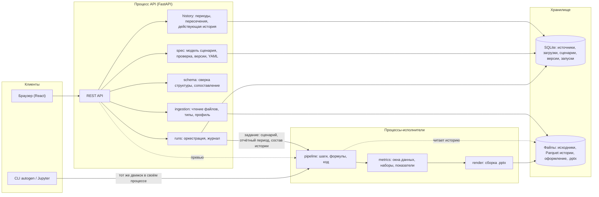
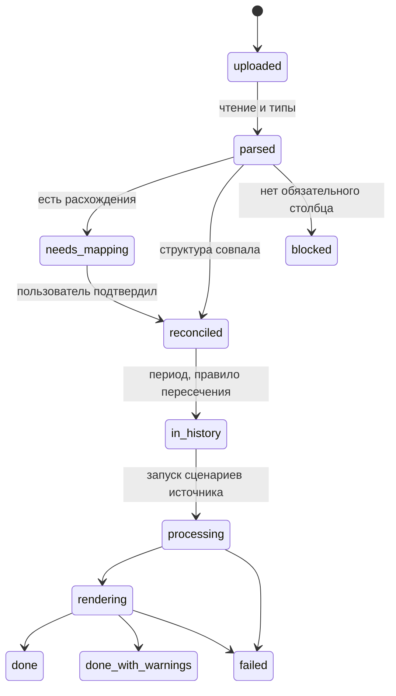
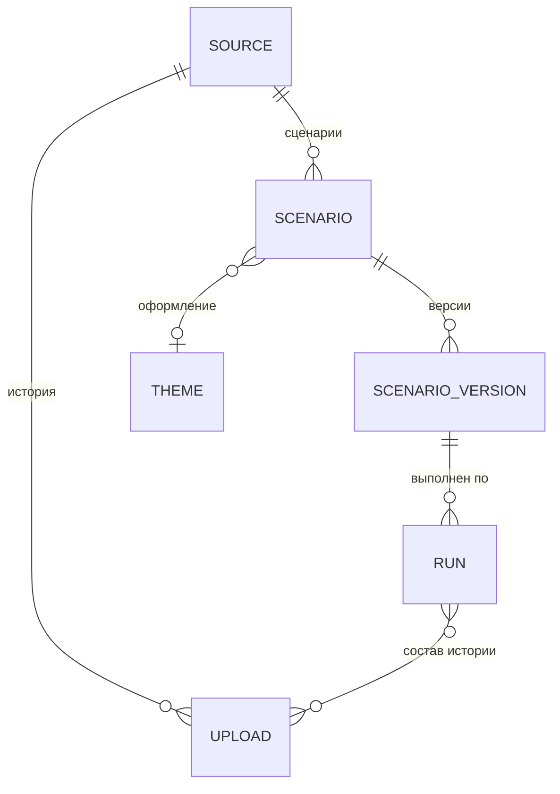

# Архитектура Autogenerator

> **Статус:** черновик v0.2 · **Дата:** 2026-09-29
> **Связанный документ:** [PRD.md](PRD.md). Термины (источник, история, отчётный период, окно данных, сценарий, сопоставление и т. д.) определены в разделе 5 PRD.
>
> Решения, помеченные **[ОТКРЫТО №N]**, зависят от уточняющего вопроса N из раздела 11 PRD.

## 1. Принципы

1. **Сценарий — это данные.** Вся логика отчёта хранится как декларативная спецификация: шаги обработки, наборы данных, показатели, слайды. Её можно проверить без данных, версионировать, сравнить, положить в git и выполнить повторно.
2. **Конструктор по умолчанию, код по желанию.** Любой элемент сценария (шаг, набор данных, показатель, блок слайда) можно заменить кодом на Python. Код — не обход принципа 1, а ещё один тип элемента: его текст хранится в спецификации рядом с визуальными шагами, получает те же входы и обязан вернуть тот же тип результата. Поэтому превью, журнал, сверка структуры и запуск работают одинаково для кода и для конструктора.
3. **Столбцы адресуются по стабильному идентификатору, а не по названию.** Каждый столбец источника получает `id` — короткое латинское имя (`amount`, `region`), которое приложение предлагает по названию, а пользователь может поменять при настройке. Шаги, наборы, блоки и пользовательский код ссылаются только на `id`. Названия из файла связываются с `id` через сопоставление, поэтому переименование столбца в выгрузке — это одна запись в сопоставлении, а не правка сценария.
4. **Загрузки неизменяемы, история вычисляется.** Каждая загрузка хранится как есть. «Действующая история» (что заменено, что исключено) вычисляется по списку загрузок и правилам источника, поэтому удаление или исключение загрузки полностью обратимо, а любой отчёт можно пересобрать.
5. **Один движок для превью, генерации и командной строки.** Превью в интерфейсе, итоговая презентация и запуск из CLI считаются одним и тем же кодом, поэтому числа везде совпадают.
6. **Предсказуемость.** Нет скрытой зависимости от текущего времени: окна данных считаются от явного отчётного периода, который вместе с составом истории записывается в журнал запуска.
7. **Изоляция ошибок.** Ошибка шага, блока или пользовательского кода локализуется и попадает в журнал; остальные слайды генерируются, а приложение не падает.
8. **Простой старт, понятный рост.** MVP — один сервер, процессы-исполнители рядом с ним, SQLite и локальные файлы, без очередей и облака. Границы модулей проведены так, чтобы потом вынести исполнителей в очередь и перейти на PostgreSQL и S3 без переписывания логики.

## 2. Стек

| Слой | Выбор | Почему | Альтернативы |
|---|---|---|---|
| Бэкенд | Python 3.12, FastAPI, Pydantic v2 | Лучшая экосистема для таблиц и PowerPoint; Pydantic описывает и проверяет спецификацию и отдаёт JSON Schema | Node.js: слабее с данными и диаграммами PowerPoint |
| Движок обработки | Polars (ленивый API) | Быстро на миллионах строк, ленивое чтение многих Parquet-файлов истории, оптимизатор плана | pandas: привычнее, но медленнее на истории; DuckDB: хорош как второй движок для SQL |
| Пользовательский код | pandas + pyarrow (по умолчанию), Polars по выбору | pandas знаком пользователю; обмен с движком через Arrow без копирования больших объёмов | — |
| Формулы | SQL-выражения, переводятся в Polars через `pl.sql_expr` | Знакомый синтаксис (`amount * 1.2`, `CASE WHEN … END`), не нужен свой парсер, произвольный Python не исполняется | Свой мини-язык |
| Шаг «SQL» (v1) | DuckDB поверх Arrow-таблицы | Полноценный SQL с оконными функциями | Polars SQL |
| Чтение Excel | Polars `read_excel` на движке calamine (fastexcel); openpyxl для объединённых ячеек | calamine в разы быстрее openpyxl | pandas + openpyxl |
| Чтение CSV | Polars + charset-normalizer (кодировка) + `csv.Sniffer` (разделитель) | Надёжно различает UTF-8 и Windows-1251 | — |
| Сборка .pptx | python-pptx | «Родные» редактируемые диаграммы PowerPoint с данными внутри; работа с макетами корпоративного шаблона; тот же API доступен пользователю в блоке «Python» | Aspose (платный); графики картинками (не редактируются) |
| Графики из кода (v1) | matplotlib, plotly + kaleido | Нестандартные графики вставляются изображением | — |
| Текст с переменными | Jinja2 в `SandboxedEnvironment` + фильтры форматирования на Babel (ru_RU) | Безопасно, привычный синтаксис `{{ }}` и `` | Собственный мини-язык |
| Сопоставление названий | rapidfuzz | Быстрые метрики похожести строк | — |
| Сценарий как текст | YAML (ruamel.yaml, с сохранением комментариев и порядка) | Читается и правится руками, удобно в git | JSON |
| Командная строка | Typer | Простой CLI поверх того же движка | Click |
| Фронтенд | React, TypeScript, Vite, Mantine, TanStack Query, Zustand, dnd-kit | Быстро собирается интерфейс-конструктор с перетаскиванием | Vue, Svelte |
| Редактор кода | Monaco | Подсветка Python, SQL и YAML, автодополнение имён столбцов и `ctx` | CodeMirror 6 |
| Таблица превью | AG Grid Community | Виртуальная прокрутка больших таблиц | TanStack Table |
| Графики в превью | Apache ECharts | Все нужные типы графиков, внешне близко к PowerPoint | Recharts |
| Метаданные | SQLite через SQLAlchemy 2 и Alembic | Ноль администрирования для одного пользователя; миграции готовы к PostgreSQL **[ОТКРЫТО №2]** | PostgreSQL сразу |
| Данные истории | Parquet-файл на каждую загрузку, за интерфейсом `FileStore` | Неизменяемые загрузки, ленивое чтение, позже S3 или MinIO | Одна таблица в DuckDB |
| PDF и картинки слайдов | LibreOffice в headless-режиме | Бесплатно, стабильно | — |
| Поставка | Docker Compose; локальный запуск одной командой; пакет `autogen` для CLI и Jupyter | **[ОТКРЫТО №3]** | Десктоп-обёртка (Tauri) |

## 3. Общая схема



**Поток данных при загрузке:** файл → ingestion (чтение, типы) → schema (сверка и сопоставление с источником) → history (период, правило пересечения, Parquet в истории).

**Поток данных при запуске:** действующая история на отчётный период → pipeline (шаги, формулы, код) → metrics (окна, наборы, показатели) → render (.pptx) → журнал и история запусков.

## 4. Модули

### 4.1. ingestion: чтение выгрузки

Вход — файл, выход — таблица в памяти и снимок структуры (`SchemaSnapshot`).

1. Формат определяется по сигнатуре файла, а не только по расширению.
2. **CSV:** кодировка через charset-normalizer (приоритет UTF-8, затем Windows-1251), разделитель через `csv.Sniffer` по первым 64 КБ, учёт кавычек.
3. **Excel:** список листов; строка заголовков — первая строка, где большинство ячеек заполнено текстом (пользователь может указать вручную). Склейка многоуровневых шапок из объединённых ячеек — v1 **[ОТКРЫТО №8]**.
4. Все столбцы сначала читаются как текст, затем тип выводится по выборке до 10 тыс. строк с учётом русских форматов: `1 234,56`, `29.09.2026`, `29.09.2026 14:30`, `да`/`нет`. Для Excel даты берутся из типа ячейки.
5. Значения, которые не удалось привести к типу, становятся пустыми; их число попадает в профиль и в предупреждения.
6. Профиль столбца: число пустых, число уникальных, минимум и максимум, 10 самых частых значений.

Параметры чтения (лист, строка заголовков, кодировка, разделитель, форматы дат) хранятся в источнике, чтобы следующая выгрузка читалась так же.

### 4.2. schema: сверка структуры и сопоставление

Отвечает за случай «новая выгрузка с изменённой структурой» **[ОТКРЫТО №1]**. Работает на уровне источника, поэтому одно подтверждённое сопоставление действует для всех сценариев этого источника.

**Данные.** Снимок структуры файла — список `{source_name, normalized_name, dtype, format, stats}`. Источник хранит свои столбцы как `{id, name, dtype, aliases[]}`, где `aliases` — все названия из файлов, которые когда-либо сопоставлялись с этим столбцом.

**Нормализация названия:** нижний регистр, обрезка и схлопывание пробелов, `ё → е`, удаление пунктуации.

**Алгоритм `reconcile(source, scenarios, snapshot)`:**

1. Обходом спецификаций всех сценариев источника вычисляется `required` — столбцы, на которые ссылается хотя бы один включённый шаг, набор, показатель или блок. Для шагов с кодом используются явно объявленные `uses` и строковые литералы из кода, совпадающие с `id` столбцов (разбор через `ast`). Столбец с датой периода обязателен всегда.
2. Точное совпадение: нормализованное название из файла совпадает с названием или любым из `aliases` столбца источника.
3. Для несовпавших столбцов ищутся кандидаты среди несопоставленных столбцов файла по оценке
   `score = 0.5 × похожесть_названия + 0.2 × совместимость_типа + 0.3 × похожесть_значений`,
   где похожесть названия — метрики rapidfuzz, похожесть значений — пересечение частых значений для текста и близость диапазонов для чисел и дат. Значения сравниваются с историей источника, а не только с первым образцом.
4. Проверка типов у сопоставленных пар: совпадает, приводится (например, число записано текстом) или несовместим.
5. Итог:
   - `ok` — все обязательные столбцы найдены точно, типы совпадают: загрузка идёт дальше сразу;
   - `needs_review` — есть кандидаты или приводимые типы: экран сопоставления с выбранными лучшими кандидатами и кнопкой «Принять все»;
   - `blocked` — у обязательного столбца нет кандидатов: список зависящих от него шагов, слайдов и сценариев.
6. После подтверждения новые названия добавляются в `aliases`, и в следующий раз шаг 2 срабатывает сам.

Необязательные столбцы, которых нет в файле, в истории становятся пустыми для этой загрузки. Новые столбцы файла, которых нет в источнике, можно добавить в источник одним кликом; в старых загрузках они будут пустыми.

Дополнительно проверяется «дрейф» значений: если в столбце, по которому фильтрует шаг, выбранные значения больше не встречаются или появились новые, запуск получает предупреждение.

Если окажется, что новые выгрузки бывают совсем другими файлами, этот модуль расширяется сопоставлением по смыслу (описание столбца и примеры значений отдаются LLM, результат подтверждает пользователь). Остальные модули не меняются, потому что работают с `id`.

### 4.3. history: история выгрузок и периоды

**Сохранение загрузки.** После сверки таблица переименовывается в `id` столбцов источника, типы приводятся к типам источника, добавляются служебные столбцы `_upload_id`, `_upload_seq` (порядковый номер загрузки в источнике) и `_row` (номер строки в файле). Результат записывается в `uploads/{upload_id}/data.parquet` и больше не меняется. Служебные столбцы задают однозначный порядок строк, поэтому «оставить последнюю» при удалении дубликатов означает «из более новой загрузки».

**Период загрузки.** Берётся минимум и максимум столбца периода и подбирается подпись: если диапазон совпадает с календарной единицей, это «январь 2026», «I квартал 2026», «неделя 10–16 марта 2026»; иначе «1–19 марта 2026». Единица (месяц, неделя, квартал) запоминается и становится единицей отчётного периода. Пользователь может поправить период вручную.

**Правило пересечения** (настройка источника, запоминается) **[ОТКРЫТО №11]**:

| Правило | Что происходит, если новая загрузка покрывает уже загруженный период |
|---|---|
| `replace_period` (по умолчанию) | Строки более ранних загрузок, у которых дата попадает в период новой загрузки, перестают участвовать в истории |
| `merge_dedupe` | Строки объединяются, дубликаты по ключевым столбцам источника удаляются, остаётся строка из более новой загрузки |
| `replace_all` | Для накопительных выгрузок «с начала года»: в истории участвует только последняя загрузка |
| `append` | Строки просто добавляются |

**Действующая история** вычисляется, а не хранится:

```python
def history_view(source, report_period=None) -> pl.LazyFrame:
    parts = []
    for up in active_uploads(source):            # без исключённых, по _upload_seq
        lf = pl.scan_parquet(up.parquet_path)
        for later in uploads_after(up):          # правило replace_period
            lf = lf.filter(~pl.col(source.period_column).is_between(later.start, later.end))
        parts.append(lf)
    lf = pl.concat(parts, how="diagonal_relaxed")  # у старых загрузок новые столбцы пустые
    if report_period:                             # пересборка за прошлый период
        lf = lf.filter(pl.col(source.period_column) <= report_period.end)
    return lf
```

Исключение или удаление загрузки просто меняет список `active_uploads`, поэтому все эффекты обратимы и предсказуемы. Для `merge_dedupe` поверх результата добавляется `unique(subset=keys, keep="last")`.

**Покрытие.** По периодам загрузок строится шкала покрытия с пропусками; она используется на экране истории и для предупреждений «нет данных за февраль, динамика за квартал неполная».

**Объём.** Parquet сжимает такие данные в 5–10 раз, а ленивое чтение берёт только нужные столбцы. История из 24 загрузок по 100 тыс. строк (2,4 млн строк) обрабатывается Polars за секунды. Срок хранения и архивирование — позже.

### 4.4. pipeline: движок обработки

Вход — действующая история (ленивая таблица со столбцами по `id`), выход — обработанная таблица.

Шаг — класс в реестре шагов:

```python
class Step(Protocol):
    type: ClassVar[str]              # "dedupe", "filter", "python", ...
    params: BaseModel                # Pydantic-модель параметров шага

    def columns_used(self) -> set[ColumnId]: ...
    def output_schema(self, schema: Schema) -> Schema: ...   # проверка без данных
    def apply(self, lf: pl.LazyFrame, ctx: RunContext) -> pl.LazyFrame: ...
```

- Визуальные шаги и формулы компилируются в один ленивый план Polars; оптимизатор сам отбрасывает неиспользуемые столбцы и переносит фильтры ближе к чтению Parquet.
- `output_schema` позволяет проверить сценарий без данных: если шаг ссылается на столбец, удалённый предыдущим шагом, редактор сразу показывает ошибку.
- Превью после шага N: план из шагов 1…N, первые 100 строк и счётчики строк до и после шага. Промежуточные результаты кэшируются в процессе-исполнителе с ключом `hash(состав истории, шаги 1…N)`.
- `RunContext` содержит отчётный период, локаль, идентификатор запуска и накопитель предупреждений.
- Фильтр по времени на уровне обработки нужен редко (например, отбросить всё до 2025 года); окна вроде «отчётный месяц» задаются у наборов данных (раздел 4.5).

| Тип шага | Что делает | Приоритет |
|---|---|---|
| `dedupe` | Удаление дубликатов по столбцам, выбор оставляемой строки | MVP |
| `filter` | Условия по значениям, И / ИЛИ, или формула на SQL | MVP |
| `time_filter` | Абсолютный или относительный период | MVP |
| `sort` | Сортировка | MVP |
| `select` / `rename` / `cast` | Удаление, переименование, смена типа | MVP |
| `formula` | Вычисляемый столбец по SQL-выражению (`pl.sql_expr`) | MVP |
| `python` | Свой код на pandas (ниже) | MVP |
| `sql` | Запрос `SELECT … FROM data` через DuckDB | v1 |
| `date_parts` / `replace_values` / `fill_null` / `text_clean` | Готовые преобразования без формул | v1 |
| `join` | Объединение с другим источником **[ОТКРЫТО №9]** | Позже |

**Шаг «Python».** Пользователь пишет функцию:

```python
def transform(df: pd.DataFrame, ctx) -> pd.DataFrame:
    df["amount_net"] = df["amount"] / 1.2
    if df["amount_net"].isna().any():
        ctx.warn("Есть заказы без суммы")
    return df[df["amount_net"] > 0]
```

- Столбцы в `df` называются по `id` источника; служебные столбцы `_upload_id` и `_upload_seq` тоже доступны.
- На границе шага ленивый план выполняется, таблица передаётся в pandas через Arrow (`to_pandas(use_pyarrow_extension_array=True)`), результат возвращается в Polars (`pl.from_pandas`). Для 100 тыс. строк это миллисекунды. По выбору шаг получает `pl.DataFrame` вместо pandas.
- Схема результата определяется прогоном на данных в превью и сохраняется в шаге как `declared_output`; следующие шаги проверяются по ней. При запуске фактический результат сверяется с `declared_output`, и расхождение даёт понятную ошибку с именем шага.
- `ctx` в коде: `ctx.period` (начало, конец, подпись, единица), `ctx.window("previous_period")`, `ctx.warn(...)`, `ctx.columns` (id → название). Вывод `print` попадает в журнал шага.
- Ошибка показывается с трассировкой и номером строки в редакторе.

Формулы (`formula`, `filter` с выражением) — это SQL-выражения, которые `pl.sql_expr` переводит в выражения Polars. Произвольный Python в них не исполняется, `eval` не используется.

### 4.5. metrics: окна данных, наборы и показатели

**Окно данных** — отрезок истории, который берёт набор или показатель. Окна считаются от отчётного периода `P` с его единицей (месяц, неделя, квартал):

| Окно | Отрезок | Пример при `P` = март 2026 |
|---|---|---|
| `report_period` | `P` | март 2026 |
| `previous_period` | предыдущая единица | февраль 2026 |
| `same_period_last_year` | `P` год назад | март 2025 |
| `quarter_to_date` | с начала квартала по конец `P` | январь–март 2026 |
| `year_to_date` | с начала года по конец `P` | январь–март 2026 |
| `last_n(n)` | `n` единиц, заканчивая `P` | `last_n(6)`: октябрь 2025 – март 2026 |
| `all` | вся история по конец `P` | — |
| `range(a, b)` | произвольный диапазон | — |

Окно применяется фильтром по столбцу периода источника (или другому столбцу с датой, если указан в наборе). Для каждого окна проверяется покрытие истории: пропущенные периоды дают предупреждение.

- **Набор данных** = результат обработки → окно → необязательный фильтр → группировка (столбцы и/или период: день, неделя, месяц, квартал, год) → агрегаты `{column, fn, as}` → сортировка → ограничение (топ-N с «Прочими»). **Динамика** — это набор с окном из нескольких периодов и группировкой по периоду: «выручка по месяцам» с окном `quarter_to_date` даёт слайд с динамикой за квартал.
- **Показатель** = одно число: агрегат по результату обработки или по набору в своём окне.
- **Сравнение периодов**: показатель с окном `previous_period` или `same_period_last_year` плюс функции `change(a, b)` и `change_pct(a, b)` в тексте слайда. Несколько периодов на одном графике (этот и прошлый год двумя сериями) — v1 **[ОТКРЫТО №7]**.
- **Набор или показатель на Python**: функция `dataset(df, ctx) -> pd.DataFrame` или `metric(df, ctx) -> float`, где `df` уже ограничен окном.
- Наборы считаются лениво и кэшируются в рамках запуска: несколько блоков на одном наборе не пересчитывают его.

### 4.6. render: сборка презентации

- **Оформление.** Основа — .pptx-файл: корпоративный шаблон или встроенный нейтральный **[ОТКРЫТО №4]**. При загрузке оформления приложение читает его макеты и плейсхолдеры и предлагает их в конструкторе.
- **Блоки:**
  - текст — плейсхолдер или текстовое поле; шаблон рендерится Jinja2 в песочнице с контекстом `{metrics, period, scenario, run}`, фильтрами `number`, `percent`, `money`, `date` (Babel, ru_RU) и функциями `change`, `change_pct`;
  - график — `CategoryChartData` и `add_chart` (столбцы, линии, круговая, кольцевая); комбинированный график (v1) собирается правкой XML диаграммы. Цвета серий берутся из темы оформления. Данные встраиваются в .pptx, поэтому график редактируется в PowerPoint;
  - таблица — `add_table` с форматами, усечение до N строк с пометкой;
  - KPI-карточка (v1) — группа фигур: число, подпись, стрелка изменения;
  - блок «Python» (v1) — функция `render(slide, box, data, ctx)` получает слайд python-pptx, прямоугольник блока и наборы данных в pandas и рисует что угодно;
  - картинка из кода (v1) — функция `figure(data, ctx)` возвращает фигуру matplotlib или plotly, которая вставляется PNG.
- **Размещение.** Блок привязывается к плейсхолдеру макета или к координатам на сетке; конструктор в браузере работает в тех же координатах (16:9).
- **Повторяющиеся слайды** (v1) **[ОТКРЫТО №10]**: слайд с `repeat_by: <column_id>` рендерится для каждого значения столбца, а его наборы получают дополнительный фильтр по этому значению.
- **Ошибки.** Если блок не собрался, на слайд ставится заметная пометка «Ошибка: …», запись уходит в журнал; остальные блоки и слайды продолжают собираться.
- **Превью в конструкторе.** Интерфейс рисует слайд сам (ECharts для графиков, HTML для текста и таблиц) по данным от эндпоинта превью, с выбором отчётного периода; числа считаются тем же движком. Для точной проверки есть кнопка «Собрать пробный .pptx»; в v1 добавляются картинки слайдов через LibreOffice.
- **PDF** (v1): готовый .pptx конвертируется LibreOffice.

### 4.7. executor: процессы-исполнители и пользовательский код

Движок (pipeline, metrics, render) выполняется не в процессе API, а в пуле долгоживущих процессов-исполнителей.

- **Зачем.** Пользовательский код может упасть, зациклиться или съесть память; процесс API при этом продолжает работать. Тяжёлые расчёты не блокируют интерфейс.
- **Как.** API отправляет задание (черновик или версия сценария, отчётный период, состав истории, что посчитать: превью шага, превью слайда или полный запуск). Превью одного сценария направляется в один и тот же процесс, чтобы работал кэш промежуточных результатов.
- **Ограничения.** Таймаут на шаг и на запуск (по умолчанию 60 с и 10 мин), лимит памяти процесса; при превышении процесс перезапускается, а шаг получает понятную ошибку.
- **Окружение кода.** Фиксированный набор библиотек: pandas, numpy, polars, python-pptx, matplotlib, plotly. Дополнительные пакеты — через настройку окружения (v1). Библиотека своих функций пользователя (v1) хранится как Python-модуль и импортируется в шаги: `from userlib import …`.
- **Доверие.** В MVP пользователь один, и его код исполняется с тем же доверием, что и в его Jupyter: изоляция процесса нужна для устойчивости, а не для защиты. Перед многопользовательским режимом **[ОТКРЫТО №2]** исполнители переводятся в песочницу: отдельный контейнер на запуск, без сети, файловая система только для чтения, gVisor или nsjail.
- **Рост.** Тот же исполнитель становится воркером очереди (arq или Celery с Redis), когда понадобятся расписание и несколько пользователей.

### 4.8. runs: запуск



- Запуск без новой загрузки (пересборка за прошлый период, запуск из CLI, изменился сценарий) начинается сразу с `processing`.
- Запуск фиксирует версию сценария, отчётный период, состав действующей истории (список загрузок), число строк после каждого шага, предупреждения, вывод пользовательского кода и путь к .pptx. Повторный запуск с теми же входами даёт тот же результат.
- Одна загрузка может запустить несколько сценариев источника; каждый получает свою запись запуска.

### 4.9. spec: модель сценария, YAML, CLI

- Спецификация описана моделями Pydantic; из них генерируется JSON Schema и OpenAPI, а из OpenAPI — типы TypeScript для фронтенда (openapi-typescript). JSON Schema подключается и к Monaco, поэтому YAML сценария в редакторе проверяется и дополняется.
- Проверка без данных: ссылки на существующие `id`, совместимость типов, существование наборов и показателей, на которые ссылаются блоки и переменные в тексте, корректность окон.
- Сценарий и источник экспортируются в YAML и импортируются обратно через ту же проверку. Поле `spec_version` и миграции позволяют менять формат, не ломая сохранённые сценарии.
- Каждое сохранение создаёт неизменяемую версию; сценарий ссылается на текущую.
- **Пакет `autogen`** содержит движок без API. CLI:
  ```
  autogen inspect выгрузка.xlsx                       # структура и профиль
  autogen validate сценарий.yaml                      # проверка без данных
  autogen run сценарий.yaml выгрузка.xlsx -o отчёт.pptx
  autogen run сценарий.yaml --server http://localhost:8000 --period 2026-03
  ```
  В первом варианте `run` работает с файлами локально, во втором берёт историю источника с сервера. Из Python (v1): `from autogen import load_scenario, run`.

## 5. Формат (пример)

Квартальный отчёт по продажам на источнике «Продажи из CRM», в который каждый месяц загружается месячная выгрузка.

**Источник:**

```yaml
id: sales_crm
name: Продажи из CRM
format: xlsx
options: { sheet: Продажи, header_row: 1 }
period_column: date
overlap_policy: replace_period
keys: [order_no]
columns:
  - { id: date,     name: Дата заказа,    dtype: date,   aliases: [Дата заказа, Дата] }
  - { id: order_no, name: Номер заказа,   dtype: string, aliases: [Номер заказа, № заказа] }
  - { id: region,   name: Регион,         dtype: string, aliases: [Регион] }
  - { id: amount,   name: "Сумма, ₽",     dtype: float,  aliases: [Сумма, "Сумма, руб."] }
```

**Сценарий:**

```yaml
spec_version: 1
name: Ежемесячный отчёт по продажам
source: sales_crm
theme: corporate-2026

pipeline:
  - id: dedupe_orders
    type: dedupe
    by: [order_no]
    keep: last                       # строка из более новой загрузки
  - id: positive_only
    type: filter
    where: "amount > 0"              # формула на SQL
  - id: net_of_vat
    type: python
    code: |
      def transform(df, ctx):
          df["amount_net"] = df["amount"] / 1.2
          return df

datasets:
  - id: by_month
    window: quarter_to_date          # динамика за квартал
    group_by: [{ column: date, bucket: month }]
    aggregate: [{ column: amount_net, fn: sum, as: revenue }]
  - id: top_regions
    window: report_period
    group_by: [region]
    aggregate: [{ column: amount_net, fn: sum, as: revenue }]
    sort: [{ by: revenue, desc: true }]
    limit: { top: 5, others_label: Прочие }

metrics:
  - { id: revenue,      window: report_period,   column: amount_net, fn: sum }
  - { id: revenue_prev, window: previous_period, column: amount_net, fn: sum }
  - { id: revenue_qtd,  window: quarter_to_date, column: amount_net, fn: sum }

slides:
  - layout: title
    blocks:
      - { type: text, slot: title, text: "Продажи: {{ period.label }}" }

  - layout: title_and_content
    blocks:
      - type: text
        slot: title
        text: >-
          {{ period.quarter_label }}: {{ metrics.revenue_qtd | money }}
      - { type: chart, slot: body, chart: column, dataset: by_month, x: date, series: [revenue], data_labels: true }

  - layout: title_and_two_content
    blocks:
      - type: text
        slot: title
        text: >-
          Выручка {{ metrics.revenue | money }},
          ростснижение
          {{ change_pct(metrics.revenue, metrics.revenue_prev) | abs | percent }} к прошлому месяцу
      - { type: chart, slot: left,  chart: pie, dataset: top_regions, x: region, series: [revenue] }
      - { type: table, slot: right, dataset: top_regions, columns: [region, revenue] }
```

При загрузке мартовской выгрузки отчётный период — март 2026: второй слайд показывает динамику январь–март из трёх месячных загрузок, третий — март в сравнении с февралём.

Пользователь не обязан писать этот YAML руками: его собирает конструктор. Но его можно открыть, поправить, положить в git и запустить из командной строки.

## 6. Хранение



| Таблица | Основные поля |
|---|---|
| `sources` | `id`, `name`, `spec` (JSON: столбцы, `aliases`, параметры чтения, столбец периода, ключи, правило пересечения), `created_at` |
| `uploads` | `id`, `source_id`, `seq`, `original_name`, `sha256`, `size`, `format`, `raw_path`, `parquet_path`, `schema_snapshot` (JSON), `mapping` (JSON), `period_start`, `period_end`, `period_unit`, `period_label`, `rows`, `status` (активна / исключена), `uploaded_at` |
| `scenarios` | `id`, `source_id`, `name`, `current_version_id`, `theme_id`, `created_at` |
| `scenario_versions` | `id`, `scenario_id`, `number`, `spec` (JSON), `comment`, `created_at` |
| `runs` | `id`, `scenario_version_id`, `trigger_upload_id`, `report_period`, `upload_ids` (JSON), `status`, `step_stats` (JSON), `warnings` (JSON), `logs`, `output_path`, `started_at`, `finished_at` |
| `themes` | `id`, `name`, `pptx_path`, `layouts` (JSON) |

Файлы:

```
data/
  sources/{source_id}/uploads/{upload_id}/original.xlsx
  sources/{source_id}/uploads/{upload_id}/data.parquet
  themes/{theme_id}.pptx
  outputs/{run_id}/Отчёт_март_2026.pptx
```

## 7. API (черновик)

| Метод | Путь | Назначение |
|---|---|---|
| POST | `/api/sources` | Создать источник из образца выгрузки |
| GET / PUT | `/api/sources/{id}` | Структура, параметры чтения, столбец периода, правило пересечения |
| POST | `/api/sources/{id}/uploads` | Загрузить один или несколько файлов; вернуть распознанную структуру, результат сверки и определённый период |
| POST | `/api/uploads/{id}/reparse` | Перечитать с другими параметрами: лист, строка заголовков, кодировка, разделитель |
| POST | `/api/uploads/{id}/confirm` | Подтвердить сопоставление и период, добавить в историю, при желании запустить сценарии |
| PATCH / DELETE | `/api/uploads/{id}` | Исключить из истории, вернуть, удалить |
| GET | `/api/sources/{id}/history` | Список загрузок и шкала покрытия с пропусками |
| POST | `/api/scenarios` | Создать сценарий на источнике |
| GET / PUT | `/api/scenarios/{id}` | Прочитать / сохранить (сохранение создаёт версию) |
| GET | `/api/scenarios/{id}/versions` | Список версий |
| GET / PUT | `/api/scenarios/{id}/yaml` | Сценарий как текст: экспорт и импорт |
| POST | `/api/preview/validate` | Проверить черновик спецификации без данных |
| POST | `/api/preview/pipeline` | Черновик, отчётный период, `until_step` → первые строки, счётчики, вывод кода |
| POST | `/api/preview/dataset` | Данные набора для превью графика или таблицы |
| POST | `/api/preview/slide` | Всё, что нужно интерфейсу, чтобы нарисовать слайд |
| POST | `/api/scenarios/{id}/runs` | Запустить за отчётный период (по умолчанию период последней загрузки) |
| GET | `/api/runs/{id}` | Статус и журнал |
| GET | `/api/runs/{id}/output` | Скачать .pptx |
| POST | `/api/themes` | Загрузить оформление .pptx |
| GET | `/api/themes/{id}/layouts` | Макеты и плейсхолдеры оформления |

Эндпоинты превью принимают несохранённый черновик сценария в теле запроса, чтобы результат правок был виден до сохранения.

## 8. Фронтенд

| Экран | Что на нём |
|---|---|
| Источники | Список источников; для каждого — история загрузок, шкала покрытия с пропусками, загрузка новых файлов (в том числе пачкой), исключение загрузок |
| Структура источника | Параметры чтения, таблица превью, карточки столбцов (тип, профиль, название, `id`), столбец периода, правило пересечения |
| Сопоставление | «Ожидалось» ↔ «в файле», подсказки с уверенностью, «Принять все», подтверждение периода |
| Сценарии | Список, создание на источнике, копирование, последний запуск |
| Обработка | Слева список шагов с перетаскиванием и выключателями; справа результат выбранного шага и счётчик «12 480 → 11 902 строк». Шаг «Python» и формулы открывают Monaco с автодополнением `id` столбцов и `ctx` |
| Наборы и показатели | Конструктор окон, группировок и агрегатов с мини-превью |
| Слайды | Лента слайдов слева, холст 16:9 в центре, свойства блока справа, выбор отчётного периода для превью; вставка переменных в текст из списка |
| Код сценария | YAML сценария в Monaco с проверкой по схеме; просмотр в MVP, правка в v1 |
| Запуски | Запуск за выбранный отчётный период, прогресс, журнал с выводом кода, скачивание, история запусков |

Редактируемый сценарий живёт в клиентском хранилище (Zustand) как JSON той же схемы, что и на бэкенде; черновик автосохраняется, кнопка «Сохранить» создаёт версию.

## 9. Безопасность, надёжность, производительность

- **Файлы:** проверка сигнатуры, лимит размера, защита от zip-бомб в .xlsx (лимит распакованного объёма), имена загруженных файлов не используются в путях на диске.
- **Код пользователя** исполняется только в процессах-исполнителях, с таймаутами и лимитом памяти (раздел 4.7). Формулы и шаблоны текста произвольный Python не исполняют: SQL-выражения переводятся в Polars, текст рендерится в песочнице Jinja2.
- **Данные не покидают сервер.** Внешние вызовы (например, ИИ) возможны только после явного включения.
- **Доступ:** MVP для одного пользователя слушает только `localhost`. При развёртывании на сервере обязательны авторизация и песочница для кода (v1) **[ОТКРЫТО №2]**.
- **Производительность:** ленивое чтение Parquet истории, только нужные столбцы, кэш промежуточных шагов в исполнителе, вывод типов по выборке, превью ограничено 100 строками.

## 10. Тестирование

- Юнит-тесты шагов, окон и агрегатов на маленьких таблицах (pytest; для фильтров и дубликатов — property-based тесты через hypothesis).
- Тесты истории: пересечение периодов по каждому правилу, исключение и возврат загрузки, пропущенные месяцы, разная структура старых и новых загрузок, пересборка за прошлый период.
- Набор «неудобных» файлов для распознавания: Windows-1251, разделитель `;`, запятая в дробях, пустые строки над шапкой, объединённые ячейки, даты текстом.
- Тесты сверки структуры: переименование, удаление, добавление, перестановка, смена типа.
- Тесты шага «Python»: ошибка в коде, таймаут, неверный тип результата, расхождение с `declared_output`.
- «Золотые» тесты генерации: история + сценарий + отчётный период → .pptx, который читается обратно через python-pptx и сравнивается по содержанию (слайды, тексты, данные диаграмм), а не побайтно. Те же тесты гоняются через CLI.
- Фронтенд: Vitest для логики, Playwright для сквозного сценария «загрузил три месяца → настроил → скачал».
- CI в GitHub Actions: ruff, mypy, pytest, eslint, tsc, vitest.

## 11. Структура репозитория (предлагаемая)

```
backend/
  autogen/       # движок как пакет: его используют API, исполнители, CLI и Jupyter
    spec/        # модели источника и сценария, проверка, YAML, миграции формата
    ingestion/   # чтение CSV и Excel, типы, профиль
    schema/      # сверка структуры, сопоставление
    history/     # периоды, правила пересечения, действующая история
    pipeline/    # реестр шагов, формулы, шаг «Python»
    metrics/     # окна данных, наборы, показатели
    render/      # python-pptx: макеты, текст, графики, таблицы, блоки с кодом
    cli.py       # autogen inspect / validate / run
  server/
    api/         # роуты FastAPI
    executor/    # пул процессов-исполнителей, таймауты, кэш
    runs/        # оркестрация запусков, журнал
    storage/     # SQLAlchemy, FileStore
  tests/
frontend/
  src/
    api/         # сгенерированные типы и клиент
    features/    # sources, history, pipeline, datasets, slides, code, runs
    components/
examples/        # образцы выгрузок за несколько месяцев и сценарии для тестов и демо
PRD.md
ARCHITECTURE.md
docker-compose.yml
```

## 12. Ключевые решения

| № | Решение | Почему | Цена |
|---|---|---|---|
| 1 | Декларативная спецификация с кодом как одним из типов элементов | Версии, проверка без данных, сопоставление, git; при этом нет потолка возможностей | Код проверяется только прогоном на данных |
| 2 | Стабильные `id` столбцов и `aliases` | Устойчивость к переименованиям; читаемые имена в коде | Нужен шаг сопоставления |
| 3 | Источник отдельно от сценария | Одна история и одно сопоставление на несколько отчётов | Ещё одна сущность в интерфейсе |
| 4 | Неизменяемые загрузки и вычисляемая действующая история | Обратимость, пересборка за любой период, предсказуемость | Правила пересечения применяются при каждом чтении (дёшево на ленивом плане) |
| 5 | Polars как движок, pandas в пользовательском коде | Скорость на накопленной истории плюс привычный пользователю API | Конвертация на границе шага «Python» |
| 6 | Движок в процессах-исполнителях | Пользовательский код не роняет приложение; путь к очереди и песочнице | Межпроцессный обмен и кэш в исполнителе |
| 7 | «Родные» диаграммы PowerPoint вместо картинок | Графики можно править после генерации | Превью в браузере не совпадает с .pptx до пикселя |
| 8 | SQLite, Parquet и локальные файлы в MVP | Простота для одного пользователя | Переход на PostgreSQL и S3 при многопользовательском режиме |
| 9 | Движок как отдельный пакет `autogen` | Один код для сервера, CLI и Jupyter | Нужно держать чистую границу между пакетом и сервером |

## 13. Развитие после MVP

- **ИИ:** блок «Выводы» (модель получает только агрегаты слайда, а не сырые данные), сопоставление столбцов по смыслу, создание сценария по текстовому описанию, помощь в написании шагов на pandas **[ОТКРЫТО №1, №5]**.
- **Источники:** базы данных, Google Sheets, API, папка или почта, запуск по расписанию с отправкой результата; объединение источников **[ОТКРЫТО №9]**.
- **История:** срок хранения и архив, режим «как было на момент» (история только из загрузок, сделанных до даты).
- **Несколько пользователей:** авторизация, роли, PostgreSQL, S3, песочница для кода.
- **Экспорт:** PDF, Google Slides.
